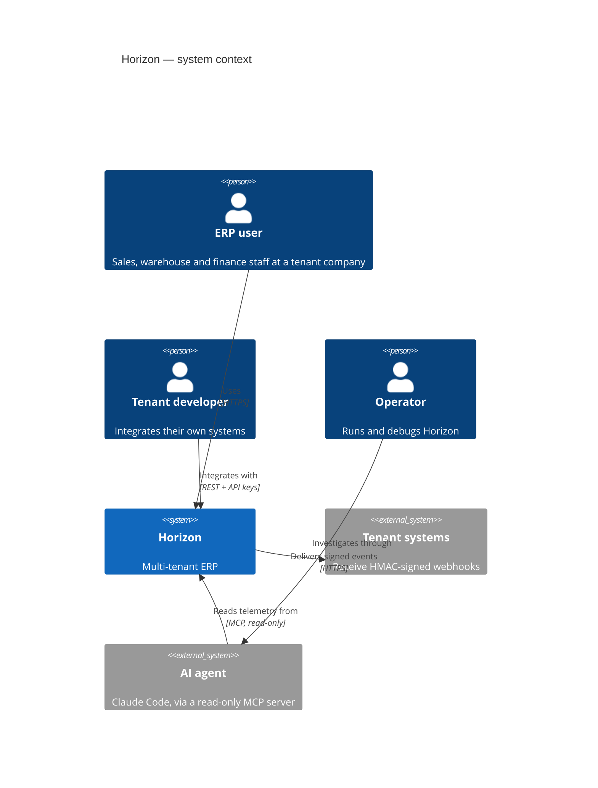
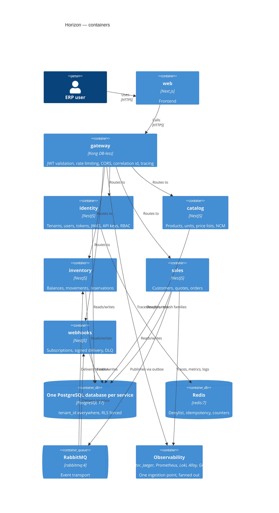

# Horizon

A general-purpose ERP, built as five independently deployable services with a database
each, an API gateway, event-driven choreography, and multi-tenant isolation enforced by
the database rather than by application code.

It is positioned like Omie or Conta Azul — general, not vertical — and it exists to
demonstrate distributed-systems engineering: transactional outbox and inbox, forced
Row-Level Security, an append-only hash-chained audit log, crypto-shredding for erasure,
end-to-end tracing across an asynchronous boundary, and contract versioning that CI
actually enforces.

**MIT licensed. Written entirely in English**, except Brazilian fiscal terms that have no
English equivalent, which are defined in [`docs/glossary.md`](docs/glossary.md).

---

> ### Current phase: **3 — contracts**
>
> `@horizon/contracts@0.1.0` is published and consumed by `identity/` at an exact pin.
> The compatibility gate is live: `scripts/check-contract-compat.mjs` diffs every schema
> against the last published snapshot and **fails a breaking change that is not
> accompanied by the right version bump**. [`docs/events.md`](docs/events.md) is generated
> from the schemas, and CI fails if it drifts.
>
> The platform behind it runs — `make up && make smoke` asserts 43 things about it.
>
> **There is still no domain code.** The services boot and answer 404. Identity is phase 4.
>
> What arrives when: [`docs/plan.md`](docs/plan.md).
> What is declared but deliberately unbuilt: [`docs/roadmap.md`](docs/roadmap.md).

---

## The golden path

The highest-priority deliverable in this repository is not module count — it is one flow
that works end to end and stays working:

**create sales order → reserve stock in `inventory` → confirm order → publish
`sales.order.confirmed` → `webhooks` delivers an HMAC-signed callback.**

It runs with `make demo`, appears as a **single trace** in Jaeger crossing three services
and RabbitMQ, and executes as a CI job on every push — so the screenshot below cannot
become a lie. Load-test results with measured throughput and p95 are committed to
`docs/benchmarks/`.

<!-- Phase 8. See docs/assets/README.md. -->
> _Trace screenshot lands here in phase 8._

---

## Architecture





Full reasoning, with what each choice costs:
[`docs/architecture.md`](docs/architecture.md).

---

## Modules

Each top-level folder is an **independent project**: its own `package.json`, lockfile,
`node_modules`, `tsconfig.json`, `biome.json`, tests and README. There is **no workspace
tooling** — modules behave as if each lived in its own repository that happens to be
vendored side by side, and a cross-module import cannot resolve.

| Module | Responsibility | Port | Phase |
|---|---|---|---|
| [`identity/`](identity/) | Tenants, users, authentication, sessions, API keys, JWKS, RBAC assignment | 3001 | 4 |
| [`catalog/`](catalog/) | Products, services, units of measure, price lists, NCM classification | 3002 | 6 |
| [`inventory/`](inventory/) | Stock balances, movements, warehouses, reservations, cost method | 3003 | 7 |
| [`sales/`](sales/) | Customers, quotes, sales orders, invoicing trigger | 3004 | 7 |
| [`webhooks/`](webhooks/) | Subscriptions, HMAC-signed delivery, retry, DLQ, replay | 3005 | 9 |
| [`web/`](web/) | Next.js frontend | 3000 | 10 |
| [`contracts/`](contracts/) | Published package: versioned Zod event and API schemas | — | 3 |
| [`gateway/`](gateway/) | Kong declarative configuration | 8000 | 2 |
| [`infra/`](infra/) | Compose, observability configuration, Terraform | — | 2, 13 |
| [`tooling/mcp-debugger/`](tooling/mcp-debugger/) | Read-only MCP server over the observability plane | — | 12 |

Audit is **not** a module: it is a local append-only table inside each service, because a
central audit service would be a synchronous dependency on every write path in the
system.

`financial/` and `fiscal/` are declared in [`docs/roadmap.md`](docs/roadmap.md) and have
**no folder** until their phase begins. Empty directories read as abandonment; a roadmap
reads as sequencing.

---

## Quick start

Requires **Node 24+** and, for the e2e suites, a Docker socket.

```bash
git clone <this repository> && cd horizon

make install     # npm ci in every project
make check       # boundaries + lint + typecheck + unit tests, everywhere
```

Or work on one module, which is the normal case:

```bash
cd sales
npm install
cp .env.example .env

npm run typecheck   # tsc --noEmit, strict + noUncheckedIndexedAccess
                    # + exactOptionalPropertyTypes + verbatimModuleSyntax
npm run lint        # biome check
npm test            # unit: no I/O, in-memory fakes
npm run test:e2e    # integration: real Postgres/Redis/RabbitMQ via Testcontainers
npm run dev         # http://localhost:3004
```

Or bring up the platform:

```bash
make up        # eleven services, all-healthy from cold in ~30s
make smoke     # 43 assertions that it actually works
make down
```

Grafana is on http://localhost:3300 (admin/admin), datasources and dashboard already
provisioned from files; Jaeger on http://localhost:16686.

### Verifying the isolation claim

```bash
node scripts/check-boundaries.mjs
```

It fails on a cross-project import, a `file:` dependency, a `domain/` layer reaching
outward or importing a framework, a snapshot escaping the boundary, or a package imported
but absent from that project's own `package.json`.

---

## Decisions

Thirty-five records in [`docs/adr/`](docs/adr/), MADR format, each with the alternatives
that were rejected. The ones a reviewer is most likely to question:

| Decision | Why | ADR |
|---|---|---|
| One repository, ten independent projects, **no workspace** | Workspace tooling makes a cross-module import typecheck and pass CI; without it, the mistake cannot resolve | [0001](docs/adr/0001-single-repository-of-independent-projects.md) |
| Boundaries enforced **four** ways, including CI with a sparse checkout | Conventions erode; the strongest test is that the siblings are not on disk | [0002](docs/adr/0002-mechanical-enforcement-of-module-boundaries.md) |
| A database per module | A shared schema undoes in persistence the boundary enforced in source | [0016](docs/adr/0016-one-database-per-module.md) |
| RLS, forced, with an unexported database client | A forgotten `WHERE tenant_id` returns nothing instead of someone else's data | [0017](docs/adr/0017-row-level-security-and-tenant-aware-transaction.md) |
| Transactional outbox + inbox | Commit-then-publish loses events silently; exactly-once delivery does not exist | [0024](docs/adr/0024-transactional-outbox-and-inbox.md) |
| Append-only audit with a per-tenant hash chain | An audit log that can be rewritten is not evidence | [0025](docs/adr/0025-append-only-audit-log-with-hash-chain.md) |
| Crypto-shredding for erasure | Erasure and an immutable chain are contradictory; destroying the key resolves it, and reaches backups | [0026](docs/adr/0026-crypto-shredding-for-erasure.md) |
| EdDSA (Ed25519), not RS256 | The compatibility RS256 buys has no consumer here; smaller, faster, no padding, no nonce | [0018](docs/adr/0018-eddsa-access-tokens.md) |
| Argon2id via `@node-rs/argon2` | Memory-hard, and prebuilt for musl so Alpine images need no toolchain | [0019](docs/adr/0019-argon2id-password-hashing.md) |
| Static, module-scoped roles | Tenant-editable roles make the permission surface unanalysable | [0023](docs/adr/0023-casl-static-module-scoped-roles.md) |
| Drizzle, not Prisma | RLS needs `SET LOCAL` on the transaction's own connection | [0007](docs/adr/0007-drizzle-and-postgresql-17.md) |
| Testcontainers, not a shared database | Roles and `FORCE ROW LEVEL SECURITY` are cluster-scoped; role config is what the tests exercise | [0013](docs/adr/0013-vitest-with-testcontainers.md) |
| Contracts through a registry, never `file:` | A `file:` dependency has no version, so it cannot express a breaking change | [0029](docs/adr/0029-contracts-distributed-through-a-registry.md) |
| Terraform written, **never applied** | Stated upfront, with a cost estimate, because an unstated gap discounts everything else | [0034](docs/adr/0034-terraform-written-but-never-applied.md) |
| The MCP debugger is read-only by construction | The agent gets an SRE's read handles; the reasoning lives outside the runtime | [0035](docs/adr/0035-mcp-debugger-read-only-by-construction.md) |

Two weaknesses are deliberate and documented rather than hidden: revocation **fails open
for reads** during a Redis outage ([0021](docs/adr/0021-redis-jti-denylist-asymmetric-failure.md)),
and roles are not editable per tenant ([0023](docs/adr/0023-casl-static-module-scoped-roles.md)).

---

## Stack

Node 24 · TypeScript strict (`noUncheckedIndexedAccess`, `exactOptionalPropertyTypes`,
`verbatimModuleSyntax`) · NestJS · Next.js · PostgreSQL 17 · Drizzle · Redis ·
RabbitMQ · Kong DB-less · Biome · Vitest · Testcontainers · OpenTelemetry → Collector →
Jaeger / Prometheus / Loki / Grafana · Docker · Terraform (never applied) · GitHub Actions

---

## Documentation

| | |
|---|---|
| [`docs/plan.md`](docs/plan.md) | Phases, deliverables, exit criteria, non-goals |
| [`docs/roadmap.md`](docs/roadmap.md) | Declared future scope, and why each piece is deferred |
| [`docs/architecture.md`](docs/architecture.md) | The choices a reviewer would question, and what each costs |
| [`docs/adr/`](docs/adr/) | 35 decision records |
| [`docs/patterns/`](docs/patterns/) | How to reimplement each cross-cutting pattern (phase 5) |
| [`docs/events.md`](docs/events.md) | The event catalogue, generated from the schemas |
| [`docs/privacy.md`](docs/privacy.md) | Lawful basis, retention, erasure |
| [`docs/glossary.md`](docs/glossary.md) | Brazilian fiscal terms, in universal language |
| [`docs/reference-analysis.md`](docs/reference-analysis.md) | Which writing conventions came from the reference project |
| [`CONTRIBUTING.md`](CONTRIBUTING.md) | Working on this repository |
