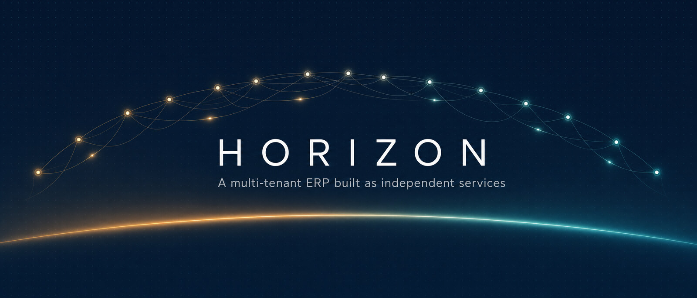
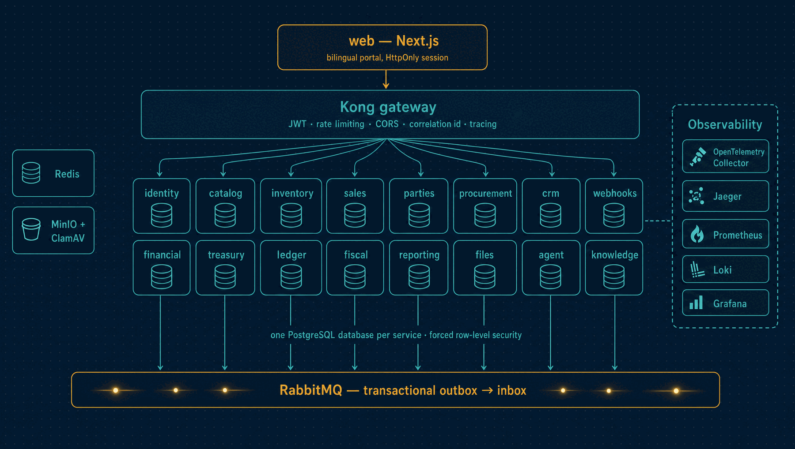
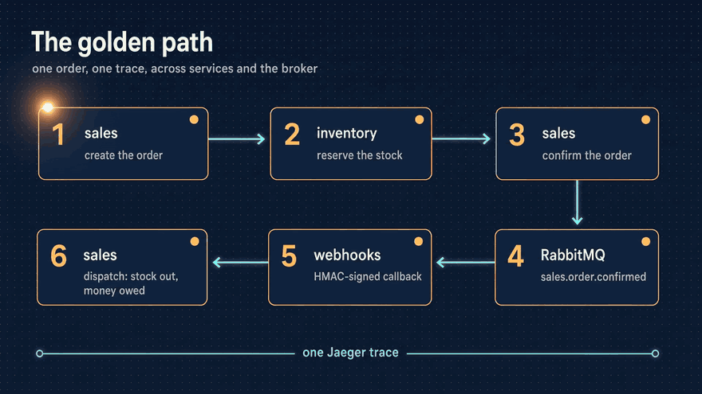
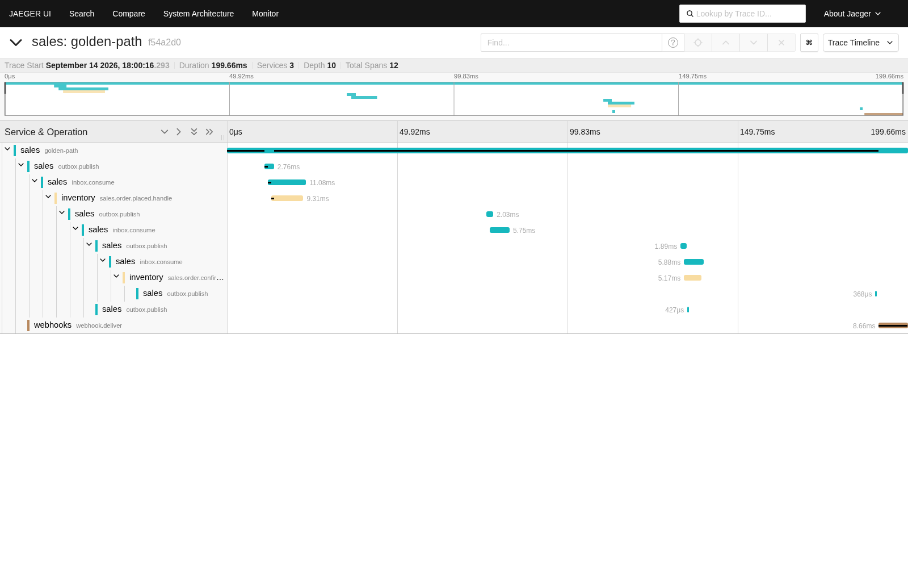

<p align="center">
  
</p>

<p align="center">
  <a href=".github/workflows/ci.yml"></a>
  <a href=".github/workflows/golden-path.yml"></a>
  <a href=".github/workflows/isolation.yml"></a>
  <a href=".github/workflows/tax-oracle.yml"></a>
  <a href="LICENSE"></a>
</p>

# Horizon

A general-purpose ERP for Brazilian companies (sales, purchasing, inventory, finance,
accounting, fiscal documents and taxes, CRM) built as **16 independent services**,
each with its own database, communicating through events.

<p align="center">
  <b>16</b> services · <b>74</b> architecture decisions · <b>~370</b> test files · <b>1</b> trace across the whole flow
</p>

**MIT licensed. Written entirely in English**, except Brazilian fiscal terms that have
no English equivalent (NF-e, ICMS, CBS, IBS…), which are defined in
[`docs/glossary.md`](docs/glossary.md).

---

## Architecture

<p align="center">
  
</p>

- **Each service owns its data.** One PostgreSQL database per service, with `tenant_id`
  on every business table and RLS forced, so a forgotten filter returns nothing instead
  of another tenant's rows.
- **Services never call each other to keep state consistent.** They publish facts
  through a transactional outbox, and consumers apply them once through an inbox. A
  service that needs another's data keeps its own projection.
- **The gateway authenticates; services authorize.** Kong validates the EdDSA token,
  and each service checks its own module-scoped roles.
- **Everything is observable from one place.** Traces, metrics and logs go through the
  OpenTelemetry Collector to Jaeger, Prometheus and Loki, with dashboards and alert rules
  provisioned from files.

The reasoning behind each choice, and what it costs, is in
[`docs/architecture.md`](docs/architecture.md).

---

## Stack

| | |
|---|---|
| **Language** |   |
| **Services** |   |
| **Frontend** |   |
| **Data** |    |
| **Messaging & edge** |   |
| **Observability** |      |
| **Quality** |     |
| **Delivery** |    |

---

## What it does

| Area | What a company can do |
|---|---|
| **Sales** | Quotes with tax estimates, orders, picking, partial delivery, returns |
| **Services** | Service orders, recurring contracts, billing per period |
| **Purchasing** | Requisitions, supplier quotations and comparison, approval thresholds, purchase orders, receiving |
| **Inventory** | Warehouses, reservations, transfers, counts, Kardex and valuation, lots, serial numbers, bills of materials, production orders |
| **Finance** | Receivables and payables with approvals, treasury accounts, bank statement import and reconciliation |
| **Accounting** | Chart of accounts, double-entry journal posted automatically from business events, periods, trial balance, results, cash flow with drill-down to the source |
| **Fiscal** | NF-e, NFC-e and NFS-e, inbound supplier XML, and a tax engine covering ICMS, IPI, PIS/Cofins and the 2026–2033 reform (IBS, CBS) |
| **CRM** | Accounts, contacts, pipelines, activities, conversion of an opportunity into a quote, forecasts |
| **Reporting** | Cross-module reports reconciled at a cutoff, CSV/XLSX exports and schedules, bulk imports with a preview |
| **AI, opt-in** | An MCP server for the company's own agents, an in-app assistant, search over attachments with citations; it reads only what the person asking may read, and every change it proposes is a draft a person confirms |
| **Platform** | Workspaces, MFA and passkeys, API keys, signed webhooks, attachments with a virus scan, segregation of duties, audit trail, a bilingual portal (Brazilian Portuguese and English) |

Fiscal documents are issued against a **simulated** tax authority. Real issuance needs
each company's digital certificate and the authority's homologation
([details](docs/fiscal-capabilities.md)). Scope that is planned but not built is in
[`docs/roadmap.md`](docs/roadmap.md), and how the project was built step by step is in
[`docs/plan.md`](docs/plan.md).

---

## The golden path

The highest-priority deliverable is not the number of modules. It is one flow that works
end to end and stays working:

<p align="center">
  
</p>

`make demo` runs it from an idempotent seed. It appears in Jaeger as **one trace**
across the services and RabbitMQ, and the [`golden path`](.github/workflows/golden-path.yml)
workflow runs it twice on every push to `main`, so a broken path or a seed that is not
idempotent fails the build. Measured throughput and p95 are in
[`docs/benchmarks/`](docs/benchmarks/golden-path.md).



The capture is evidence from `make demo`, not a drawing. Longer flows have recorded
runs of their own under [`docs/drills/`](docs/drills/):
- reports reconciled against the modules they came from;
- the same business flow [with AI on](docs/drills/2026-09-29-phase-n-golden-path-ai-on.json)
  and [with AI off](docs/drills/2026-09-29-phase-n-golden-path-ai-off.json);
- a quote's [tax estimate, the tax locked at delivery, and its posting in the ledger](docs/drills/2026-10-01-phase89-golden-path.json).

---

## Start here

If you only have ten minutes for the code, these are the pieces worth opening:

| What | Where |
|---|---|
| **Tenant isolation in the database.** RLS is forced on every business table, and each transaction sets its tenant. | [`0001_tenant_isolation.sql`](identity/src/infrastructure/database/drizzle/migrations/0001_tenant_isolation.sql) · [`identity-database.ts`](identity/src/infrastructure/database/drizzle/identity-database.ts) |
| **The proof that it holds.** A test that tries to bypass RLS, use the wrong role, or leak a tenant across pooled connections. | [`database.e2e-spec.ts`](identity/test/database.e2e-spec.ts) |
| **Events that are never lost.** The relay publishes what was committed in the same transaction as the change. | [`outbox-relay.ts`](identity/src/infrastructure/messaging/outbox-relay.ts) |
| **Events applied exactly once.** Redelivery, events arriving out of order, and a consumer that changed. | [`messaging.e2e-spec.ts`](sales/test/messaging.e2e-spec.ts) |
| **An audit log that cannot be rewritten.** Each entry hashes the one before it, and a verifier checks the chain. | [`chain.ts`](identity/src/domain/audit/chain.ts) · [`verify-audit-chain.ts`](identity/src/application/use-cases/verify-audit-chain.ts) |
| **Erasure in an append-only world.** Destroying a person's key makes every copy of their data unreadable. | [`erase-data-subject.ts`](identity/src/application/use-cases/erase-data-subject.ts) |
| **Tax formulas as data.** A small, bounded expression language evaluated with exact fractions, never floats. | [`formula.ts`](fiscal/src/formula.ts) |
| **Four eyes, enforced by the database.** A trigger refuses a tax-rule change approved by the person who asked for it. | [`0060_phase88_rule_governance.sql`](fiscal/migrations/0060_phase88_rule_governance.sql) |
| **Boundaries checked mechanically.** No module can import another's source. | [`check-boundaries.mjs`](scripts/check-boundaries.mjs) · [`isolation.yml`](.github/workflows/isolation.yml) |

---

## Modules

Each top-level folder is an **independent project**: its own `package.json`, lockfile,
`node_modules`, `tsconfig.json`, `biome.json`, tests and README. There is **no workspace
tooling**. Modules behave as if each lived in its own repository, and a cross-module
import cannot resolve.

| Module | Responsibility | Port |
|---|---|---|
| [`identity/`](identity/) | Accounts, workspaces, sessions, MFA and passkeys, API keys, JWKS, roles, segregation of duties | 3001 |
| [`catalog/`](catalog/) | Products and services, units, price lists, NCM and tax classification, bills of materials | 3002 |
| [`inventory/`](inventory/) | Warehouses, balances, movements, reservations, transfers, counts, Kardex, valuation, lots, serials, production | 3003 |
| [`sales/`](sales/) | Quotes, orders, deliveries and returns, service orders, recurring contracts and their billing | 3004 |
| [`webhooks/`](webhooks/) | Subscriptions, HMAC-signed delivery, bounded retry, dead letters, replay | 3005 |
| [`parties/`](parties/) | Every organization and person the business deals with, their roles, tax identifiers and erasure | 3006 |
| [`financial/`](financial/) | Receivables and payables, approvals, settlements and reversals, dimensions | 3007 |
| [`treasury/`](treasury/) | Bank and cash accounts, an append-only journal, transfers, statement import and reconciliation | 3008 |
| [`ledger/`](ledger/) | Chart of accounts, double-entry journal, periods, automatic postings, trial balance, results and cash flow | 3009 |
| [`procurement/`](procurement/) | Requisitions, supplier quotations, approval thresholds, purchase orders, receiving and returns | 3010 |
| [`fiscal/`](fiscal/) | NF-e, NFC-e and NFS-e in simulation, inbound XML, and the tax engine: a catalogue of versioned tax packages, estimates, locked calculations that replay, four-eyes rule changes | 3011 |
| [`crm/`](crm/) | Accounts, sealed contacts, pipelines, event-sourced opportunities, activities, conversion to a quote, forecasts | 3012 |
| [`reporting/`](reporting/) | A sealed journal of other modules' events; reports reconciled at a cutoff; exports and schedules; notifications | 3013 |
| [`files/`](files/) | Attachments: signed links, a virus scan before serving, encryption under the owner's key, retention | 3014 |
| [`agent/`](agent/) | The tenant's own MCP server and the opt-in assistant, reading with the person's own permissions; its writes are drafts a person confirms | 3015 |
| [`knowledge/`](knowledge/) | The document index: one pgvector partition per tenant, search with citations, suggestions from the workspace's own history, erased with its file | 3016 |
| [`web/`](web/) | Next.js portal, bilingual (Brazilian Portuguese and English), routed by the user's roles | 3000 |
| [`contracts/`](contracts/) | Published package `@horizon/contracts`: versioned Zod schemas for every event and API | — |
| [`gateway/`](gateway/) | Kong declarative configuration | 8000 |
| [`infra/`](infra/) | Compose, observability, backups, Terraform | — |
| [`tooling/mcp-debugger/`](tooling/mcp-debugger/) | Read-only MCP server over the observability plane, for the operator | — |

Audit is **not** a module. It is an append-only table inside each service, because a
central audit service would be a synchronous dependency on every write path.

---

## Quick start

Requires **Node 24+** and Docker.

> [!WARNING]
> **The full stack is heavy.** With every service running, its 33 containers use about
> **4 GB of RAM**, and the images take about **18 GB of disk**. ClamAV is optional
> (`--profile scanner`) and adds about 1 GB, twice that while it reloads signatures.
> Plan for a machine with **16 GB of RAM** and 25 GB free. On less, run the platform
> (`make up`) and only the modules you are working on.

```bash
git clone https://github.com/iricardofernandes/horizon.git && cd horizon

make install       # npm ci in every project
make up            # start the platform: Postgres, Redis, RabbitMQ, Kong, observability…
make smoke         # prove the platform works, not merely that it started
make demo          # idempotent seed, then the golden path
make up-apps       # every service, and the portal at http://localhost:3000
```

Sign in as `demo@horizon.local` with `Horizon-demo-2026!` and pick the `horizon-demo`
workspace. Grafana is at http://localhost:3300 and Jaeger at http://localhost:16686.

Before pushing:

```bash
make check         # boundaries, lint, typecheck and unit tests, everywhere
make ci-local      # plus builds and the Testcontainers e2e suites
make ci-local-full # plus clean installs and every Docker image
make test-alerts   # the Prometheus alert rules and their tests
make test-phase10  # the portal flow in Chromium, desktop and mobile, both languages
```

Working on one module is the normal case:

```bash
cd sales
npm install && cp .env.example .env
npm run typecheck   # strict, noUncheckedIndexedAccess, exactOptionalPropertyTypes
npm run lint        # biome
npm test            # unit: no I/O
npm run test:e2e    # real Postgres, Redis and RabbitMQ through Testcontainers
npm run dev         # http://localhost:3004
```

### Verifying the isolation claim

```bash
node scripts/check-boundaries.mjs
```

It fails on a cross-project import, a `file:` dependency, a `domain/` layer that reaches
outward or imports a framework, or a package imported without being declared. CI goes
further: the [`isolation`](.github/workflows/isolation.yml) workflow checks out **one**
module, with no siblings on disk, and builds and tests it against contracts from a
registry.

---

## Decisions

Every significant choice is recorded in [`docs/adr/`](docs/adr/README.md): 74 decisions,
each with the alternatives it rejected. That page also explains why each technology in the
stack was chosen. Five of them shape everything else:

- **No workspace tooling.** A cross-module import cannot even resolve
  ([0001](docs/adr/0001-single-repository-of-independent-projects.md)).
- **A database per module, with forced RLS.** A forgotten tenant filter returns nothing
  ([0016](docs/adr/0016-one-database-per-module.md),
  [0017](docs/adr/0017-row-level-security-and-tenant-aware-transaction.md)).
- **Transactional outbox and inbox.** No event is lost between a commit and the broker
  ([0024](docs/adr/0024-transactional-outbox-and-inbox.md)).
- **Erasure by crypto-shredding.** A person's data is erased by destroying its key, even
  in backups and an immutable audit chain
  ([0026](docs/adr/0026-crypto-shredding-for-erasure.md)).
- **Tax law as versioned packages.** A rate change never rewrites a locked document
  ([0070](docs/adr/0070-tax-law-is-a-shared-catalogue-that-workspaces-adopt.md)).

---

## Documentation

| | |
|---|---|
| [`docs/plan.md`](docs/plan.md) | How the project was built, step by step, with exit criteria and non-goals |
| [`docs/erp-expansion-plan.md`](docs/erp-expansion-plan.md) | The dependency-ordered plan for the business modules |
| [`docs/tax-engine-plan.md`](docs/tax-engine-plan.md) | The tax rules engine |
| [`docs/roadmap.md`](docs/roadmap.md) | Declared future scope, and why each piece waits |
| [`docs/architecture.md`](docs/architecture.md) | The choices a reviewer would question, and what each costs |
| [`docs/adr/`](docs/adr/) | 74 decision records |
| [`docs/events.md`](docs/events.md) | The event catalogue, generated from the schemas |
| [`docs/service-levels.md`](docs/service-levels.md) | SLIs, objectives and the alerts that guard them |
| [`docs/recovery-runbook.md`](docs/recovery-runbook.md) | Backups, restores and the drills that time them |
| Threat models | [platform](docs/phase-m-threat-model.md) · [AI](docs/phase-n-threat-model.md) · [tax engine](docs/phase-o-threat-model.md) · [fiscal](docs/fiscal-threat-model.md) · [CRM](docs/crm-threat-model.md) · [services](docs/services-threat-model.md) |
| [`docs/drills/`](docs/drills/) | Recorded golden paths, drills and restore runs |
| [`docs/patterns/`](docs/patterns/) | How to reimplement each cross-cutting pattern |
| [`docs/privacy.md`](docs/privacy.md) | Lawful basis, retention, erasure |
| [`docs/glossary.md`](docs/glossary.md) | Brazilian fiscal terms, in plain English |
| [`CONTRIBUTING.md`](CONTRIBUTING.md) | Working on this repository |

---

## About

Built by **Ricardo Fernandes de Oliveira** ·
[LinkedIn](https://www.linkedin.com/in/ricardof-oliveira/)

I built Horizon because most portfolio projects stop where the hard parts begin. A to-do
app never has to keep two databases consistent, prove that one customer cannot see
another's data, or explain a tax amount five years later. An ERP has to do all of that.
Brazil's tax system, with the reform phasing in from 2026 to 2033, is a good test of
whether a design survives change.

It was also a way to practise building software where every claim has evidence: a test,
a recorded drill, or a decision record that names what was traded away. When something
is not done, the documentation says so.

