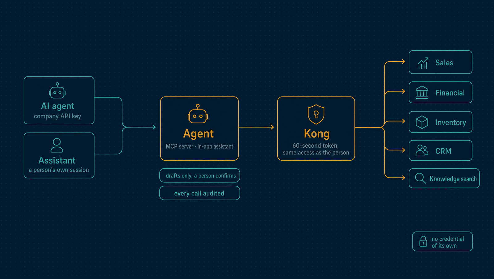

# Agent

AI with isolation. The company's own MCP server, where its AI agents read Horizon through
an API key with exactly the access of the person who issued it, and the opt-in in-app
assistant, which answers a person's questions with that person's own access and cites
everything it read.

| | |
|---|---|
| **Port** | 3015 |
| **Database** | `horizon_agent`, its own, with forced row-level security and no grant on any business table |
| **Talks to** | Every module, only through Kong, with the caller's own token |
| **Stack** | NestJS · Drizzle · PostgreSQL · Model Context Protocol · Claude (optional) |

<p align="center">
  
</p>

---

## What it does

- **The MCP endpoint.** `POST /agent/tenants/{tenantId}/mcp`, stateless, authenticated
  by an API key. An agent such as Claude Code connects to it like any MCP server.
- **A declared catalogue of read tools** over Parties, Catalog, Sales, Inventory,
  Procurement, Financial, Treasury, CRM, Fiscal documents and Reporting. Each tool is one
  `GET` route with the scope it needs, an input schema and a row cap. No tool takes a
  path. An agent only sees the tools of the modules its key can read.
- **Document search.** `search_documents` searches the company's attachments by meaning
  and by words, and every result cites its attachment, record and excerpt.
- **Drafts, never decisions.** Six tools create drafts: a quote, a purchase requisition, a
  payable, a CRM task, activity or note. The draft counts as the key issuer's, so that
  person cannot approve it. No tool submits, approves, posts, settles, cancels or touches
  access ([ADR 0066](../docs/adr/0066-agent-writes-are-drafts.md)).
- **The in-app assistant**, off by default. Only the workspace owner turns it on, by
  accepting a notice, and sets a monthly token budget. Every statement in an answer must
  cite a source it read, or it is returned as not found. Conversations are sealed under
  the person's key, kept 30 days, and erased with the person.
- **Models are optional.** The default generator is extractive and deterministic. Claude
  answers only when an API key is configured; without it, nothing is sent anywhere
  ([ADR 0069](../docs/adr/0069-models-are-ports-and-generation-is-opt-in.md)).

## What it leaves to others

- **Credentials.** The agent has none of its own. Each request exchanges the caller's key
  through Kong for a 60-second token, and reads through Kong with it. There is no
  privileged path ([ADR 0065](../docs/adr/0065-the-tenant-agent-is-a-stateless-mcp-adapter.md)).
- **Business data.** Answers pass through and are never stored. The audit keeps a hash of
  the arguments, the result size and the outcome, never the content.

---

## One MCP request, in order

1. A well-formed workspace id and a `Bearer hz_…` key, otherwise `401`.
2. Agent access switched on for the workspace, otherwise `403`, before any exchange.
3. The key exchanged through Kong; refusals pass through (`401`, `403`, `429`, `503`).
4. The token verified against Identity's keys, for the same workspace, holding
   `agent:connect`.
5. The call validated, read, cut to a row and byte limit, and **audited before the answer
   leaves**. A call that cannot be audited returns no data.

## Connecting an agent

Create a key under Developers → API keys with `agent:connect` and a read scope per module,
switch access on under Developers → Agent, then point the MCP client at the endpoint:

```json
{
  "mcpServers": {
    "horizon": {
      "type": "http",
      "url": "http://localhost:8000/agent/tenants/<tenant id>/mcp",
      "headers": { "Authorization": "Bearer hz_live_…" }
    }
  }
}
```

---

## API

| Method | Path | Purpose |
|---|---|---|
| `POST` | `/tenants/:tenantId/mcp` | The MCP endpoint |
| `GET`, `PUT` | `/settings` | Agent access for the workspace, off by default |
| `GET` | `/drafts` | The records agents drafted in a module |
| `GET` | `/assistant/status` | Whether the assistant is on, and the budget left |
| `PUT` | `/assistant/settings` | Turn it on (owner), off, or set the budget |
| `POST` | `/assistant/questions` | Ask a question |
| `GET` | `/assistant/conversations`, `/assistant/conversations/:id` | My conversations |
| `DELETE` | `/assistant/conversations/:id` | Delete one |
| `GET` | `/audit` | Every tool call and switch, hash-chained |
| `GET` | `/health/live`, `/health/ready` | Liveness and readiness |

---

## Events

The Agent publishes no events. It listens to `identity.data-subject.erased` and erases
that person's conversations.

---

## Run it

```bash
npm install && cp .env.example .env
npm run db:migrate
npm run dev            # http://localhost:3015
```

Tests, the build and the code layout are the same in every service:
[how every service runs](../docs/service-runtime.md). `node ../scripts/phase72-smoke.mjs`
and `node ../scripts/phase76-smoke.mjs` exercise the MCP server and the assistant
through Kong on the running stack.

<details>
<summary><b>Configuration specific to the Agent</b></summary>

| Variable | Purpose |
|---|---|
| `GATEWAY_URL`, `GATEWAY_TIMEOUT_MS` | Kong, through which every read goes |
| `AGENT_MAX_ROWS`, `AGENT_MAX_RESULT_BYTES` | The cap on every answer |
| `ASSISTANT_GENERATOR` | `extractive` (default) or `anthropic` |
| `ASSISTANT_MODEL`, `ANTHROPIC_API_KEY`, `ANTHROPIC_BASE_URL`, `ASSISTANT_TIMEOUT_MS` | The model, when generation is opted in |
| `ASSISTANT_MASTER_KEY`, `ASSISTANT_PREVIOUS_MASTER_KEYS`, `ASSISTANT_REWRAP_INTERVAL_MS` | Seal conversations, and rotate the master key |
| `ASSISTANT_PURGE_INTERVAL_MS` | How often conversations past 30 days are purged |

The variables every service shares are in
[the shared configuration](../docs/service-runtime.md#configuration-every-service-shares).

</details>

---

## Read more

- [How every service runs](../docs/service-runtime.md)
- [The Agent API](../docs/agent-api.md) and the [AI threat model](../docs/phase-n-threat-model.md)
- [Architecture](../docs/architecture.md) and the [decision records](../docs/adr/README.md)
