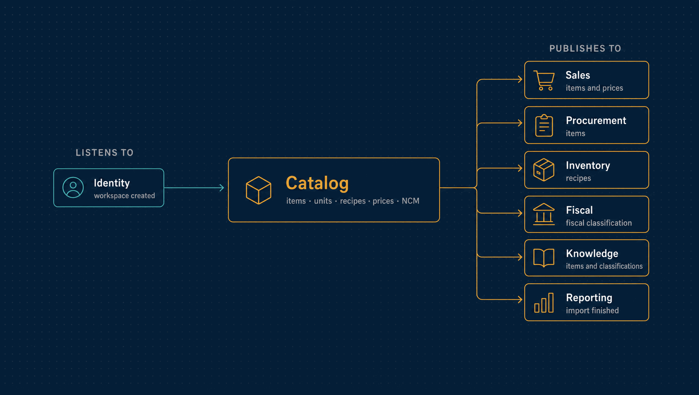

# Catalog

What the company sells and buys: products and services, units of measure, families and
variants, recipes, price lists, and each item's fiscal classification.

| | |
|---|---|
| **Port** | 3002 |
| **Database** | `horizon_catalog`, its own, with forced row-level security |
| **Talks to** | Sales, Procurement, Inventory, Fiscal and Knowledge read what it publishes |
| **Stack** | NestJS · Drizzle · PostgreSQL · RabbitMQ · Redis |

<p align="center">
  
</p>

---

## What it does

- **Items.** Products and services, each with a kind that never changes once set. An
  item is deactivated, never deleted, so old documents still point at something real.
- **Units of measure**, with the conversion factors between them. A new workspace
  starts with `UN`, `KG`, `L` and `H`.
- **Families and variants.** A family varies along ordered axes, such as size and
  colour. Each item in it is one combination, and no two items answer the axes the same
  way.
- **Recipes.** What an item is made of, versioned by date. A recipe is superseded, never
  edited, because goods made under the old one must stay explicable. Nothing may be made
  of itself at any depth, which the use case and a database trigger both check.
- **Price lists**, one currency each, with the current price of each item.
- **Fiscal classification.** The item's NCM code and whether the company pays IPI on it,
  in dated revisions that Fiscal reads.
- **Bulk import** of units, items and prices from a spreadsheet: preview, map the
  columns, confirm, and download the rows that failed.

## What it leaves to others

- **Stock** is Inventory's. Catalog says what a thing is, never how many there are.
- **The price actually charged** is snapshotted by Sales onto the order, so a later
  price change never alters a past order.
- **What a classification means for tax** is Fiscal's.

---

## API

<details>
<summary><b>Items, families and recipes</b></summary>

| Method | Path | Purpose |
|---|---|---|
| `GET`, `POST` | `/items` | List items, or add one |
| `GET` | `/items/:itemId` | One item |
| `PATCH` | `/items/:itemId/deactivate` | Stop it being added to new documents |
| `GET`, `POST` | `/units` | Units of measure |
| `GET`, `POST` | `/families` | Families and their axes |
| `GET` | `/families/:familyId/variants` | The items of a family and what tells them apart |
| `PUT` | `/families/variants/:itemId` | Place an item in a family as one combination |
| `GET` | `/items/:itemId/composition` | What it is made of on a given day |
| `GET` | `/items/:itemId/composition/explosion` | Everything one unit needs, all the way down |
| `POST` | `/items/:itemId/composition` | A new recipe version from a date |

</details>

<details>
<summary><b>Prices and fiscal classification</b></summary>

| Method | Path | Purpose |
|---|---|---|
| `GET`, `POST` | `/price-lists` | Price lists with their current prices, or a new list |
| `PUT` | `/price-lists/:priceListId/prices/:itemId` | Set an item's price |
| `PATCH` | `/items/:itemId/classification` | A new classification revision |
| `GET` | `/items/classifications` | The current classification of every item |
| `GET` | `/items/:itemId/classification/:revision` | One revision |

</details>

<details>
<summary><b>Imports and operations</b></summary>

| Method | Path | Purpose |
|---|---|---|
| `GET` | `/imports/kinds` | What can be imported |
| `POST` | `/imports/:kind` | Upload a spreadsheet |
| `PUT` | `/imports/:id/mapping` | Map its columns |
| `POST` | `/imports/:id/preview`, `/confirm`, `/cancel` | Preview, apply or drop it |
| `GET` | `/imports`, `/imports/:id`, `/imports/:id/failures` | Imports, one import, and its failed rows |
| `GET` | `/audit` | The hash-chained audit log, with the chain's verdict |
| `GET` | `/health/live`, `/health/ready` | Liveness and readiness |

</details>

**Roles.** `viewer` reads. `editor` adds and deactivates items and sets prices. `admin`
also defines units and creates price lists: reshaping the catalogue is administrative,
filling it is daily work.

---

## Events

| Published | Meaning |
|---|---|
| `catalog.item.created` | An item exists and may be sold, bought or stocked |
| `catalog.item.deactivated` | It may no longer be added to new documents |
| `catalog.price.changed` | An item's price in a list changed |
| `catalog.item.classification-changed` | An item's fiscal classification has a new revision |
| `catalog.family.defined`, `variant.assigned` | A family and its variants |
| `catalog.composition.defined` | A new recipe version |
| `catalog.import.finished` | A bulk import ended, with its counts |

| Consumed | Reaction |
|---|---|
| `identity.tenant.created` | Creates the default units and an empty base price list |

---

## Guarantees

Besides what [every service guarantees](../docs/service-runtime.md#guarantees-every-service-gives):

- **A recipe cannot loop.** A cycle is refused by the use case and again by a deferred
  database trigger.
- **History stays explicable.** Recipes and classifications are superseded by new
  revisions, never edited.
- **Reads survive a revocation-store outage, writes do not.** If the denylist is
  unreachable, list endpoints keep answering and every write is refused with `503`.

---

## Run it

```bash
npm install && cp .env.example .env
npm run dev            # http://localhost:3002, OpenAPI at /docs
```

Tests, migrations, the build and the code layout are the same in every service:
[how every service runs](../docs/service-runtime.md).

<details>
<summary><b>Configuration specific to Catalog</b></summary>

| Variable | Purpose |
|---|---|
| `DEFAULT_PRICE_LIST_CURRENCY` | The currency of a new workspace's base price list |
| `IDEMPOTENCY_SECRET` | Keys the stored idempotency responses |
| `IMPORT_BATCH_SIZE`, `IMPORT_LEASE_MS`, `IMPORT_POLL_INTERVAL_MS`, `IMPORT_RETENTION_HOURS` | How imports are processed and how long their files are kept |

The variables every service shares are in
[the shared configuration](../docs/service-runtime.md#configuration-every-service-shares).

</details>

---

## Read more

- [How every service runs](../docs/service-runtime.md)
- [Zero-downtime migrations](../docs/patterns/zero-downtime-migration.md), proven on this module
- [Architecture](../docs/architecture.md) and the [decision records](../docs/adr/README.md)
- [The event catalogue](../docs/events.md)
