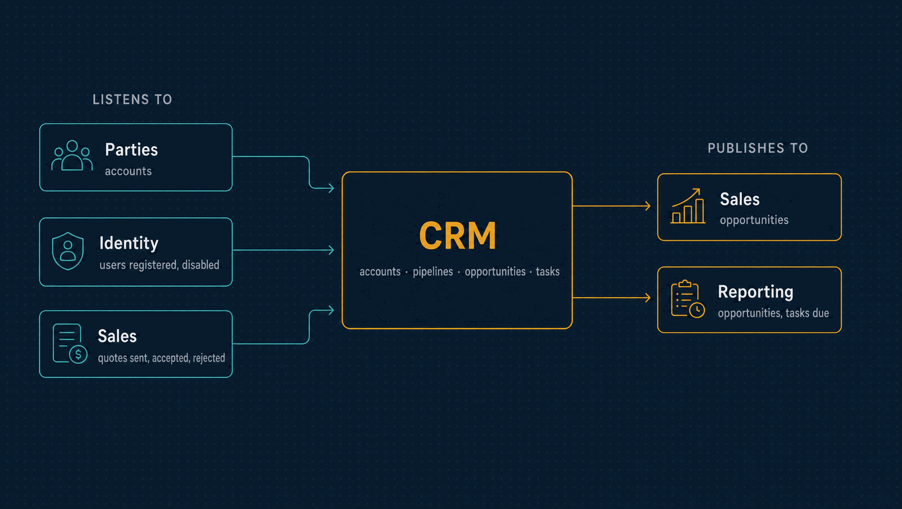

# CRM

The customers the company is trying to win or keep: accounts, the people it talks to
there, pipelines and opportunities, activities, tasks and reminders, the handover to a
Sales quote, and forecasts rebuilt from history.

| | |
|---|---|
| **Port** | 3012 |
| **Database** | `horizon_crm`, its own, with forced row-level security |
| **Talks to** | Parties (accounts), Identity (owners), Sales (quotes made for an opportunity) |
| **Stack** | NestJS · Drizzle · PostgreSQL · RabbitMQ |

<p align="center">
  
</p>

---

## What it does

- **Accounts** are the parties that are prospects, customers or partners
  ([ADR 0057](../docs/adr/0057-crm-accounts-are-parties-with-typed-documents.md)). Parties
  owns their name and document; CRM adds the owner, segment and tags.
- **Contacts.** People at an account, with the lawful basis for holding them. Their
  personal fields are sealed under a key per contact, destroyed on erasure.
- **Pipelines.** Ordered stages with a win probability. Won and lost are outcomes, not
  stages. Stages, pipelines, sources and loss reasons are archived, never deleted.
- **Event-sourced opportunities.** An account, contacts, owner, source, expected value and
  close date. Each change is appended to the opportunity's history, which is the source of
  truth; the record is computed from it.
- **Activities, tasks and notes.** Calls, meetings, emails and visits; tasks with an
  assignee, a due time and an optional reminder; notes corrected by revisions. Their free
  text is sealed under the account's key.
- **Reminders**, sent exactly once even across restarts or with several instances.
- **The handover to Sales.** A quote made for an opportunity is followed here. When the
  customer accepts it, the opportunity is won at the quote's total, once. CRM never calls
  or writes to Sales.
- **Forecasts and pipeline metrics** at a cutoff: open, weighted and won value per month,
  and entries, exits, conversion and time per stage. A cutoff older than ten minutes is
  settled, so its numbers can be reproduced later.

## What it leaves to others

- **Organizations and their documents** belong to Parties; CRM never registers one.
- **Quotes and orders** belong to Sales.

---

## API

<details>
<summary><b>Accounts and contacts</b></summary>

| Method | Path | Purpose |
|---|---|---|
| `GET` | `/accounts` | Accounts, filtered by search, role, owner and status |
| `GET`, `PATCH` | `/accounts/:id` | One account with its contacts, or set its owner, segment and tags |
| `POST` | `/accounts/:id/contacts` | Add a contact |
| `GET`, `PUT` | `/contacts/:id` | One contact, or update it |
| `PATCH` | `/contacts/:id/status` | Activate or deactivate |
| `DELETE` | `/contacts/:id` | Erase a contact by destroying its key |
| `GET` | `/owners` | The workspace's users who can own accounts |
| `GET` | `/accounts/:id/timeline` | Everything that happened with an account |

</details>

<details>
<summary><b>Pipelines and opportunities</b></summary>

| Method | Path | Purpose |
|---|---|---|
| `GET`, `POST` | `/pipelines` | Pipelines, or a new one |
| `GET`, `PUT` | `/pipelines/:id` | One pipeline, or rename it |
| `PATCH` | `/pipelines/:id/status` | Archive or restore |
| `POST` | `/pipelines/:id/stages` | Add a stage |
| `PATCH` | `/pipelines/:id/stages/:stageId` | Change a stage |
| `PUT` | `/pipelines/:id/stage-order` | Reorder the stages |
| `GET`, `POST` | `/sources`, `/loss-reasons` | Workspace lists |
| `PATCH` | `/sources/:id`, `/loss-reasons/:id` | Change or archive an entry |
| `GET`, `POST` | `/opportunities` | Opportunities, or a new one |
| `GET`, `PUT` | `/opportunities/:id` | One opportunity with its history and quotes, or revise it |
| `POST` | `/opportunities/:id/stage` | Move it to another stage |
| `POST` | `/opportunities/:id/owner` | Reassign it |
| `POST` | `/opportunities/:id/win`, `/lose`, `/reopen` | Close it, with a reason when lost, or reopen it |
| `GET` | `/opportunities/:id/timeline` | Its timeline |

</details>

<details>
<summary><b>Activities, tasks and notes</b></summary>

| Method | Path | Purpose |
|---|---|---|
| `POST` | `/activities` | Record a call, meeting, email or visit |
| `GET`, `PUT` | `/activities/:id` | One activity, or correct it |
| `GET`, `POST` | `/tasks` | Tasks, or a new one |
| `GET`, `PUT` | `/tasks/:id` | One task, or change it |
| `POST` | `/tasks/:id/assignee` | Reassign it |
| `POST` | `/tasks/:id/complete`, `/cancel` | Finish or drop it |
| `GET` | `/agenda` | My open tasks due soon |
| `POST` | `/notes` | Write a note |
| `GET` | `/notes/:id` | A note and its revisions |
| `POST` | `/notes/:id/revisions` | Correct a note |

</details>

<details>
<summary><b>Metrics and operations</b></summary>

| Method | Path | Purpose |
|---|---|---|
| `GET` | `/forecast` | Open, weighted and won value per month, by pipeline, owner or source |
| `GET` | `/pipelines/:id/metrics` | Entries, exits, conversion and time per stage, win rate, loss reasons |
| `GET` | `/audit` | The hash-chained audit log, with field names and never contact values |
| `GET` | `/health/live`, `/health/ready` | Liveness and readiness |

</details>

**Roles.** `viewer` reads. `representative` also writes. `manager` also assigns owners and
configures pipelines and lists. `admin` also erases contacts.

---

## Events

| Published | Meaning |
|---|---|
| `crm.opportunity.created`, `revised`, `stage-changed`, `owner-changed` | An opportunity's life, with its probability, owner, source and value, never its title or contacts |
| `crm.opportunity.won`, `lost`, `reopened` | It was closed or reopened |
| `crm.opportunity.converted` | An accepted quote won it, at the quote's total |
| `crm.task.due` | A task's reminder is due |

| Consumed | Reaction |
|---|---|
| `parties.party.registered`, `updated`, `erased` | Keeps the accounts; erasure blanks the names, destroys the keys and cancels open tasks |
| `identity.user.registered`, `user.disabled` | Keeps the owners, as ids only |
| `sales.quote.sent`, `accepted`, `rejected` | Follows the quotes made for an opportunity, and converts it on acceptance |
| `identity.tenant.created` | Provisions the workspace |

---

## Guarantees

Besides what [every service guarantees](../docs/service-runtime.md#guarantees-every-service-gives):

- **History is the truth.** An opportunity's record is computed from its append-only
  history, and the metrics are rebuilt from it in the same transaction.
- **Reproducible numbers.** The history refuses a fact more than two minutes from the
  database clock, so a cutoff older than ten minutes always gives the same answer.
- **Personal data stays sealed.** Contact fields and free text are encrypted, and the audit
  log records field names, never values.

---

## Run it

```bash
npm install && cp .env.example .env
npm run db:migrate
npm run dev            # http://localhost:3012
```

Tests, the build and the code layout are the same in every service:
[how every service runs](../docs/service-runtime.md).

<details>
<summary><b>Configuration specific to CRM</b></summary>

| Variable | Purpose |
|---|---|
| `REMINDER_POLL_INTERVAL_MS`, `REMINDER_BATCH_SIZE` | How often and how many reminders the scheduler sends |
| `JOURNAL_SEAL_INTERVAL_MS` | How often the relay seals each workspace's history for Reporting |

The variables every service shares are in
[the shared configuration](../docs/service-runtime.md#configuration-every-service-shares).

</details>

---

## Read more

- [How every service runs](../docs/service-runtime.md)
- [The CRM API](../docs/crm-api.md) and its [threat model](../docs/crm-threat-model.md)
- [Architecture](../docs/architecture.md) and the [decision records](../docs/adr/README.md)
- [The event catalogue](../docs/events.md)
