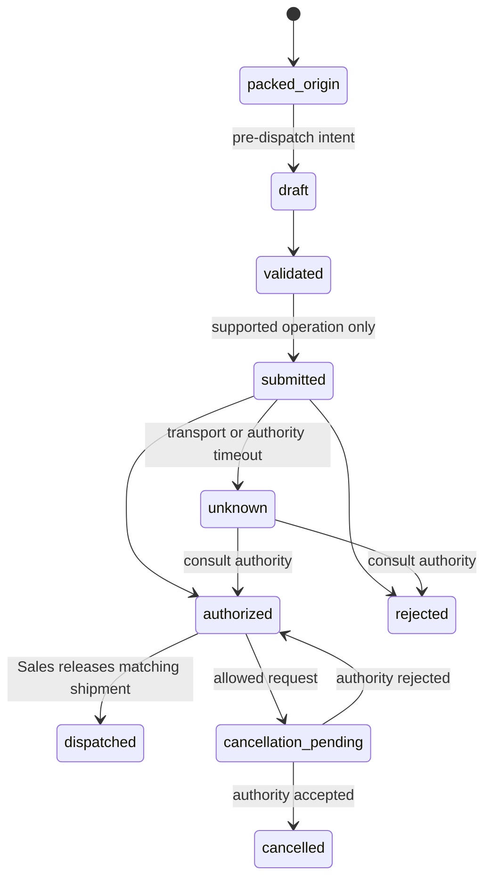
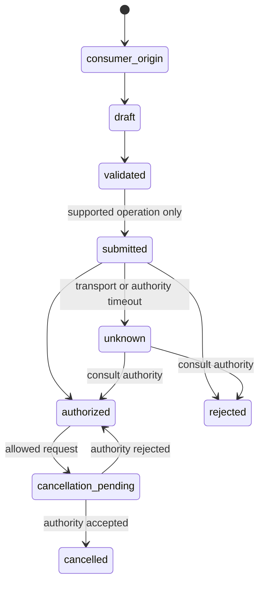
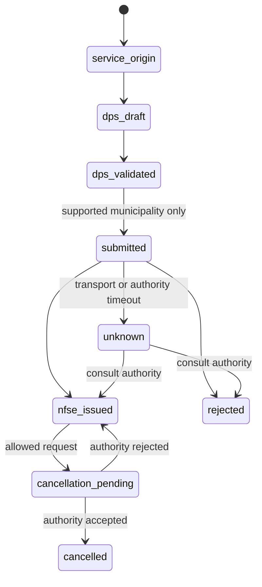

# 48. Fiscal origin and operational ownership

- Status: accepted for Phase 39 integration; authority gates activate with the relevant adapter
- Date: 2026-09-21

## Context

Sales currently publishes `sales.shipment.dispatched` and `sales.invoicing.requested`
in one transaction, with the same shipment id. Inventory consumes the dispatch for stock;
Financial consumes it for the receivable. Procurement's recorded receipt similarly owns
the inbound stock and payable effects. These existing effects cannot be repeated when a
fiscal document is authorized or when a supplier XML is imported. A model 55 NF-e for
goods may need authorization before dispatch, while existing orders and dispatches were
created before Fiscal existed.

## Decision

Fiscal owns the document, its authority exchange, artifacts, status and linked fiscal
events. Sales owns the shipment and its dispatch/return facts; Procurement owns the
purchase receipt and return facts. Inventory and Financial continue consuming those
operational facts, never Fiscal authorization or inbound XML as an independent movement
or title. A cancellation does not erase a dispatch or a posted title; an allowed
operational reversal is a separate command and event under ADR 0042.

| Operation | Stock fact and owner | Money fact and owner | Fiscal state owner |
|---|---|---|---|
| Sales confirmation | `sales.order.confirmed` reserves stock in Inventory | Financial projects the agreed receivable forecast; no posted title | None yet |
| Sales delivery, including each partial delivery | `sales.shipment.dispatched` consumes the reservation in Inventory | The same dispatch posts its share of the receivable in Financial | Fiscal creates one blocked intent from `sales.fiscal-origin.recorded`; later authority state belongs to Fiscal |
| Sales return | `sales.shipment.returned` restores stock in Inventory | The same return reverses its posted share in Financial | Fiscal records a distinct return origin; cancellation or credit document never creates another stock or money effect |
| Procurement receipt | `procurement.receipt.recorded` adds stock in Inventory | The same receipt posts the payable in Financial | Fiscal may link the supplier XML after matching; XML import does not post a second receipt |
| Procurement return | `procurement.receipt.returned` reverses stock in Inventory | The same return reverses the payable in Financial | Fiscal records or links the return document without another operational reversal |

For a consumer service transaction such as national NFS-e, the service-delivery fact
must be named by its owning business module before Fiscal creates an intent. No stock
effect is inferred for a service. Model 65 keeps the same separation between the
consumer-sale fact and the authority document, with its own capability and state
machine.

Every fiscal draft is keyed by `(tenant_id, origin_module, origin_type, origin_id,
purpose)`. For a Sales delivery, `origin_id` is the shipment id, not the order id;
partial deliveries therefore have separate origins. The current Sales model permits
one full return per shipment, so that return uses the shipment id with purpose `return`.
If Sales later permits partial or multiple returns against one shipment, each return
must get its own immutable operation id before it publishes a fiscal origin. Other
purposes such as complement and remittance require their own contracts and origin
rules. Procurement inbound XML is keyed by
the supplier's access key and matched to a receipt rather than treated as a new receipt.
Fiscal enforces both origin uniqueness and external access-key uniqueness in its own
database; the inbox deduplicates delivery of messages. A retry reuses the draft and
authority request identity. Unknown authority outcomes are consulted by access key or
provider identifier before another transmission. An operator cannot mark an unknown
response authorized by hand.

`sales.invoicing.requested` version 1 remains a legacy post-dispatch trigger: its
`shipmentId` is mandatory for Fiscal's delivery origin even though the published v1
schema marks it optional for historical consumers. An event without a shipment id is
quarantined for reconciliation, never assigned the order id as an approximate origin.
Existing dispatched shipments enter Fiscal by replay or an owner-provided, paginated
backfill of Sales events, with the same origin key. A migration never replays an
Inventory or Financial effect. Before model 55 authorization gates ship, Sales must
introduce a pre-dispatch invoicing intent from a frozen, packed delivery and block the
dispatch command until the matching authorized status is projected. That change needs a
new contract and a rollback strategy; Fiscal's simulated status cannot release the gate.
For legacy and unsupported operations, the current post-dispatch workflow remains
explicitly marked unsupported for legal issuance until an approved operation path exists.
The operational sequence for old shipments is recorded in the
[Phase 39 migration runbook](../fiscal-phase39-migration.md).

The same rule applies separately to model 65 and national NFS-e. Each gets its own
precondition and authority status machine; sharing the fiscal origin key does not make
authorization, contingency or cancellation rules interchangeable.

The following diagrams define separate *internal* minimum states. Transitions involving
an authority are disabled until the exact model, jurisdiction, operation, environment
and adapter capability is approved. They do not claim a legal contingency route or
deadline; those require the model's reviewed source and adapter fixtures.

### NF-e model 55: goods delivery

Sales retains the packed shipment on rejection or unknown outcome. Existing dispatched
shipments enter a separate retrospective review path; they cannot be passed through the
new pre-dispatch gate retroactively.

### NFC-e model 65: consumer sale

Model 65 has its own authority protocol and eventual contingency design; no model 55
authorization result or deadline is reused for a consumer sale.

### National NFS-e: service provision

A late rejection keeps the order and packed goods available for
correction; a late cancellation after dispatch triggers an explicit Sales review and
never moves stock or money on its own.

## Consequences

- A delivery, return or receipt has one owner for each stock and financial effect.
- The authority response is a durable observation; timeout is an unknown state, not a
  rejection or permission to issue another number.
- Preexisting shipped orders retain their historical commercial and financial facts.
  Fiscal may link an imported/retrospective document only after operator review.
- The pre-dispatch gate cannot be enabled until the simulator, status projection and
  relevant homologation tuple have passed the Phase J release gates.
