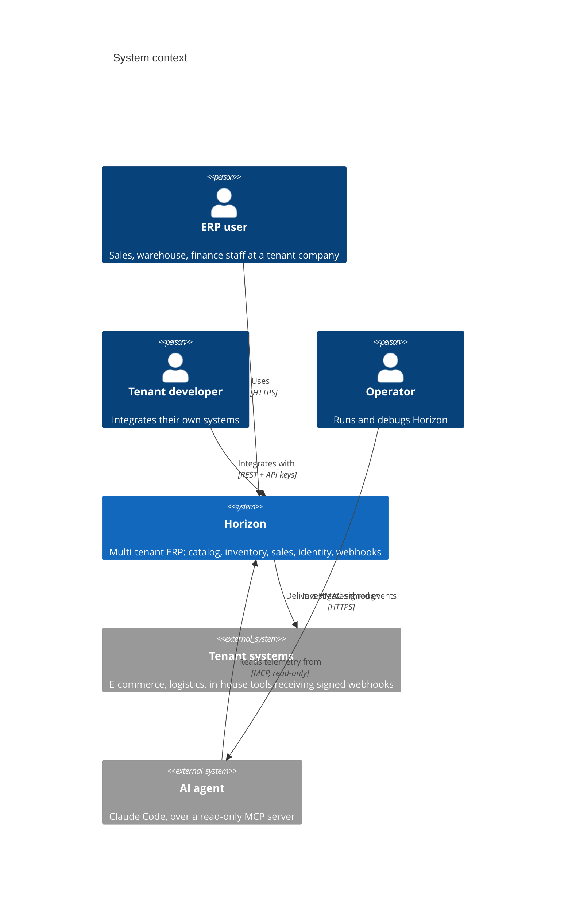
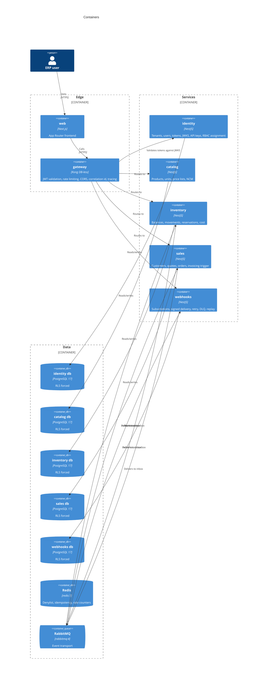

# Architecture

Horizon is a general-purpose ERP built as five independently deployable services
behind an API gateway, each with its own database, communicating over HTTP and
asynchronous events.

This document explains the choices a reviewer would question, and **what each one
costs**. Every decision has a corresponding ADR in [`adr/`](adr/) with the full
rationale and the alternatives that were rejected; this is the connected argument.

---

## The system





---

## Why no workspace

Ten projects in one repository, and **no pnpm workspaces, no npm workspaces, no
Turborepo**. Each folder has its own `package.json`, lockfile, `node_modules`,
`tsconfig.json` and `Dockerfile`, and behaves as if it lived in a separate repository
that happens to be vendored side by side.

The reason is that workspace tooling makes the system easy to read *and* easy to
accidentally couple. Under a workspace,
`import { Money } from '../../catalog/src/domain/money'` typechecks, runs, passes CI,
and is discovered only when someone tries to deploy `sales` without `catalog`. The
tooling that makes a monorepo pleasant is the same tooling that dissolves the boundary
the architecture depends on.

Without a shared resolution root, that import has nowhere to resolve. The mistake
becomes a compile error instead of a deployment surprise. Four mechanisms enforce it,
at four different costs — `rootDir` in seconds, `scripts/check-boundaries.mjs` in
seconds, the Docker build context in a minute, and a CI job with a **sparse checkout of
only that directory** in a few minutes. The last is the strongest test available: the
siblings are not on disk.

**What it costs.** Ten dependency trees to patch, ten lockfiles that drift, slower
installs, more disk, and no single command that builds everything — the root `Makefile`
shells out per project rather than sharing a task graph. Shared code is genuinely
duplicated: the tactical DDD kernel is copied into each module and permitted to
diverge. That is the price of the boundary, and it is paid deliberately.

→ [ADR 0001](adr/0001-single-repository-of-independent-projects.md),
[ADR 0002](adr/0002-mechanical-enforcement-of-module-boundaries.md)

### Project profiles

"Each folder is an independent project" is a rule about **self-containment**, not a
demand that every folder hold the same files. A Kong configuration directory has no
use for a Drizzle config, and `contracts/` ships to a registry rather than to a
container.

| Project | package.json | tsconfig | Biome | Vitest | Drizzle | Dockerfile | .env.example |
|---|:--:|:--:|:--:|:--:|:--:|:--:|:--:|
| `identity/` `catalog/` `inventory/` `sales/` `webhooks/` | ● | ● | ● | ● + e2e | ● | ● | ● |
| `web/` | ● | ● | ● | ● | — | ● | ● |
| `contracts/` | ● | ● | ● | ● | — | — | — |
| `tooling/mcp-debugger/` | ● | ● | ● | ● | — | — | ● |
| `gateway/` | scripts only | — | — | — | — | — | — |
| `infra/` | scripts only | — | — | — | — | — | — |

`gateway/` and `infra/` carry a minimal `package.json` so the root `Makefile` can call
them uniformly. Their real tooling is `deck` and `terraform`, which are Go binaries, not
npm packages.

---

## Why a database per module

Five services sharing a database are not five services. A shared schema means a
migration in one module can break another, a slow query in one exhausts the connections
of all, and any module can read — and eventually write — another's tables. The boundary
enforced in source would be undone in persistence.

So: **one PostgreSQL database per module.** No cross-module join, no shared table, no
foreign key across a boundary, and no read access to another module's database, not
even read-only for reporting. Data another module needs arrives through an HTTP call or
a local projection built from events.

**What it costs.** Referential integrity across contexts is not enforced by the
database: `sales` holds a `product_id` that `catalog` owns, and nothing at the storage
layer prevents it dangling. Deletions become soft and event-driven, and each module
validates references at the point of use. Reporting across modules needs a consumer that
builds a read model — it is a module, not a query. And writing to two modules is not
atomic, which is the entire reason the next section exists.

→ [ADR 0016](adr/0016-one-database-per-module.md)

---

## Why Row-Level Security rather than a `WHERE` clause

Tenant isolation implemented as `WHERE tenant_id = $1` is a guarantee that must be
re-established in every query, forever, by every author. It fails silently — the query
returns rows, the test passes, and the leak is found by a customer — and it cannot be
audited except by reading every query ever written.

Horizon puts the guarantee in PostgreSQL: `tenant_id` on every business table, RLS
**enabled and forced**, an application role holding neither `SUPERUSER` nor
`BYPASSRLS`, migrations under a separate owner role, and policies comparing against
`current_setting('app.current_tenant')`.

The application side is made structurally unavoidable rather than conventionally
encouraged: **the Drizzle client is not exported from the module that constructs it.**
Only the transaction runner is. A repository has no reachable path to an unscoped
connection, so "forgot to scope the query" is not a state the code can be in. Every
request opens a transaction and issues `SET LOCAL app.current_tenant` first; `SET LOCAL`
is transaction-scoped, so a pooled connection cannot carry a tenant into the next
request.

The failure mode inverts. A forgotten filter returns *nothing* instead of returning
someone else's data. If the tenant is unset, `current_setting` raises and every query
fails — no tenant context means no data, never all data.

**What it costs.** A `SET LOCAL` per transaction and a policy evaluation per row, kept
cheap by composite indexes that always lead with `tenant_id`. Genuinely cross-tenant
work — a platform migration, a support tool — needs a separate role and a separate
audited code path, because there is no admin bypass in the application role. Background
workers set tenant context per unit of work, never per batch.

→ [ADR 0017](adr/0017-row-level-security-and-tenant-aware-transaction.md)

---

## Why a transactional outbox

With a database per module, a state change and its announcement live in two systems.
The obvious implementation is:

```ts
await db.transaction(...)      // commit the order
await rabbit.publish(event)    // tell everyone
```

Those are not atomic. A crash between the two lines commits the order and loses the
event permanently, with no error and no way to detect it afterwards — inventory is never
told to reserve stock, and the order sits confirmed and unfulfilled. Publishing first is
worse: the event then describes a state that may never exist.

This is not an edge case; it is the default behaviour of the obvious code. So the domain
change and an `outbox` row are written **in the same transaction**, and a relay polls
undispatched rows with `FOR UPDATE SKIP LOCKED` — which lets multiple replicas run
without coordination — publishes, and marks them dispatched.

The relay can publish and then crash before marking, so delivery is **at-least-once**.
That is accepted rather than fought, because exactly-once delivery over a network does
not exist. Every consumer therefore writes an `inbox` row, unique on
`(source_module, event_id)`, **inside the same transaction as the effect**. A duplicate
violates the constraint, the transaction rolls back, the message is acknowledged, and
the effect happened exactly once.

**What it costs.** Publication is asynchronous, so there is a delay between commit and
delivery bounded by the poll interval — exposed as an `outbox_lag` metric with the oldest
undispatched row's age. Two extra tables and a background process per module, both with
retention policies. And ordering is not guaranteed across aggregates: where it matters,
the event carries a per-aggregate sequence number and the consumer rejects out-of-order
arrivals, rather than assuming the broker preserves order.

→ [ADR 0024](adr/0024-transactional-outbox-and-inbox.md)

---

## Why crypto-shredding

Two requirements of this system are, taken literally, mutually exclusive.

LGPD Art. 18 and GDPR Art. 17 give a data subject the right to erasure. The audit log is
append-only and hash-chained per tenant, so that tampering is detectable by anyone with
read access — including an auditor who does not trust the operators. Deleting a row
breaks the chain. Modifying a row breaks the chain. The chain's entire value is that it
cannot be altered, which is precisely what erasure demands.

Neither requirement can be dropped, so the resolution is to **destroy the key, not the
row**. Personal data columns are encrypted with a per-data-subject key held in a
`data_subject_keys` table (KMS in the Terraform definition). Erasure destroys the key.
The ciphertext stays byte for byte where it was, the hash chain still verifies because
nothing it hashed changed, and the plaintext is unrecoverable by anyone including the
operator. What survives is the *shape* of history — that an entity existed, that an
action occurred — with the personal content cryptographically destroyed.

It also handles backups correctly, which a `DELETE` cannot: a `DELETE` does not reach
yesterday's backup, so restoring it resurrects the erased subject. Under
crypto-shredding the backup holds ciphertext whose key exists nowhere, so a restore
resurrects nothing.

**What it costs.** This is the expensive one. **Encrypted columns cannot be indexed,
searched, sorted or joined.** Logging in by email address — an exact-match lookup on
personal data — is impossible against ciphertext, so a **blind index** is stored
alongside: a keyed HMAC of the normalised value, supporting exact match and nothing
else, dropped at erasure along with the key. Range queries and partial matches on
personal data are simply unavailable, and the schema is designed around that rather than
working around it. Key management becomes load-bearing: losing a key is an unintentional
erasure. Every read of personal data costs a key fetch and a decryption, cached per
request and never across requests.

It also constrains the future: a model trained on personal data does not forget a subject
when their key is destroyed, so the erasure guarantee would be silently broken by the
model's existence. That consequence is recorded in [`roadmap.md`](roadmap.md) under
Fine-tuning rather than discovered later.

→ [ADR 0026](adr/0026-crypto-shredding-for-erasure.md),
[ADR 0025](adr/0025-append-only-audit-log-with-hash-chain.md),
[`privacy.md`](privacy.md)

---

## Why EdDSA rather than RS256

Access tokens are verified on every request, twice — at Kong, and again locally by the
receiving service, because `TRUST_GATEWAY_JWT` is `false` by default and a service
reached directly on its port should not be defenceless.

RS256 is the right choice when unknown third parties must verify tokens with legacy
libraries. Horizon has no such consumer: the only verifiers are Kong and Horizon's own
modules. Third-party access uses API keys, a separate mechanism entirely. So the
compatibility RS256 buys has no buyer, while its costs are real — a 256-byte signature on
every request, slower signing, and the RSA padding attack surface.

Ed25519 gives a 32-byte public key, a 64-byte signature, roughly an order of magnitude
faster signing, deterministic signatures with no nonce to reuse (which is what rules out
ECDSA), and no padding at all. Key generation is instant, which makes rotation cheap
enough to actually practise.

**What it costs.** Anything that can only verify RS256 cannot consume these tokens.
Nothing needs to; a future integration that did would get an API key. And every verifier
must pin `alg` to `EdDSA` — a verifier that trusts the token's own header accepts `none`.
That is a test case, not a comment.

→ [ADR 0018](adr/0018-eddsa-access-tokens.md)

---

## Where the deliberate weaknesses are

Two, stated here so neither is later mistaken for an oversight.

**Revocation fails open for reads.** The `jti` denylist lives in Redis. When Redis is
unreachable, privileged operations fail closed and read-only ones fail open — so during a
Redis outage, a token revoked in the last 15 minutes can still read. The window is
bounded by the access-token lifetime, the exposure is limited to what that token's owner
could already read, and nothing can be changed. The alternative is a total product outage
on every Redis blip, which is a worse expected outcome for an ERP where a read-only
degraded mode is useful and a write-blocked one is safe. The behaviour is tested with
Redis stopped, and every fail-open decision is logged so an outage's exposure is
measurable rather than estimated.
→ [ADR 0021](adr/0021-redis-jti-denylist-asymmetric-failure.md)

**Roles are not editable per tenant.** Tenant-configurable roles are the expected ERP
feature and a permanent liability: permission checks become unanalysable and no test can
enumerate the reachable states. Horizon's roles are static and declared in code, so the
entire permission surface is readable from source in a few minutes. A role change is a
deployment, not a support action. That is a product constraint, documented as a decision.
→ [ADR 0023](adr/0023-casl-static-module-scoped-roles.md)

---

## Reading order

| Question | Document |
|---|---|
| What is being built, in what order | [`plan.md`](plan.md) |
| What is declared but deliberately unbuilt | [`roadmap.md`](roadmap.md) |
| Why each decision, and what was rejected | [`adr/`](adr/) |
| How a pattern is reimplemented in a new module | [`patterns/`](patterns/) |
| Brazilian fiscal terms | [`glossary.md`](glossary.md) |
| Lawful basis, retention, erasure | [`privacy.md`](privacy.md) |
| Which conventions came from the reference project | [`reference-analysis.md`](reference-analysis.md) |
