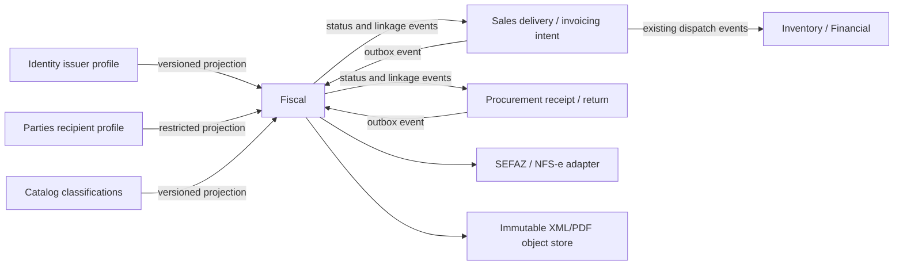

# Fiscal implementation plan — Phase J

Status: Phases 39 and 40 delivered; later phases planned. Reviewed against the repository and official technical portals on
2026-09-21. This document is the execution plan for phases 39–48 in
[plan.md](plan.md); it is not a statement that Horizon can legally issue any document.

## Outcome and boundaries

Build a `fiscal/` context that can explain a tax calculation, preserve the exact rules
and input used for it, manage the lifecycle of NF-e, NFC-e and NFS-e documents, import
supplier XML, and reconcile fiscal facts with the operational facts already owned by
Sales, Procurement, Inventory and Financial. An authority adapter must prove each
supported issuer, document model and jurisdiction in homologation before the product
offers production transmission for that combination.

The phase does not include SPED filings, CT-e/MDF-e, a nationwide promise for every
SEFAZ or municipality, a general tax advice engine, or the service contract and recurring
billing workflows of Phase K. New document models and jurisdictions enter the capability
matrix only after their own evidence gate.

### Sources that control implementation

The working [source register](fiscal-source-register.md),
[capability matrix](fiscal-capabilities.md) and
[fiscal-origin decision](adr/0048-fiscal-origin-and-operational-ownership.md) and
[restricted-projection design](adr/0049-restricted-fiscal-profile-projections.md) are the
Phase 39 records. Missing artifact versions and evidence keep every adapter unsupported.

Keep a source register in `docs/` until `fiscal/` exists, then ship its referenced
fixtures with the service. Record the retrieved file, URL, publication date,
effective date, checksum, XSD version, test fixtures and the capability that depends on
it. Recheck the register before each adapter release and when an official technical note
changes. Never infer validity from an old PDF copied into source control.

| Subject | Official source to monitor | Planning consequence |
|---|---|---|
| NF-e/NFC-e | [Portal NF-e manuals](https://www.nfe.fazenda.gov.br/PORTAl/listaConteudo.aspx?AspxAutoDetectCookieSupport=1&tipoConteudo=ndIjl+iEFdE%3D), [current technical notes](https://www.nfe.fazenda.gov.br/portal/consultaRecaptcha.aspx/listaConteudo.aspx?AspxAutoDetectCookieSupport=1&tipoConteudo=04BIflQt1aY%3D), [XML schemas](https://hom.nfe.fazenda.gov.br/Portal/listaConteudo.aspx?AspxAutoDetectCookieSupport=1&tipoConteudo=BMPFMBoln3w%3D) | Version XML generation, validation and authority behavior per model and environment. The MOC distinguishes models 55 and 65; they must have separate capability tests. |
| NFS-e national system | [production documentation](https://www.gov.br/nfse/pt-br/biblioteca/documentacao-tecnica/documentacao-atual), [homologation documentation](https://www.gov.br/nfse/pt-br/biblioteca/documentacao-tecnica/producao-restrita), [API environments](https://www.gov.br/nfse/pt-br/biblioteca/documentacao-tecnica/apis-prod-restrita-e-producao) | Treat production and test layouts, DPS and events as versioned artifacts. Check the enabled route for each municipality and issuer before claiming coverage. |
| IBS/CBS transition | [Receita Federal 2026 guidance](https://www.gov.br/receitafederal/pt-br/acesso-a-informacao/acoes-e-programas/programas-e-atividades/reforma-tributaria-do-consumo/orientacoes-2026), [document timeline](https://www.gov.br/receitafederal/pt-br/acesso-a-informacao/acoes-e-programas/programas-e-atividades/reforma-tributaria-do-consumo/orientacoes-da-reforma-tributaria) | Rule and layout versions have effective dates. The engine must retain simultaneous legacy and IBS/CBS results where the applicable source requires them. Do not hardcode a transition schedule into code. |
| Tax identifiers | [Receita Federal CNPJ alfanumérico](https://www.gov.br/receitafederal/pt-br/acesso-a-informacao/acoes-e-programas/programas-e-atividades/cnpj-alfanumerico/cnpj-alfa) | Existing numeric CNPJs remain valid, and new identifiers may contain letters. The current `parties/` and `identity/` numeric normalization must be expanded before fiscal issuance. |

These links identify the authority, not a frozen version. The first deliverable is a
reviewed support matrix with the exact source versions used by each release. A tax
specialist must approve the rule fixtures and scenario mapping; passing an XSD is not
proof that a tax result is correct.

## Repository facts and decisions required first

- `fiscal/` does not exist. The [new module checklist](patterns/new-module-checklist.md)
  and one-database-per-module rule apply. Port 3011 is reserved in
  [erp-expansion-plan.md](erp-expansion-plan.md).
- `sales.invoicing.requested` can be emitted on confirmation and can carry a shipment
  id. `sales.shipment.dispatched` and `procurement.receipt.recorded` already drive
  stock and Financial effects. Fiscal must establish one authoritative fiscal origin
  per delivery or operation, and must never publish a second stock or title effect just
  because XML was authorized or imported.
- `parties.party.registered/updated` deliberately omit tax identifiers, and the party
  address is free text. `identity/` has a structured issuer address and fiscal regime,
  but no municipality code or issuer-profile event. Fiscal needs a secure, event-fed
  projection of structured issuer and recipient data before it can freeze a document. Follow
  [ADR 0040](adr/0040-shared-party-registry.md): no synchronous Parties call in the
  document write path. Decide the minimal encrypted payload, restricted consumers,
  backfill and erasure handling in an ADR before adding the event.
- The existing financial title and stock movement remain owned by their modules.
  Authorization can release a blocked operational step only through a versioned event
  and an idempotent consumer. A late rejection or cancellation must preserve the
  original fiscal and operational records and use explicit compensations where allowed
  by the owning module, per [ADR 0042](adr/0042-posted-records-are-reversed.md).

### Proposed context boundary

The Sales dispatch gate is conditional on the documented operation: current Inventory
and Financial already process dispatch and receipt events. The integration ADR must
name which existing Sales command is delayed by fiscal authorization and which
Procurement facts are merely matched; Fiscal does not directly write their stores.

### Proposed public contract and persistence shape

Freeze names in phase 39, then publish them through `@horizon/contracts`. The initial
surface can be small; each command carries a tenant-scoped idempotency key and each list
is paginated. No response exposes certificate material or unrestricted recipient data.

| Surface | Initial purpose |
|---|---|
| `GET /fiscal/capabilities` | Exact model, issuer, jurisdiction, operation and environment support; show `unsupported`, `simulated`, `homologated` or `production-enabled`. |
| `POST /fiscal/calculations/preview` | Pure calculation and explanation, with source/rule version; no document or stock effect. |
| `POST /fiscal/documents`, `GET /fiscal/documents/:id` | Create one draft per stable origin and read its immutable snapshot and status timeline. |
| `POST /fiscal/documents/:id/validate`, `/issue`, `/cancellation-requests` | Explicit transitions; authority callbacks and polling use separate internal handlers. |
| `GET /fiscal/documents/:id/artifacts/:kind` | Authorized tenant-scoped XML, protocol or PDF download with content digest. |
| `POST /fiscal/imports`, `GET /fiscal/imports/:id`, `POST /fiscal/imports/:id/matches` | Stage inbound XML, review a proposed match and commit a reviewed fiscal link. |

The owning database needs unique keys for fiscal origin, issuer/model/series/number and
external access key, scoped by tenant and environment. `fiscal_documents` holds the
current state and immutable commercial/tax snapshot; append-only `fiscal_transitions`,
`authority_attempts`, `authority_events`, `fiscal_artifacts` and `inbound_matches`
explain how it got there. Rule versions and source packages have independent validity
windows and digests. External callbacks are recorded before state transitions and
deduplicated by provider event/protocol identity.

Candidate published events are `fiscal.document.authorized`,
`fiscal.document.rejected`, `fiscal.document.cancelled` and `fiscal.inbound.matched`.
Each names fiscal document id, origin ids, model, environment, authority reference,
effective instant and contract version. They carry no raw XML or certificate. Sales and
Procurement consume status/linkage; Inventory and Financial continue to consume their
existing operational events. The browser routes are `/app/fiscal/outbound`,
`/app/fiscal/inbound`, `/app/fiscal/rules` and `/app/fiscal/settings`, gated by the new
module roles and localized at the view boundary.

## Execution phases

Each phase ends with an executable vertical slice or a verifiable prerequisite. A later
phase may build on a simulator, but a simulated authorization is visibly labeled and
cannot enable production status, downloadable official documents, or shipment release.

### 39 — Source matrix, identities and choreography

**Work**

1. Record ADRs for: fiscal document ownership; the sales confirmation/dispatch/authorization
   sequence; which event creates or reverses each stock and financial effect; document
   origin uniqueness; and uncertain authority responses. Define separate state diagrams
   for model 55, model 65 and national NFS-e. Specify how a preexisting sale is migrated.
2. Build the source register and a capability matrix keyed by model, environment,
   issuer establishment, UF or municipality, operation and adapter version. Start every
   row as `unsupported`; `simulated`, `homologated` and `production-enabled` require
   progressively stronger evidence.
3. Expand tax identifier value objects, encrypted indexes, API validation and frontend
   CPF/CNPJ classification in `parties/`, `identity/` and the remaining legacy Sales
   paths for numeric and alphanumeric CNPJ, preserving existing identifiers. Add
   structured recipient address, issuer municipality code and registrations,
   recipient flags and effective-dated fiscal profile fields without changing historical
   snapshots. Use an expand/backfill/cutover migration where tables are populated.
4. Publish restricted issuer/recipient fiscal-profile changes and the missing catalog
   classification changes through versioned contracts. Backfill projections from owning
   services without reading their databases. Review sensitive event transport, encryption,
   logs, retention and erasure with the privacy model before release.
5. Correct the Sales fiscal trigger: one request per billable origin, including partial
   deliveries and returns. Define `origin = (module, document type, document id, purpose)`
   and a database unique key; a duplicate message or retry cannot create a second draft.

**Exit evidence:** Numeric and alphanumeric identifiers both round-trip through old and
new records; two events for one delivery create one fiscal intent; all supported
scenarios have a named owner for stock, receivable/payable and fiscal state. The
revised choreography passes the golden path and cross-tenant tests.

### 40 — Independent fiscal service and durable records

**Work**

1. Add `fiscal/` to `scripts/modules.json`, contracts roles, Identity tests, gateway,
   Compose, Terraform, CI module lists, Makefile, demo seed, web proxy and observability.
   Use port 3011 and exact-pin a new `@horizon/contracts` release in all consumers before
   granting a `fiscal` role. Proposed roles: `admin`, `issuer`, `reviewer`, `viewer`, with
   separate permissions for rules, transmission, cancellation, import and read.
2. Add tenant-scoped tables for issuer projections, party/item projections, rules and
   source packages, documents and lines, numbers, authority submissions/responses,
   fiscal events, attachment metadata, imports/matches, idempotency, outbox and inbox.
   Enforce tenant-leading uniqueness, same-tenant references, forced RLS, application
   and migration roles, audit hash chain and append-only post-issue history.
3. Define ports for `AuthorityGateway`, `FiscalArtifactStore`, `CertificateProvider`,
   `Clock` and `RulePackageRepository`. Ship deterministic simulators, a local encrypted
   artifact adapter for tests, and an S3-compatible object-storage adapter for deployment.
   Provision an encrypted business-document bucket, restricted service policy, backup/
   restore path and local Compose equivalent; this is separate from Terraform's state
   bucket. Store XML,
   response/protocol and PDF by tenant-scoped immutable key with digest, size, media
   type, source schema and creation instant; verify digest on retrieval. Certificates
   live behind a secret reference, never in the business database, logs or repository.
4. Define the document identity and numbering transaction. A concurrent pair of
   issuers cannot reserve the same `(tenant, establishment, environment, model, series,
   number)`. A timeout does not silently free a number; reconciliation determines the
   authority outcome first.

**Exit evidence:** Build, boundaries, RLS and cross-tenant tests pass; duplicate inbox
delivery and process crash cannot duplicate a document or number; artifacts survive a
service restart and are readable only by the owning tenant. No external authority is
contacted yet.

### 41 — Temporal tax rules with explanations

[Detailed Phase 41 execution plan](fiscal-phase41-implementation-plan.md).

**Work**

1. Import versioned source tables for CFOP, NCM/CEST, CST/CSOSN, IBS/CBS and service
   classifications as reference data with provenance and effective windows. Add
   issuer, item, party and operation profiles whose precedence is explicit. Reject
   overlapping rules of equal priority; never silently choose the first match.
2. Implement pure calculation over an immutable input snapshot: issuer and recipient
   fiscal facts, origin/destination, operation, model, issue/competence date, line
   quantity, scaled unit price and applicable classifications. Return line and document
   amounts as minor-unit `Money`, scaled rates, rounding mode, rule ids, source package
   digest and a human-readable explanation. Keep legacy and IBS/CBS components separate.
3. Persist the selected input, rule version and output when a document becomes ready.
   Replaying the same historical input later must use its recorded version even after
   a new rule package is activated. Rule edits create a successor version; they never
   rewrite a posted calculation. An exception or manual override requires a role,
   reason and audit entry.
4. Add `POST /fiscal/calculations/preview` and read-only explanation endpoints; preview
   cannot transmit or produce operational events. Build a fixture corpus reviewed by a
   fiscal specialist, including date boundaries, inter-state operations, returns,
   regime changes, rounding and missing classifications.

**Exit evidence:** Historical calculation is byte-for-byte reproducible; every amount
has an explanation and official source reference; unsupported tax scenarios fail with
an explicit code and cannot be transmitted. No floating-point tax path exists.

### 42 — NF-e model 55 lifecycle with a simulator

[Detailed Phase 42 execution plan](fiscal-phase42-implementation-plan.md).

**Work**

1. Create an outgoing draft from an explicit Sales origin or an authorized manual
   operation, freezing issuer, recipient, item, quantity, price and rule snapshots.
   Reconcile the commercial total with calculated fiscal totals; resolve mismatches
   before readiness. Record source order and shipment ids at line level.
2. Model `draft -> ready -> queued -> submitted -> authorized | rejected | unknown`.
   Model cancellation as a linked request and authority event, never an edit of the
   authorized XML. A rejected document can be corrected through a new signed attempt
   only according to the selected official specification. Every transition has actor,
   instant, reason where required, request id and authority correlation.
3. Generate and sign XML using the pinned official schema; validate before submission.
   Record the sent bytes, digest, submission and protocol separately. Create a DANFE
   rendering adapter from the authorized snapshot, with explicit preview watermark
   before authorization. Implement status lookup and retry after `unknown`, including
   the case where the authority accepted the document but the response was lost.
4. Expose draft/validate/issue/status/cancel/read APIs with HTTP idempotency and RFC 9457
   errors. Publish versioned fiscal status events only after durable local state.

**Exit evidence:** The simulator covers authorization, rejection, timeout after accept,
duplicate callback, cancellation, number collision and retry. For one Sales origin there
is at most one active fiscal document. The UI and API label the result `simulated`.

### 43 — One NF-e SEFAZ homologation path

[Detailed Phase 43 execution plan](fiscal-phase43-implementation-plan.md).

**Work**

1. Select one issuer/UF and one supported operation from the capability matrix. Pin
   its current MOC, technical notes, XSD, endpoints, certificate requirements and
   authority response fixtures. Implement a real adapter behind the port, with TLS
   certificate loading from a secret provider, schema validation, signed requests,
   bounded retries, timeouts, circuit breaker and a query-before-resend rule.
2. Run homologation cases for authorization, business rejection, temporary outage,
   uncertain result, consultation and cancellation. Archive redacted request/response
   evidence and protocol references. Do not log raw XML, tax identifiers or private keys.
3. Add a release gate for production credentials and issuer configuration, and an
   explicit operator-visible support matrix. Enable production transmission only for
   the exact tested tuple; other UFs and operations stay simulated or unsupported.

**Exit evidence:** A homologation round trip and reconciliation test pass against the
official environment. The adapter never treats a timeout as a rejection or resends an
uncertain document before consulting its status. Production remains disabled until the
exact tuple has its own evidence and operational runbook.

### 44 — Inbound XML and three-way reconciliation

**Work**

1. Accept uploaded XML through a size-limited streaming path; reject DTD/entity
   expansion, wrong schema/model, mismatched issuer/recipient, invalid key/digest and
   duplicate key with different bytes. Persist original bytes and import provenance.
   Validate signature and authority status through the capability adapter when
   supported; unverified imports remain explicitly marked.
2. Stage parsed supplier, lines, taxes, quantities and references. Match the supplier
   to a Party, items to Catalog, and quantities/values to Procurement order and goods
   receipt; show unmatched and conflicting lines for a reviewer. An import alone never
   adds stock or posts a payable: those effects already belong to
   `procurement.receipt.recorded` and Financial. Match by stable origin id, not by
   amount or date alone.
3. Support XML arriving before or after receipt; preserve both documents and the
   reconciliation decision. Publish only a fiscal-link event after review. Require a
   reason for a mismatch override and retain the original comparison.

**Exit evidence:** Reimport and broker replay create no second receipt/payable; a
partially received order can match one of several invoices; two tenants with the same
supplier key never see each other's XML; a conflicting duplicate is visible and blocked.

### 45 — Returns, remittance and complementary documents

**Work**

1. For each supported operation, define a document kind, reference to the original,
   allowed quantities/values, source Sales/Procurement event and required authority
   adapter capability. Keep the stock movement owned by Inventory and the title
   reversal owned by Financial; correlate their ids on the fiscal document.
2. Implement cancellation, correction and complement as model-specific event flows.
   A cancellation request is not a completed cancellation until the authority confirms
   it. If the authority refuses it, retain the authorized original and the refusal.
   Do not present a generic correction action for a model that lacks an approved flow.
3. Add link and conservation tests for partial returns and repeated requests: returned
   quantity cannot exceed the original, complementary value is independently recorded,
   and neither XML import nor fiscal cancellation can silently duplicate stock or money.

**Exit evidence:** Original and linked documents remain readable, every correction has
a reason, and replaying the complete event history yields the same quantities and
financial links. Unsupported document kinds cannot be issued.

### 46 — NFC-e model 65 as a separate capability

**Work**

1. Reuse the calculation and durable lifecycle foundations, but add model-65-specific
   inputs, numbering, XML, QR code, auxiliary rendering, credentials and authority
   responses according to the pinned current specifications. Do not copy a model-55
   XML generator and change only its `mod` field.
2. Add a cashier-style flow only after its underlying Sales/Inventory handoff is
   specified; one sale can produce one authorized consumer document and one stock/
   financial effect. Handle model-specific contingency in a separate bounded slice
   when its official rules and recovery test are available.
3. Simulate first, then homologate one issuer/UF tuple and publish the exact support
   matrix entry. Keep every other tuple disabled.

**Exit evidence:** Model 65 passes its own XSD, QR/rendering and authority-state
fixtures, including duplicate sale, outage and cancellation. The model 55 tests remain
unchanged and green.

### 47 — National NFS-e and municipal capability

**Work**

1. Add a service fiscal profile and competence date distinct from goods classification.
   Implement the national DPS, NFS-e and event adapters from the pinned production and
   homologation documentation. Model national-system identifiers, numbering,
   submission, consultation and supported cancellation/substitution events separately
   from NF-e. A service item can create a manually reviewed document now; Phase K later
   connects service orders and recurring contracts through idempotent origin events.
2. Resolve issuer/municipality capability from a versioned registry. Verify the chosen
   national-system path for the actual issuer, municipality and operation; a general
   municipality-adhesion statistic is not proof that a particular API operation works.
   Other municipal providers require their own adapters, fixtures and support rows.
3. Simulate, homologate one supported tuple, and reconcile a lost response by DPS or
   document identifier before retrying. Keep service tax and IBS/CBS source versions
   traceable in the explanation.

**Exit evidence:** One national NFS-e tuple has complete homologation evidence,
including issue, query and supported correction/cancellation; an unsupported
municipality cannot reach the transmission endpoint; duplicate contract-period events
in Phase K will map to one fiscal origin.

### 48 — Operator screens, rollout and support evidence

**Work**

1. Build screens alongside phases 41–47, then finish the complete workflow: rule
   preview and explanation; outbound drafts and status timeline; inbound XML review
   and matching; authority errors and retries; linked return/correction documents;
   document download; certificate expiry and capability settings. Keep all user copy
   in `pt-BR` and `en`, with machine values in English per ADR 0044.
2. Add metrics and alerts for queue lag, authorization latency, unknown outcomes,
   rejection codes, certificate expiry, XML validation failure, unmatched imports,
   object-store failures and source-package age. Provide bounded replay and manual
   reconciliation commands that cannot duplicate business effects.
3. Run the full quote/order -> fiscal authorization -> permitted dispatch -> stock and
   receivable path, and purchase XML -> receipt -> payable match, against local
   infrastructure with deterministic authorities. Run homologation suites only for
   configured live tuples. Publish a support matrix that names model, environment,
   issuer/UF or municipality, operation, adapter and evidence date.
4. Update the glossary, API/event docs, runbooks, threat model and backups. Verify
   certificate rotation, artifact restore and legal-retention configuration with the
   deployment owner; do not invent a universal retention period. Keep authorization
   evidence and original XML even when a later linked event changes the outcome.

**Exit evidence:** `make check`, module isolation, real PostgreSQL/RabbitMQ crash and
cross-tenant suites, the golden path, browser workflows, artifact restore and every
enabled homologation matrix row pass. The product never calls a simulated document
authorized and never advertises an untested jurisdiction.

## Cross-phase invariants and release gates

| Invariant | Proof |
|---|---|
| A document has one fiscal origin and its authority state is not guessed | Database uniqueness, duplicate event and timeout-after-accept tests, status consultation before retry |
| A posted document is reproducible and immutable | Stored input, source package hash, rule ids, rounding mode, XML digest and append-only linked corrections |
| Fiscal cannot duplicate stock or money | Replay tests joining Sales/Procurement origin ids to one Inventory movement and one Financial title/reversal; no cross-database writes |
| Tenants and sensitive data remain isolated | Forced RLS and cross-tenant tests for every table/object; restricted projection events, certificate secret references and redacted logs |
| A capability is truthful | A matrix row starts unsupported, simulator output is labeled, homologation evidence is retained, production is scoped to the tested tuple |
| Tax classifications change without rewriting history | Effective-dated rules and reference tables; old fixtures recalculate under their saved source version |

The order above is a dependency order, not a promise of legal coverage by a date. A
source change may require a new rule package or adapter release before a later phase
can be marked complete. Phase J closes only when every feature claimed as supported has
the corresponding executable evidence; unsupported cases remain visible to operators.
