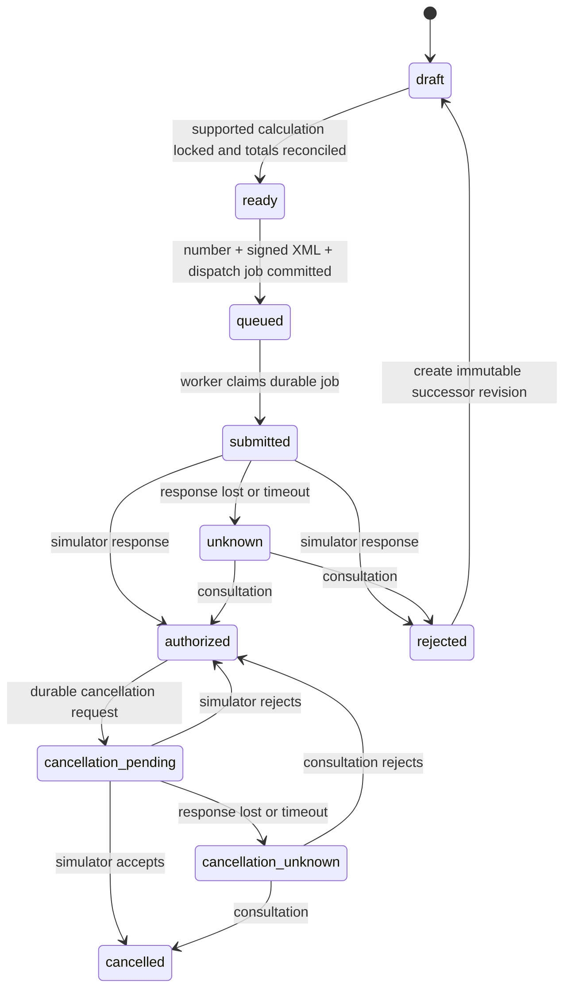

# Phase 42 — NF-e model 55, simulated end to end

Status: **planned on 2026-09-22**. This is the executable plan for
[Phase 42 in the fiscal roadmap](fiscal-implementation-plan.md#42--nf-e-model-55-lifecycle-with-a-simulator).
Phase 40 delivered durable Fiscal documents, number reservations, authority/cancellation
attempts, immutable artifacts and a deterministic transport simulator. Phase 41 delivered
the approved calculation fixture, frozen calculation binding and historical replay. Phase
42 connects those foundations into one complete NF-e model 55 simulation lifecycle.

No homologation or production SEFAZ call is part of this phase. A successful result is a
**simulated authorization**, is visibly marked as such in every API response and rendered
artifact, and cannot release a Sales shipment. The first real SEFAZ adapter and the
pre-dispatch operational gate remain Phase 43 work.

## Result and narrow supported tuple

For one reviewed normal-sale scenario, an authorized issuer can create an NF-e model 55
draft from an immutable Sales fiscal origin or a restricted manual simulation origin,
bind and verify its Phase 41 calculation, reserve exactly one number, generate schema-valid
XML, sign it with a simulation-only credential, submit it to a deterministic simulator,
consult an uncertain result and request cancellation. Horizon retains the exact XML,
request, response, protocol and DANFE bytes with SHA-256 digests and an auditable state
history.

The only tuple eligible to become `simulated` is the Phase 41 approved scenario:

- model `55`, environment `simulation`, normal-regime intrastate SP sale;
- NCM `09012100`, issue date in the reviewed 2026 interval;
- the exact issuer establishment configured by the local rollout;
- issue, status consultation and cancellation through the Phase 42 simulator adapter;
- rule fixture `rtc-v0057-model55-normal-sale-sp-2026-01` and its recorded source package.

All other models, environments, issuers, jurisdictions, operations and classifications
remain `unsupported`. A calculation fixture does not by itself enable authority operations:
the exact capability row advances to `simulated` only after the XML, lifecycle and rollout
evidence in this plan pass.

## Starting point and gaps

- `FiscalDocuments` already creates an encrypted draft from one tenant-owned Sales intent,
  stores immutable line digests and reserves a number concurrently. Draft creation still
  accepts models other than 55 and is not yet gated by a capability row.
- No manual-origin aggregate exists. The manual simulation path needs its own immutable,
  tenant-scoped origin, actor/reason audit and owner-revision references; it must not be an
  API escape hatch for caller-supplied tax results or raw XML.
- `FiscalCalculations.lock` binds a supported calculation and moves a draft to internal
  `validated`. Phase 42 must expose that invariant as `ready`, reconcile commercial and
  fiscal totals, and prevent every later step without the exact binding.
- `FiscalLifecycle` currently moves `validated -> submitted -> authorized | rejected |
  unknown` directly and its in-memory simulator accepts only digests and numbers. It does
  not have a durable `queued` boundary, signed XML, access key, raw response/protocol
  artifacts, callback identity or public HTTP commands.
- The authority and cancellation tables are append-only and retry-safe for the Phase 40
  test simulator, but one attempt per document is not enough to represent a corrected
  rejected document without rewriting history. The correction model must be explicit.
- `FiscalArtifacts` can store `xml`, `response`, `protocol` and `pdf`, but artifact purpose,
  sequence, signed/authorized distinction and binding to an attempt are not represented.
- Public `validate`, `issue` and cancellation routes intentionally return `409`; the
  capabilities endpoint returns no supported rows. No status/consult command or status
  event contract is exposed.
- The source register hashes MOC 7.0 and multiple overlapping NF-e XSD packages. Phase 42
  must select one compatible schema set, pin its exact bytes and record the selection. A
  portal listing or an old checksum alone is not an adapter approval.

## Decisions frozen by this plan

1. **Simulation is a capability, not an environment shortcut.** The database capability
   key is `(model, environment, establishment, jurisdiction, operation, adapter version)`.
   Missing rows are unsupported. Only a reviewed active row can reach validation or issue.
2. **`ready` replaces the Phase 41 internal name `validated`.** An additive migration maps
   existing simulation `validated` rows to `ready`; API contracts use only `ready`. The
   calculation binding and its digest remain unchanged.
3. **Submission crosses a durable queue boundary.** `ready -> queued` atomically reserves
   the number, generates and persists the signed request artifact, and writes a dispatch
   job. A worker records `submitted` before external I/O. A crash from that point is
   reconciled by consultation, never blind resend.
4. **Rejected corrections are successor documents.** The rejected row, number, XML and
   responses remain immutable. A correction creates a new revision linked by
   `predecessor_document_id` and `root_document_id`; a partial unique constraint permits at
   most one nonterminal revision for an origin. It receives its own calculation binding,
   number, signature and request identity.
5. **Cancellation is a linked event workflow.** It never edits authorized XML. The request,
   reason, response and protocol are immutable and idempotent. A rejected cancellation
   returns the document to `authorized`; an uncertain cancellation remains consultable.
6. **Simulation never unblocks operations.** Simulated status events include
   `environment=simulation`, `simulated=true` and the capability/adapter version. Sales
   must not use them to release a shipment. No Inventory or Financial event is emitted.
7. **Manual means an audited simulation origin.** An `admin` or `issuer` may create it only
   for the active simulated tuple, selecting tenant-owned issuer, recipient and Catalog
   revisions and recording a reason. The stored origin is immutable and then follows the
   same calculation, XML, numbering and lifecycle path as a Sales origin.

## State machine and invariants

Every transition carries tenant, document, actor or system identity, occurrence instant,
command/idempotency key, reason where applicable, correlation ID and structured detail.
The current row is a projection guarded by the append-only transition history. Database
constraints reject skipped or reversed transitions and reject mutation of fiscal facts.

The following invariants hold in the database and application layer:

- one active document revision per fiscal origin, with every historical revision retained;
- one number per document and one document per issuer/environment/model/series/number;
- one access key per tenant/environment and a check digit verified before signing;
- one canonical signed XML digest per issuance attempt;
- a `ready` document has one supported frozen calculation whose input matches the document;
- a queued/submitted document cannot acquire a different calculation, number or XML;
- a final authority observation cannot be replaced by a conflicting callback or poll;
- `unknown` and `cancellation_unknown` can only progress through consultation;
- cancellation requires a simulated authorization and the same active capability row;
- every byte-returning artifact lookup is tenant-scoped and digest-verified.

## Work packages and order

| Step | Deliverable | Dependencies | Required evidence |
|---|---|---|---|
| 1. Source and capability freeze | Machine-readable manifest for the selected MOC, technical notes, XSD files, signature profile, adapter version and the exact simulated issuer/SP tuple. | Phase 41 package | Official byte digests, schema inventory, reviewer, selection rationale and fixture IDs. |
| 2. Public contracts | Versioned document/status/artifact/capability commands, results, problems and fiscal status events in `@horizon/contracts`. | 1 | Registry tests, exact consumer pins and backward-compatibility check. |
| 3. Persistence/state upgrade | Add `ready`, `queued`, cancellation uncertainty, revisions, access keys, dispatch jobs, attempt observations and artifact bindings through forward migrations. | 2 | Migration, immutability, RLS, uniqueness and concurrent-transition tests. |
| 4. NF-e XML and signature core | Pure deterministic model-55 access-key, canonical XML, XSD validation and XMLDSig pipeline with a simulation credential provider. | 1–3 | Golden bytes/digests, schema tests, signature verification and mutation-negative fixtures. |
| 5. Readiness orchestration | Build calculation input from frozen projections, lock the approved calculation, reconcile totals and transition `draft -> ready`. | 2–4 | Boundary, mismatch, unsupported, retry and cross-tenant tests. |
| 6. Durable issue worker and simulator | Queue, submit, store observations/artifacts, recover crashes, consult unknown outcomes and deduplicate callbacks. | 3–5 | Authorization, rejection, accepted-then-timeout, restart and duplicate-delivery tests. |
| 7. Cancellation and corrected revision | Durable cancellation consultation and immutable successor flow for rejected issuance. | 3–6 | Accepted/rejected/unknown cancellation and one-active-revision tests. |
| 8. API, events and DANFE | Enable scoped HTTP commands/read models, status timeline, artifacts, simulated events and watermarked rendering. | 2–7 | Auth/idempotency/API/event tests; no shipment, stock or money side effects. |
| 9. Local rollout | Activate one simulation capability, run the approved origin end to end, restore artifacts and exercise rollback. | 1–8 | CI, Docker/Kong smoke, database counts/digests and Phase 42 evidence record. |

Steps 2 and the pure portions of step 4 can proceed together after the source selection.
No route or capability row is activated before steps 1–8 pass.

## Source, XML and signature gate

Create `docs/fiscal-phase42-source-manifest.json` with the exact selected archive and each
consumed XSD's relative path, size and SHA-256. Record the MOC and technical-note digests,
retrieval time, publication/effective information, namespace versions, signature profile,
adapter version and reviewer. Retain official bytes in a content-addressed local artifact
path and verify them before tests or rollout. If the current `PL 010f` and `PL 010d`
contents cannot be combined unambiguously for the chosen 2026 simulation date, stop the
capability at `unsupported` until the selected schema set is reviewed.

Build the XML pipeline as pure stages:

1. `FrozenDocument + FrozenCalculation + ReservedNumber -> NFeModel55Data`;
2. construct the 44-digit access key and verify its modulo-11 check digit;
3. serialize deterministic UTF-8 XML with stable namespace, element order and decimal/date
   formatting; reject rather than omit required fiscal facts;
4. validate the unsigned document against the pinned XSD set;
5. sign the required NF-e element using the configured XMLDSig algorithms and a
   simulation-only key exposed through `CertificateProvider`;
6. verify the signature independently, validate signed XML again where applicable, then
   persist the exact bytes before queue publication.

The private key and certificate bytes never enter PostgreSQL, logs, fixtures, API bodies or
Git. Local tests generate or load a clearly named simulation credential from the existing
secret path. Logs may contain document ID, access-key suffix and artifact digest, not raw
XML, taxpayer identifiers or key material.

Golden fixtures cover accents/UTF-8, alphanumeric CNPJ where selected schemas permit it,
decimal scale, totals, optional-element omission, invalid check digit, schema failure,
signature mutation and stable byte generation. The fixture's tax totals must equal its
Phase 41 canonical calculation, not a second implementation of tax formulas in the XML
builder.

## Persistence changes

Use forward migrations after Phase 41 migration `0018`; do not rewrite delivered
migrations. The exact table split may follow repository naming, but it must represent:

- capability rows and activation evidence, including adapter/schema/source digests;
- immutable manual origins with actor, reason and exact owner-projection revisions;
- document revision/root/predecessor identity and terminal/active uniqueness;
- access key, calculation binding and commercial-versus-fiscal reconciliation digest;
- append-only issuance and cancellation commands/observations with provider correlation,
  raw-artifact digests and observation kind (`response`, `callback`, `consultation`);
- durable dispatch/reconciliation jobs with lease, attempt count and next-attempt time;
- artifact purpose and owning attempt/event (`unsigned_xml`, `signed_xml`, request,
  response, authorization protocol, cancellation request/protocol and DANFE);
- a tenant-scoped inbox/deduplication key for simulated callbacks and an outbox for public
  status events.

All tenant data has forced RLS and tenant-leading foreign/unique keys. Artifact metadata,
attempts, observations, transitions, calculation bindings and final documents are
append-only. Mutable worker leases and delivery markers are isolated from immutable
business evidence. An artifact row becomes visible only after its bytes are durably stored;
orphan-byte cleanup must never delete an object referenced by metadata.

## Readiness and total reconciliation

`POST /documents/:id/validate` is the only public command that can make a draft `ready`.
Under one tenant-scoped transaction it:

1. verifies model 55, simulation environment and the exact active capability tuple;
2. loads and verifies the encrypted Sales/manual origin, issuer, recipient and item
   revisions;
3. derives the Phase 41 calculation input without accepting caller-supplied fiscal facts;
4. locks or selects the identical approved calculation binding;
5. compares line and document commercial totals to the calculation bases/totals using
   explicit reconciliation fields and reviewed tolerances (zero unless a source says
   otherwise);
6. appends the transition/audit and returns the frozen digests.

A retry with the same idempotency key returns the original result. A different request
digest, changed owner revision, unsupported rule, missing classification, ambiguous rule or
total mismatch returns a stable RFC 9457 problem and leaves the document in `draft`. There
is no manual flag that turns an unsupported calculation into ready.

## Issue, uncertainty and callback rules

`POST /documents/:id/issue` does not call the adapter on the HTTP thread. It atomically
creates or returns the issuance command, reserves a number, builds/stores signed XML,
transitions to `queued` and commits a dispatch job. The response is `202 Accepted` with the
document, status URL and immutable command ID.

The worker claims a job with database locking, persists the attempt and `submitted`
transition, then calls the adapter. Each adapter result contains structured status/code,
provider correlation and raw response/protocol bytes. Those bytes are stored and verified
before the final status and outbox event commit. If the call throws, times out, the process
dies after sending, or response persistence is incomplete, the document becomes/remains
`unknown`; the next job calls `consult` by access key/correlation. It never creates a new
number, signed XML or submit identity. If consultation definitively proves that no request
exists (including a crash after the local `submitted` commit but before I/O), the worker may
resend the exact same signed bytes and request identity; an inconclusive consultation stays
`unknown` and is never blindly resent.

The deterministic simulator is restart-stable: outcomes derive from a persisted scenario
fixture and command identity rather than an in-process map. It supports authorized,
business-rejected, timeout-before-accept, timeout-after-accept, delayed consultation,
duplicate callback and conflicting-observation test cases. A duplicate with identical
identity/bytes is a no-op; a conflicting final observation raises an integrity alert and
does not rewrite state.

## Cancellation and corrected documents

`POST /documents/:id/cancellation-requests` requires an authorized model-55 simulation,
an idempotency key and a reviewed reason of the allowed length. It stores the exact request
and signed event XML if the selected specification requires it, then follows the same
submit/unknown/consult discipline. The authorization protocol and XML remain downloadable
after cancellation. The cancellation protocol is a separate artifact.

For an issuance rejection, `POST /documents/:id/corrections` accepts only an operator
reason and references to owner-approved corrected facts; it does not accept arbitrary tax
totals or raw XML. It creates a successor draft after reloading immutable owner revisions.
The rejected predecessor remains terminal. Returns, complements, remittances, correction
letters and post-authorization commercial changes remain Phase 45 scope.

## HTTP and contract surface

Publish schemas before enabling routes. Responses expose `simulated: true`, environment,
adapter/schema version, current status, status URL and relevant digests. Proposed surface:

| Method and route | Permission | Behavior |
|---|---|---|
| `GET /fiscal/capabilities` | `read` | Return only exact active rows plus unsupported default; never infer support. |
| `POST /fiscal/manual-origins` | `draft:create` | Freeze an audited origin from tenant-owned revisions for the exact simulated tuple. |
| `POST /fiscal/documents` | `draft:create` | Create/reuse a model-55 simulation draft from an eligible origin. |
| `POST /fiscal/documents/:id/validate` | `transmission:submit` | Bind calculation, reconcile and return `ready`. |
| `POST /fiscal/documents/:id/issue` | `transmission:submit` | Queue one signed submission and return `202`. |
| `POST /fiscal/documents/:id/status-queries` | `transmission:submit` | Queue consultation only for `submitted`/`unknown`; idempotent. |
| `POST /fiscal/documents/:id/cancellation-requests` | `cancellation:request` | Queue one cancellation workflow. |
| `POST /fiscal/documents/:id/corrections` | `draft:create` | Create a successor only from a rejected simulation. |
| `GET /fiscal/documents/:id` | `read` | Return current view, revision links, digests and simulation label. |
| `GET /fiscal/documents/:id/transitions` | `read` | Return an ordered, tenant-scoped status timeline. |
| `GET /fiscal/documents/:id/artifacts/:kind` | `read` | Stream a digest-selected artifact with no-store and sandbox headers. |

All mutation routes require an `Idempotency-Key`; reuse with different canonical request
bytes is `409`. Stable problems include `CAPABILITY_UNSUPPORTED`, `DOCUMENT_NOT_READY`,
`CALCULATION_MISMATCH`, `INVALID_STATE_TRANSITION`, `XML_SCHEMA_INVALID`,
`SIGNATURE_FAILED`, `ISSUANCE_OUTCOME_UNKNOWN`, `CONFLICTING_OBSERVATION` and
`CANCELLATION_NOT_ALLOWED`. Validation errors are `422`, authorization is `401/403`,
missing tenant-owned resources are `404`, conflicts are `409`, and accepted asynchronous
commands are `202`.

Publish versioned `fiscal.document.simulation-authorized`, `...rejected`, `...cancelled`
and optionally `...unknown` operational-observation events only after state and artifact
metadata commit. Every event includes document/root/revision IDs, origin reference, model,
environment, simulated flag, access key or appropriately minimized reference, occurrence
instant, adapter version and status digest; it contains no XML or protected party data.

## DANFE and artifact rules

Render DANFE from the frozen document, calculation and recorded authority observation,
never by recalculating current rules. The renderer is an adapter with deterministic fixture
tests. Every page of every Phase 42 PDF carries an unmistakable
`SIMULAÇÃO — SEM VALOR FISCAL` watermark. Preview PDFs before authorization also say
`NÃO AUTORIZADA`; simulated authorization never removes the simulation watermark.

XML downloads are named and described as simulation artifacts. APIs and UI must not call
them official or production NF-e. Digests, byte sizes, media types, schema/source versions
and creation instants appear in the document read model. A restore test copies the object
store/database backup into a clean local stack and verifies every digest and tenant guard.

## Verification matrix

| Risk | Required test/evidence |
|---|---|
| Capability truth | Exact approved tuple is simulated; another issuer, UF, model, operation, date or environment is unsupported at create, validate and issue. |
| Draft/readiness | Duplicate origin and idempotent validate converge; missing owner revision, unsupported calculation and total mismatch remain draft. |
| Number/access key | Concurrent issue reserves one number; collision fails; check digit and issuer/model/series/number fields agree with XML. |
| XML/signature | Golden bytes validate against pinned XSD; independent signature verification passes; any signed-byte mutation fails. |
| Queue/crash safety | Crash before send retries the job; crash/timeout after accept consults; neither path allocates or transmits twice. |
| Authority outcomes | Authorized, rejected, unknown then authorized/rejected, duplicate callback and conflicting final observation. |
| Correction | Rejected predecessor stays immutable; one successor is active; successor receives a new number and calculation/XML binding. |
| Cancellation | Accepted, rejected and accepted-with-lost-response paths retain authorization and separate cancellation artifacts. |
| Artifacts | XML/request/response/protocol/PDF survive restart and restore; digest mismatch and cross-tenant access fail closed. |
| Events/effects | Outbox is atomic and deduplicated; simulated events do not release Sales, move stock or post/reverse money. |
| Security | Role matrix, revoked token, body/line limits, XML parser hardening, secret redaction and no private key/raw XML logs. |

Unit tests cover key generation, XML mapping, canonical bytes, signature verification,
state guards and renderer inputs. PostgreSQL/Testcontainers tests cover RLS, constraints,
concurrency, job leases, idempotency and outbox. API tests cover RFC 9457 responses and
permissions. End-to-end tests run through RabbitMQ, object storage, worker and Kong with a
real database and restart the worker between submit and consultation.

## Expected code changes

| Area | Planned change |
|---|---|
| `contracts/src/http/`, `contracts/src/events/` | Add versioned fiscal lifecycle/capability schemas, problems and simulated status events; release and exact-pin consumers. |
| `fiscal/migrations/0019_*` onward | Add capability activation, ready/queue states, revisions, access keys, dispatch/reconciliation jobs, richer observations and artifact bindings. |
| `fiscal/src/documents.ts`, `calculations.ts` | Gate model 55 creation, derive/lock calculation, reconcile totals and create corrected successors. |
| New `fiscal/src/nfe55/*` | Access key, pure mapping, XML serialization, XSD validation, XMLDSig verification and fixture adapters. |
| `fiscal/src/ports.ts`, `lifecycle.ts` | Pass exact bytes/correlations, persist durable simulator state and enforce consult-before-resend. |
| `fiscal/src/artifacts.ts`, new renderer adapter | Store typed issuance/cancellation evidence and deterministic watermarked DANFE. |
| `fiscal/src/api.ts`, `worker.ts` | Enable scoped commands/read models, queue worker, status consultation and outbox publication. |
| `fiscal/fixtures/`, `fiscal/test/`, `scripts/` | Add reviewed XML/lifecycle fixtures, concurrency/restart tests and a Phase 42 Kong smoke. |
| `docs/` | Add source manifest, capability row, runbook and `fiscal-phase42-evidence.md`. |

## Rollout, rollback and exit evidence

1. Re-download or locate the official source bytes, verify every manifest digest and fail
   closed on mismatch. Apply additive migrations with the capability row inactive.
2. Import the simulation credential reference and approved fixture; run XML/XSD/signature,
   database, API and end-to-end suites. Verify unsupported tuples still fail.
3. Activate the single local `simulated` capability row and run through Kong: create,
   validate/ready, issue, accepted-then-timeout, consult, artifact download, cancellation
   and cancellation consultation. Record transition/job/attempt/artifact/outbox counts and
   all non-sensitive digests in `docs/fiscal-phase42-evidence.md`.
4. Restart Fiscal, the worker and object storage during the scenario; then execute the
   restore drill and verify artifact hashes. Run module checks and `make ci-local`.
5. Roll back by deactivating the capability and stopping new queue claims. Drain or consult
   already submitted/unknown commands before shutdown. Retain documents, numbers,
   transitions, attempts, observations and artifacts; never delete or renumber them.

Phase 42 is complete only when one approved model-55 tuple is truthfully exposed as
`simulated`; the full create-to-cancel path works through public APIs and the durable
worker; signed XML and all response/protocol/DANFE artifacts are digest-verifiable;
accepted-then-timeout is recovered by consultation without a second send; duplicate and
concurrent commands converge; unsupported tuples fail closed; cross-tenant and role tests
pass; simulated results cannot release a shipment or create stock/financial effects; and
the local rollout, restore drill and evidence record pass. If schema selection, signature
review or required source bytes are unresolved, keep the capability inactive and do not
mark the phase delivered.
