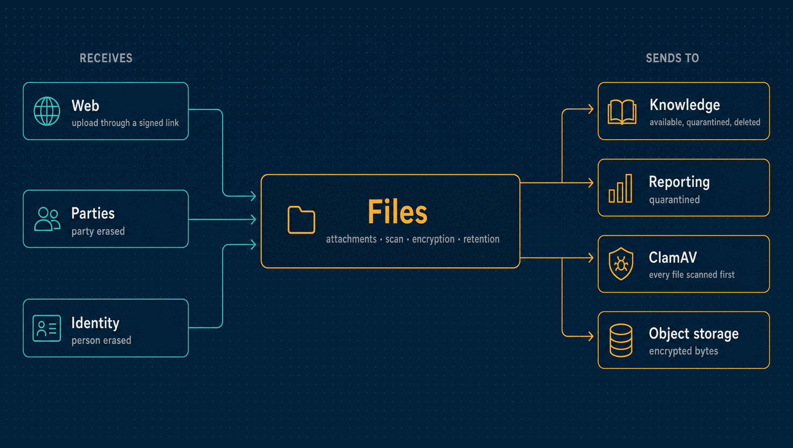

# Files

Attachments on the records of other modules: scanned for viruses before they are ever
served, encrypted under their owner's key, kept as long as their record type requires,
and shredded with their owner.

| | |
|---|---|
| **Port** | 3014 |
| **Database** | `horizon_files`, its own, with forced row-level security, and its own bucket |
| **Talks to** | Parties and Identity (erasure); Knowledge indexes what it makes available |
| **Stack** | NestJS · Drizzle · PostgreSQL · RabbitMQ · S3-compatible storage · ClamAV |

<p align="center">
  
</p>

---

## What it does

- **Attachments on records.** Each one names a record, such as a party, purchase order,
  receivable, payable, service order or opportunity. Its life is
  `uploading → scanning → available | quarantined → deleted`.
- **Scanned before served.** Nothing is downloadable until ClamAV says it is clean. An
  infected file is quarantined for 30 days, then removed. A scan with no answer is retried.
- **Signed links.** Uploads and downloads go through short-lived signed links.
- **Encryption per owner.** Each file has its own data key, wrapped by its owner's key,
  which is wrapped by a master key. Erasing the owner destroys their key, and a database
  trigger never lets it come back
  ([ADR 0026](../docs/adr/0026-crypto-shredding-for-erasure.md)).
- **Retention per record type.** Purchase orders, titles and service orders five years,
  opportunities two, a party's files until the party is erased.
- **A record of every removal**: who, why, how many bytes and when, append-only.

## What it leaves to others

- **Who may read or attach.** Files has no roles of its own. The owning module's role,
  read from the token, decides: a Financial operator may attach to a receivable, a viewer
  may only read it ([ADR 0060](../docs/adr/0060-attachments-are-a-files-module.md)).

---

## API

| Method | Path | Purpose |
|---|---|---|
| `GET` | `/record-types` | Which records accept attachments, and how long they are kept |
| `POST` | `/attachments` | Ask for an upload slot on a record |
| `PUT` | `/uploads/:id` | Upload the bytes through the signed link |
| `GET` | `/attachments` | A record's attachments |
| `GET` | `/attachments/:id` | One attachment and its state |
| `GET` | `/attachments/:id/link` | A signed download link, once it is available |
| `GET` | `/attachments/:id/content` | The file, through that link |
| `DELETE` | `/attachments/:id` | Delete it |
| `GET` | `/audit` | Who asked for a slot, took a link or deleted a file |
| `GET` | `/health/live`, `/health/ready` | Liveness and readiness |

---

## Events

| Published | Meaning |
|---|---|
| `files.attachment.available` | A file passed the scan and can be read |
| `files.attachment.quarantined` | A file was infected |
| `files.attachment.deleted` | A file was deleted or expired |

None of them carries the file's name.

| Consumed | Reaction |
|---|---|
| `parties.party.erased`, `identity.data-subject.erased` | Destroys the owner's key and ends their files, in the same transaction |

---

## Run it

```bash
npm install && cp .env.example .env
npm run db:migrate
npm run dev            # http://localhost:3014
make up-scanner        # at the repository root: ClamAV, for real scanning
```

The worker (scanning again, retention, removals) runs when `DATABASE_RELAY_URL` is set.
Tests, the build and the code layout are the same in every service:
[how every service runs](../docs/service-runtime.md).

<details>
<summary><b>Configuration specific to Files</b></summary>

| Variable | Purpose |
|---|---|
| `FILES_STORE`, `FILES_BUCKET`, `FILES_S3_ENDPOINT`, `FILES_S3_REGION`, `FILES_FILE_ROOT` | Where the encrypted bytes are kept |
| `FILES_MASTER_KEY` | Wraps every owner's key |
| `FILES_LINK_SECRET` | Signs upload and download links |
| `FILES_SCANNER` | `eicar` (deterministic, for tests) or `clamav` |
| `CLAMD_HOST`, `CLAMD_PORT`, `CLAMD_TIMEOUT_MS` | The ClamAV daemon |
| `FILES_SCAN_RETRY_MS`, `FILES_POLL_INTERVAL_MS`, `FILES_CLAIM_MS` | The worker's pace |

The variables every service shares are in
[the shared configuration](../docs/service-runtime.md#configuration-every-service-shares).

</details>

---

## Read more

- [How every service runs](../docs/service-runtime.md)
- [The Files API](../docs/files-api.md)
- [Architecture](../docs/architecture.md) and the [decision records](../docs/adr/README.md)
