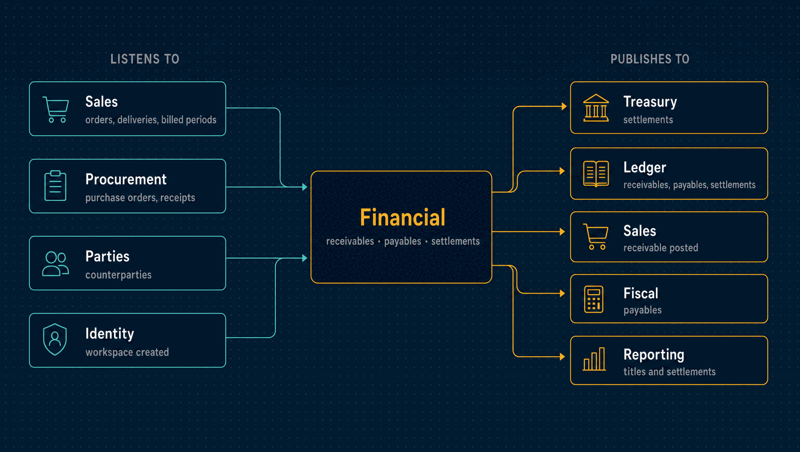

# Financial

What the company is owed and what it owes: receivables and payables with their
instalments, approvals, settlements and reversals, the categories and dimensions they are
classified by, and the cash-flow outlook they add up to.

| | |
|---|---|
| **Port** | 3007 |
| **Database** | `horizon_financial`, its own, with forced row-level security |
| **Talks to** | Sales and Procurement raise its titles; Treasury, Ledger and Fiscal follow them |
| **Stack** | NestJS · Drizzle · PostgreSQL · RabbitMQ |

<p align="center">
  
</p>

---

## What it does

- **Titles.** Receivables and payables with instalments, issue, competence and due
  dates, a category, allocations and their origin. A draft can be revised or cancelled. A
  posted title is settled or reversed, never edited
  ([ADR 0042](../docs/adr/0042-posted-records-are-reversed.md)).
- **Forecasts that become titles.** A confirmed sales order or an approved purchase order
  becomes a forecast: money expected, owed by nobody yet. A delivery or a receipt turns
  that same title effective for its share, so expected and owed money are never counted
  twice. A forecast never posts and never reaches the books.
- **Titles raised by events.** A delivery, a service delivery and a billed contract period
  each raise a receivable. Goods received raise a payable. A return or a cancellation
  withdraws or reverses what it made owed, or flags it for a person when it was already
  settled.
- **Approvals.** A payable at or above the workspace's threshold posts only after a
  financial admin other than the requester approves it.
- **Settlements.** Money received or paid against an instalment, with discount, interest
  and penalty. A settlement is reversed with a reason, never deleted.
- **Cash-flow outlook.** What is still expected to come in and go out, by due date, with
  what is owed apart from what is only forecast.
- **Registries.** A category tree up to four levels deep, departments and projects,
  payment methods, and payment terms whose shares always total exactly 100%. Allocating
  an amount across dimensions never loses or invents a cent.
- **Bulk import** of open titles from a spreadsheet.

## What it leaves to others

- **Bank accounts, balances and reconciliation** belong to Treasury.
- **Journal entries and accounting periods** belong to the Ledger.
- **Who the counterparties are** belongs to Parties.

The three-way boundary is
[ADR 0041](../docs/adr/0041-financial-treasury-ledger-boundaries.md).

---

## API

<details>
<summary><b>Receivables and payables</b></summary>

The same routes exist under `/receivables` and `/payables`.

| Method | Path | Purpose |
|---|---|---|
| `GET`, `POST` | `/receivables` | Titles, or draft one (optionally as a forecast) |
| `GET` | `/receivables/summary` | Totals by status |
| `GET` | `/receivables/counterparties` | Who the titles are with |
| `GET`, `PUT` | `/receivables/:id` | One title, or revise a draft |
| `POST` | `/receivables/:id/realise` | Turn a forecast into an effective title |
| `POST` | `/receivables/:id/post` | Post it |
| `POST` | `/receivables/:id/cancel` | Cancel a draft |
| `POST` | `/receivables/:id/reverse` | Reverse a posted title, with a reason |
| `POST` | `/receivables/:id/settlements` | Record money received against an instalment |
| `POST` | `/receivables/:id/settlements/:settlementId/reverse` | Reverse a settlement |
| `GET`, `PUT` | `/payables/approval-policies` | The threshold above which a payable needs approval |
| `POST` | `/payables/:id/approval-request` | Ask for approval |
| `POST` | `/payables/:id/approve`, `/reject` | Decide somebody else's payable |

</details>

<details>
<summary><b>Registries and outlook</b></summary>

| Method | Path | Purpose |
|---|---|---|
| `GET`, `POST` | `/categories` | The category tree |
| `GET`, `POST` | `/dimensions` | Departments and projects |
| `GET`, `POST` | `/payment-methods` | Cash, transfer, Pix, boleto, cards, cheque |
| `GET`, `POST` | `/payment-terms` | Instalment templates |
| `POST` | `/payment-terms/:id/schedule` | Preview the instalments of an amount |
| `POST` | `/allocations/preview` | Preview an allocation across dimensions |
| `PATCH` | `/:registry/:id/status` | Deactivate or reactivate an entry; nothing is deleted |
| `GET` | `/cash-flow-outlook` | What is expected in and out, by due date |

</details>

<details>
<summary><b>Imports, approvals and operations</b></summary>

| Method | Path | Purpose |
|---|---|---|
| `POST` | `/imports/:kind` | Upload a spreadsheet |
| `PUT` | `/imports/:id/mapping` | Map its columns |
| `POST` | `/imports/:id/preview`, `/confirm`, `/cancel` | Preview, apply or drop it |
| `GET` | `/imports`, `/imports/:id`, `/imports/:id/failures`, `/imports/kinds` | Imports and their failed rows |
| `GET`, `POST` | `/delegations` | Lend the payable approval to another member for up to 90 days |
| `POST` | `/delegations/:id/revoke` | End a delegation |
| `GET` | `/audit` | The hash-chained audit log, with the chain's verdict |
| `GET` | `/health/live`, `/health/ready` | Liveness and readiness |

</details>

**Roles.** `viewer` reads. `operator` drafts, posts, settles and asks for approval.
`admin` also reverses, approves, and configures the registries and the approval policy.

---

## Events

<details>
<summary><b>Published</b></summary>

| Event | Meaning |
|---|---|
| `financial.receivable.posted`, `receivable.reversed` | A claim on a customer began or was undone |
| `financial.payable.posted`, `payable.reversed` | An obligation to a supplier began or was undone |
| `financial.payable.approval-requested` | A payable waits for someone to approve it |
| `financial.settlement.recorded`, `settlement.reversed` | Money was received or paid, or that was undone |
| `financial.import.finished` | A bulk import ended |

</details>

<details>
<summary><b>Consumed</b></summary>

| Event | Reaction |
|---|---|
| `sales.order.confirmed` | A forecast receivable for the whole order |
| `sales.shipment.dispatched` | An effective receivable for the delivery's share; the forecast shrinks |
| `sales.shipment.returned` | Withdraws what that delivery made owed, and expects it again |
| `sales.order.cancelled` | Cancels the order's forecast if it never posted |
| `sales.service.delivered`, `service.delivery-cancelled` | A receivable per service delivery, or its withdrawal |
| `sales.contract-period.billed`, `contract-period.credited` | A receivable per billed period, or its withdrawal |
| `procurement.order.approved`, `order.cancelled`, `order.closed` | A forecast payable, or its withdrawal |
| `procurement.receipt.recorded`, `receipt.returned` | An effective payable for what arrived, or its withdrawal |
| `parties.party.registered`, `updated`, `erased` | Keeps the counterparty projection, and shreds it on erasure |
| `identity.tenant.created` | Provisions the workspace |

</details>

---

## Guarantees

Besides what [every service guarantees](../docs/service-runtime.md#guarantees-every-service-gives):

- **Money is never split wrong.** Property tests check a thousand random allocations and
  random settlement histories: every split adds up to the cent.
- **Settlements cannot be edited.** The database refuses it; a mistake is a reversal.
- **Four eyes on payables.** Whoever drafted a payable or asked for its approval never
  decides it. A decision through a delegation records both names
  ([ADR 0062](../docs/adr/0062-segregation-of-duties-is-a-declared-matrix.md)).
- **Registries are never deleted.** An entry is deactivated, so old documents keep what
  they used.

---

## Run it

```bash
npm install && cp .env.example .env
npm run db:migrate
npm run dev            # http://localhost:3007
```

Tests, the build and the code layout are the same in every service:
[how every service runs](../docs/service-runtime.md).

<details>
<summary><b>Configuration specific to Financial</b></summary>

| Variable | Purpose |
|---|---|
| `JOURNAL_SEAL_INTERVAL_MS` | How often the relay seals each workspace's history for Reporting |
| `IMPORT_BATCH_SIZE`, `IMPORT_LEASE_MS`, `IMPORT_POLL_INTERVAL_MS`, `IMPORT_RETENTION_HOURS` | How imports are processed and kept |

The variables every service shares are in
[the shared configuration](../docs/service-runtime.md#configuration-every-service-shares).

</details>

---

## Read more

- [How every service runs](../docs/service-runtime.md)
- [Architecture](../docs/architecture.md) and the [decision records](../docs/adr/README.md)
- [The event catalogue](../docs/events.md)
