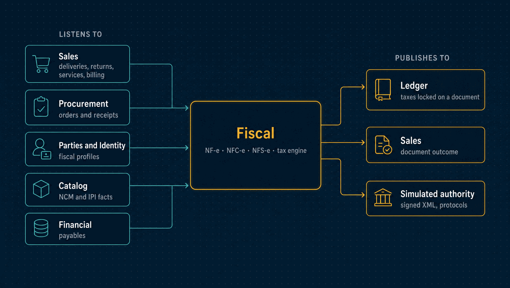

# Fiscal

Brazilian fiscal documents and the taxes on them: NF-e, NFC-e and the national NFS-e,
supplier XML, returns and complements, and a versioned tax engine that estimates taxes
where money is decided and locks them on the document. Documents are issued against a
**simulated** tax authority.

| | |
|---|---|
| **Port** | 3011 |
| **Database** | `horizon_fiscal`, its own, with forced row-level security; documents in a private bucket |
| **Talks to** | Sales and Procurement (what to document), Parties, Identity and Catalog (profiles), Ledger (taxes to post) |
| **Stack** | Node.js HTTP · postgres.js · PostgreSQL · RabbitMQ · S3-compatible storage · XML signing |

<p align="center">
  
</p>

---

## What it does

### Fiscal documents

- **NF-e (model 55)** for a delivery or a return from Sales, built from a frozen copy of
  the origin, signed, validated against the official schemas, and sent to the authority
  of the issuer's state ([ADR 0050](../docs/adr/0050-fiscal-authorizer-follows-issuer-jurisdiction.md)).
- **NFC-e (model 65)** for a sale to a final consumer, with its QR code and the 80 mm
  receipt ([ADR 0053](../docs/adr/0053-nfce-is-a-separate-model-over-the-sales-shipment.md)).
- **The national NFS-e** for services, one per delivered line or billed contract period,
  keyed by municipality ([ADR 0054](../docs/adr/0054-national-nfse-is-keyed-by-municipality-and-reconciled-by-dps.md)).
- **Returns, complements and correction letters**, as documents linked to the original
  ([ADR 0052](../docs/adr/0052-returns-and-complements-are-linked-documents.md)).
- **Supplier NF-e imports.** The XML is verified, kept encrypted, and matched against
  Procurement's receipts. It is evidence, never a stock or money effect on its own
  ([ADR 0051](../docs/adr/0051-supplier-xml-is-evidence-not-an-operational-fact.md)).
- **Numbers are never reused.** Numbers are reserved concurrently per series, and a
  reserved number survives timeouts and restarts.

### The tax engine

- **Tax law as a shared catalogue.** Rules come in immutable, versioned packages built
  from official sources. A workspace adopts a package from a date; nothing changes under
  it on its own ([ADR 0070](../docs/adr/0070-tax-law-is-a-shared-catalogue-that-workspaces-adopt.md)).
- **Formulas are data.** A small, bounded expression language over a closed vocabulary,
  evaluated with exact fractions, never floats
  ([ADR 0071](../docs/adr/0071-tax-formulas-are-data-over-a-closed-vocabulary.md)).
- **Taxes covered.** IBS and CBS through the 2026–2033 reform, checked against the
  government's official calculator; ICMS, IPI, PIS, Cofins and ISS in reviewed scenarios;
  the issuer's regime at the issue date, and the 2029–2032 blend. The Imposto Seletivo has
  no published rates yet, so it answers `unsupported`.
- **Supported only with evidence.** A scenario is calculated only if the official
  calculator agreed with it or a reviewed fixture approves it. Anything else answers
  `unsupported` with the missing dimension, never a guess
  ([ADR 0072](../docs/adr/0072-a-tax-scenario-is-supported-only-with-evidence.md)).
- **Estimates where money is decided, amounts at the lock.** Quotes and orders show an
  estimate. The amount that reaches the books is the one locked on the document, which
  replays byte for byte later ([ADR 0073](../docs/adr/0073-tax-estimates-outside-fiscal-amounts-inside-it.md)).
- **Every amount explained.** Each tax component names the rule, its version and the
  legal source it came from.
- **Four eyes on rule changes.** Adopting or withdrawing a package, or adding an own rule,
  is a request another admin approves, after seeing its diff and its impact on the
  documents already locked ([ADR 0074](../docs/adr/0074-a-tax-rule-change-is-requested-and-approved-by-another-person.md)).

## What it leaves to others

- **The business facts.** Sales says what was delivered, Procurement what was received.
  Fiscal never creates stock or money effects.
- **Posting the taxes** is the Ledger's, from the locked calculation.
- **Real transmission.** Issuing for real needs each company's digital certificate and
  the authority's homologation. What is and is not supported is listed in
  [the fiscal capabilities](../docs/fiscal-capabilities.md).

---

## API

<details>
<summary><b>Documents</b></summary>

| Method | Path | Purpose |
|---|---|---|
| `GET`, `POST` | `/documents` | Documents, or a draft from an origin |
| `GET` | `/documents/:id`, `/documents/:id/v2` | One document and its state |
| `GET` | `/documents/:id/transitions` | Its timeline |
| `POST` | `/documents/:id/validate` | Check readiness and lock the tax calculation |
| `POST` | `/documents/:id/issue` | Send it to the (simulated) authority |
| `POST` | `/documents/:id/status-queries` | Ask the authority for its status |
| `POST` | `/documents/:id/cancellation-requests`, `/cancellation-queries` | Cancel it, and follow the cancellation |
| `POST` | `/documents/:id/corrections`, `/correction-letters` | Correct a draft, or send a correction letter |
| `GET` | `/documents/:id/links` | Linked documents, and the ids other modules keyed their effects by |
| `GET` | `/documents/:id/artifacts`, `/documents/:id/artifacts/:kind` | The XML, protocols and the DANFE |
| `GET` | `/documents/:id/calculation`, `/calculation/explanation` | The locked taxes, and where each came from |
| `GET` | `/document-kinds` | Every document kind, and why unsupported ones are refused |
| `POST` | `/linked-origins`, `/manual-origins` | A return, complement or manual origin |
| `GET`, `POST` | `/imports`, `/imports/:id`, `/imports/:id/xml`, `/reconciliation`, `/conflict-dismissals` | Supplier XML and its match against receipts |
| `GET`, `POST` | `/service-profiles`, `/service-origins`, `/service-documents`, `/service-intakes`, `/nfse-registry/…` | The national NFS-e |
| `GET`, `PUT` | `/service-issuance-policies/:establishmentId` | Issue service documents automatically, or after review |
| `GET`, `POST` | `/establishment-credentials` | Certificates per establishment |

</details>

<details>
<summary><b>Taxes and their rules</b></summary>

| Method | Path | Purpose |
|---|---|---|
| `POST` | `/estimates` | Estimate the taxes of a quote or an order |
| `POST` | `/calculations/preview` | Calculate a scenario without locking anything |
| `GET` | `/capabilities`, `/capabilities/v2` | What the workspace can issue, and which tax scenarios are supported |
| `GET` | `/catalog/packages` | The tax packages in the shared catalogue |
| `GET` | `/catalog/packages/:id/diff` | What adopting a package would change |
| `GET` | `/rules` | The rules the workspace calculates with |
| `GET`, `POST` | `/rule-changes` | Requested rule changes, or a new request with its impact |
| `GET` | `/rule-changes/:id` | One request, its diff and its impact |
| `POST` | `/rule-changes/:id/approve`, `/reject`, `/cancel` | Decide it (another admin), or withdraw it |
| `POST` | `/rule-overrides` | Propose an override of a rule, with a reason |
| `GET`, `POST` | `/delegations` | Lend the approval to another member for up to 90 days |
| `POST` | `/delegations/:id/revoke` | End a delegation |

</details>

<details>
<summary><b>Operations</b></summary>

| Method | Path | Purpose |
|---|---|---|
| `GET` | `/support`, `/support/overview` | Support reads: metrics without tenant data, bounded replay |
| `GET` | `/audit` | The hash-chained audit log, with the chain's verdict |
| `GET` | `/health` | Health |

</details>

---

## Events

<details>
<summary><b>Published</b></summary>

| Event | Meaning |
|---|---|
| `fiscal.calculation.locked` | The taxes of a document were locked; the Ledger posts them |
| `fiscal.document.simulation-authorized`, `simulation-rejected`, `simulation-cancelled` | An NF-e's outcome at the simulated authority |
| `fiscal.document.production-outcome`, `document.homologation-observed` | What a real authority answered, in production or homologation |
| `fiscal.consumer-document.simulation-outcome` | An NFC-e's outcome |
| `fiscal.service-document.simulation-outcome` | An NFS-e's outcome |
| `fiscal.linked-document.simulation-outcome` | A return's or complement's outcome |
| `fiscal.inbound.matched` | A supplier XML was matched to a receipt |

</details>

<details>
<summary><b>Consumed</b></summary>

| Event | Reaction |
|---|---|
| `sales.fiscal-origin.recorded` | A delivery or return to document |
| `sales.shipment.dispatched`, `shipment.returned` | Follows the goods that left or came back |
| `sales.service.delivered`, `service.delivery-cancelled` | An NFS-e per delivered line, or its cancellation |
| `sales.contract-period.billed`, `contract-period.credited` | An NFS-e per billed period, or its cancellation |
| `procurement.order.approved`, `receipt.recorded`, `receipt.returned` | What supplier XML is matched against |
| `financial.payable.posted`, `payable.reversed` | Links supplier documents to their payables |
| `identity.company.fiscal-profile-changed` | The issuer's profile, in dated revisions |
| `parties.party.fiscal-profile-changed`, `party.erased` | Recipients' profiles, and their erasure |
| `catalog.item.classification-changed` | Items' NCM and IPI facts |

</details>

---

## Guarantees

Besides what [every service guarantees](../docs/service-runtime.md#guarantees-every-service-gives):

- **A locked document replays byte for byte.** It is calculated again from its own stored
  rules, never from the catalogue, and a worker replays a sample every ten minutes.
- **The catalogue cannot be tampered with.** A package is named by its source's digest,
  rules are immutable, and the application's database role cannot write the catalogue.
- **Self-approval is refused twice:** by the service and by a database trigger.
- **Sensitive data is sealed.** Origins, profiles and calculation inputs are encrypted
  under a per-tenant key, and documents are stored encrypted with their digest checked on
  every read.
- **Measured.** Preview latency, unsupported answers, the official calculator's agreement
  and replay failures each have a service level and an alert
  ([service levels](../docs/service-levels.md)).

---

## Run it

```bash
npm ci && cp .env.example .env
npm run db:migrate
npm run build && npm start       # one process: the API on :3011, and the worker
make up-fiscal                   # at the repository root: the API, the worker and the bucket
```

Tests: `npm test` and `npm run test:e2e`, as in [every service](../docs/service-runtime.md).
`make tax-oracle` checks the IBS/CBS packages against the official calculator, and
`make phase-o-golden-path` runs a quote to a ledger posting on the stack.

<details>
<summary><b>Configuration specific to Fiscal</b></summary>

| Variable | Purpose |
|---|---|
| `FISCAL_ARTIFACT_KEY_HEX` | The 32-byte key that seals origins, profiles, inputs and documents |
| `FISCAL_ARTIFACT_BUCKET`, `FISCAL_ARTIFACT_ENDPOINT`, `FISCAL_ARTIFACT_REGION` | Where documents are stored |
| `FISCAL_SERVICE_KEYS_JSON` | Per-workspace API keys the worker exchanges to read owner profiles |
| `PARTIES_URL`, `IDENTITY_URL`, `CATALOG_URL` | Where those profiles are read |
| `FISCAL_PHASE42_SCHEMA_PATH`, `FISCAL_PHASE42_EVENT_SCHEMA_PATH`, `FISCAL_INBOUND_SCHEMA_PATH`, `FISCAL_NFSE_SCHEMA_PATH` | The pinned official schemas |
| `FISCAL_SIMULATION_PROFILE_JSON`, `FISCAL_SIMULATION_CERTIFICATE_PATH`, `FISCAL_SIMULATION_PRIVATE_KEY_PATH`, `FISCAL_SIMULATOR_SCENARIO` | The simulated authority |

The variables every service shares are in
[the shared configuration](../docs/service-runtime.md#configuration-every-service-shares).

</details>

---

## Read more

- [The module reference](../docs/fiscal-module-reference.md): how each document kind and
  the tax engine are set up, rolled out and verified
- [Fiscal capabilities](../docs/fiscal-capabilities.md), [the operations runbook](../docs/fiscal-operations-runbook.md)
  and the [glossary](../docs/glossary.md)
- [The tax engine plan](../docs/tax-engine-plan.md) and its [threat model](../docs/phase-o-threat-model.md)
- [Architecture](../docs/architecture.md) and the [decision records](../docs/adr/README.md)
