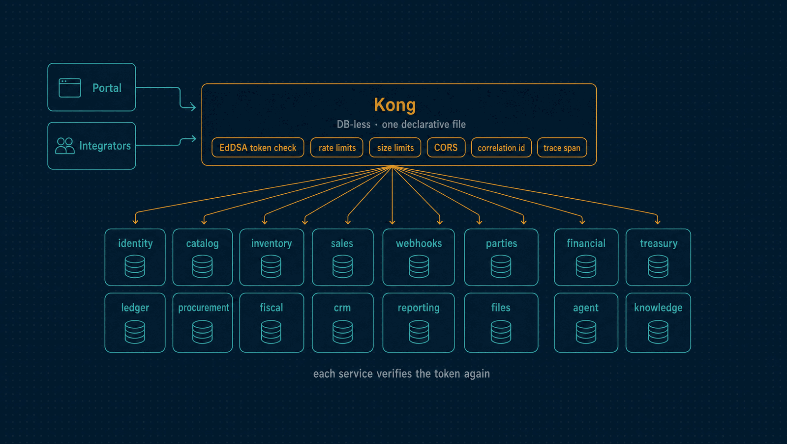

# Gateway

Kong, in DB-less mode: the single public entry point to Horizon. One declarative file
routes to every service and applies rate limits, size limits, CORS, correlation ids and
tracing once, for all of them. Tokens are verified by each service.

| | |
|---|---|
| **Port** | 8000 |
| **Routes to** | All sixteen services |
| **Stack** | Kong 3.9 OSS, DB-less · decK |

<p align="center">
  
</p>

---

## What this project owns

- **Routing.** Which path reaches which service, and on which upstream.
- **Cross-cutting request policy**, applied once here instead of in every service: rate limiting (global,
  per-consumer, per-API-key), request size limiting, correlation ids, CORS, and
  OpenTelemetry span emission.
- **Consumer and rate-limit tiers**, declared statically.

## What it explicitly does not own

- **Authentication and authorization.** Every service verifies each token itself
  (`TRUST_GATEWAY_JWT=false`) and decides what it permits from its own role map (ADR 0023).
  Kong holds Identity's public keys and its `jwt` plugin runs on one route only, the
  self-test below: every module serves public paths under its own prefix (health, signed
  links, invitations, the MCP endpoint), so the plugin is not on the business routes.
- **Being a check at all for tokens.** Reaching a service's port directly grants nothing,
  because the service is the one that verifies. The gateway is where request policy lives.
- **API key existence.** Keys are created at runtime and validated by `identity/`. Kong
  enforces the rate-limit tier attached to a key's consumer group.
- **State.** Kong runs DB-less. There is no gateway database to run, back up or migrate.

---

## `kong.yml` is a template

Kong OSS verifies EdDSA (RFC 8037) but has **no plugin that fetches a JWKS document** —
`openid-connect` is Enterprise-only. The public key therefore has to be present in the
declarative configuration.

Rather than commit key material here and hand-edit it on every rotation, this file stays
key-free and `infra/scripts/render-kong-config.sh` injects the current public keys into
`infra/generated/kong.generated.yml`, which is what the container mounts. The full
reasoning, and what was rejected, is in
[ADR 0036](../docs/adr/0036-kong-oss-has-no-jwks-so-the-gateway-config-is-rendered.md).

```bash
make kong-config   # re-render after a key change
```

`identity/` still publishes `/.well-known/jwks.json` — it is the source of truth for
every other verifier, and the render script is a Kong-shaped adapter over the same keys.

## The image for AWS

The gateway image in [`Dockerfile`](Dockerfile) is what the AWS stack runs. It rewrites
two things Compose and ECS name differently: the OpenTelemetry endpoint becomes the
sidecar on `127.0.0.1`, and each upstream `http://<service>:<port>` becomes Cloud Map's
`http://<service>.horizon.local:<port>`. The committed `kong.yml` stays the same for both.

## The `/gateway/verify` route

A route with no upstream, answered directly by `request-termination`. It exists so the
gateway's own token validation can be tested without any service running behind it:
`make smoke` calls it with a valid token (expects 200), with a token signed by a freshly
generated key (expects 401), and with no token at all (expects 401).

## Working on it

```bash
npm run lint    # deck file validate kong.yml
```

`deck` is a Go binary and is not an npm dependency. Install it from
<https://github.com/Kong/deck> or run it through its container image; CI installs it in
the workflow. This is the one project whose tooling is not `npm install`-able, which is
why it carries a `package.json` with only the scripts the root `Makefile` calls.

Kong publishes no Alpine image in current versions, so the "Alpine where a variant
exists" rule does not apply to this service.
