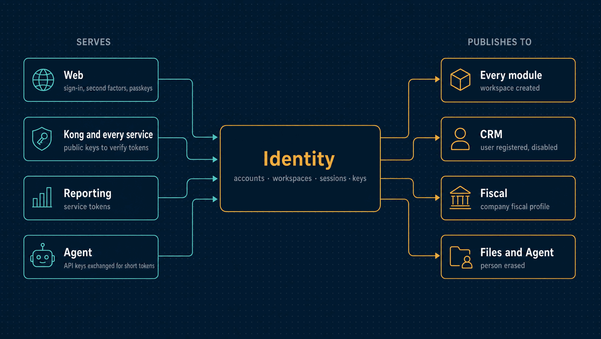

# Identity

Who someone is and which workspaces they may enter: accounts, workspaces, sign-in with
second factors, sessions, API keys, and the keys every other service uses to check a
token.

| | |
|---|---|
| **Port** | 3001 |
| **Database** | `horizon_identity`, its own, with forced row-level security |
| **Talks to** | Every service reads its public keys. It publishes facts every module listens to, and listens to none. |
| **Stack** | NestJS · Drizzle · PostgreSQL · Redis · RabbitMQ · Ed25519 · Argon2id · WebAuthn |

<p align="center">
  
</p>

---

## What it does

- **One account, many workspaces.** A person signs in once, then picks a workspace. A
  workspace token exists only after a verified membership is selected
  ([ADR 0038](../docs/adr/0038-global-account-before-workspace-selection.md)).
- **Passwords done properly.** Argon2id, rehashed on sign-in when the policy rises
  ([ADR 0019](../docs/adr/0019-argon2id-password-hashing.md)).
- **Second factors.** TOTP, passkeys (WebAuthn) and single-use recovery codes. A
  workspace can require them for admins or for everyone, with a grace period. Sensitive
  actions ask for a recent sign-in again (step-up).
- **Short tokens, rotating sessions.** Access tokens live 15 minutes and are signed with
  Ed25519. Refresh tokens rotate on every use, and a replayed one revokes the whole
  family ([ADR 0018](../docs/adr/0018-eddsa-access-tokens.md),
  [ADR 0020](../docs/adr/0020-opaque-rotating-refresh-tokens.md)).
- **Visible sessions.** Each person sees their devices and can end any session, and an
  admin can end another user's.
- **Invitations.** Single-use links valid for 72 hours, mailed through SMTP. Only the
  link's digest is stored.
- **API keys.** `hz_<env>_<prefix>_<secret>`, with explicit scopes. The secret is shown
  once and stored as an Argon2id hash. A key can be rotated with an overlap or revoked
  ([ADR 0022](../docs/adr/0022-api-key-format-and-scopes.md)).
- **Roles.** Each user holds `(module, role)` pairs. What a role allows is decided by the
  module that receives the request, not here
  ([ADR 0023](../docs/adr/0023-casl-static-module-scoped-roles.md)).
- **Erasure.** Personal data is encrypted under a key per person. Destroying the key
  erases it everywhere, backups included, and tells every module to shred its own copies
  ([ADR 0026](../docs/adr/0026-crypto-shredding-for-erasure.md)).
- **The company's own registration.** The workspace's legal and fiscal profile, kept in
  dated revisions that Fiscal reads.
- **Service tokens.** Scheduled work (Reporting's exports) gets a short token for one
  workspace, with roles fixed in code.

## What it leaves to others

- **What a role means.** Each module maps its own roles to permissions.
- **Customers and suppliers.** They are business counterparties, kept in Parties. A
  user is someone who signs in.
- **Business data of any kind.** Identity knows who you are, never what you sold.

---

## API

<details>
<summary><b>Sign-in and sessions</b></summary>

| Method | Path | Purpose |
|---|---|---|
| `POST` | `/auth/signup` | Create a workspace and its owner |
| `POST` | `/auth/login` | Check the password; answer with a workspace-selection token or a second-factor challenge |
| `POST` | `/auth/mfa`, `/auth/mfa/passkey`, `/auth/mfa/passkey/options` | Answer the second-factor challenge |
| `POST` | `/auth/enrollment/totp`, `/auth/enrollment/totp/confirm` | Enrol a factor when the workspace requires one |
| `POST` | `/auth/workspaces` | The workspaces a selection token may enter |
| `POST` | `/auth/workspace` | Enter one, and open a session |
| `POST` | `/auth/workspace-selection` | Switch workspaces without signing in again |
| `POST` | `/auth/refresh` | Rotate the refresh token |
| `POST` | `/auth/step-up` | Prove a recent sign-in before a sensitive action |
| `POST` | `/auth/logout` | End the session and revoke its token |
| `GET` | `/auth/sessions` | My sessions and devices |
| `DELETE` | `/auth/sessions/:sessionId` | End one of them |
| `POST` | `/auth/sessions/revoke-others` | End all the others |
| `GET` | `/.well-known/jwks.json` | The public keys every service verifies tokens with |

</details>

<details>
<summary><b>My account and second factors</b></summary>

| Method | Path | Purpose |
|---|---|---|
| `GET` | `/me` | Who I am |
| `GET` | `/me/export` | Everything held about me |
| `PATCH` | `/me/preferences` | My preferred language |
| `GET` | `/me/mfa` | My factors |
| `POST` | `/me/mfa/totp`, `/me/mfa/totp/:factorId/confirm` | Add an authenticator app |
| `POST` | `/me/mfa/passkeys/options`, `/me/mfa/passkeys` | Add a passkey |
| `POST` | `/me/mfa/recovery-codes` | New recovery codes |
| `DELETE` | `/me/mfa/factors/:factorId` | Remove a factor |

</details>

<details>
<summary><b>Workspace, users and invitations</b></summary>

| Method | Path | Purpose |
|---|---|---|
| `GET` | `/workspace` | The workspace |
| `PUT` | `/workspace/company` | The company's legal and fiscal registration |
| `GET` | `/workspace/company/fiscal-profiles`, `/workspace/company/fiscal-profile/:revision` | Its dated revisions |
| `GET`, `PUT` | `/workspace/mfa-policy` | Who must use a second factor |
| `GET`, `POST` | `/users` | The workspace's users |
| `GET` | `/users/:userId` | One user |
| `PATCH` | `/users/:userId/disable` | Disable a user and end their sessions |
| `POST` | `/users/:userId/roles` | Grant a role |
| `GET`, `DELETE` | `/users/:userId/sessions` | Another user's sessions |
| `GET`, `POST` | `/invitations` | Pending invitations, and invite someone |
| `POST` | `/invitations/:invitationId/resend`, `/revoke` | Resend or withdraw one |
| `GET` | `/invitations/lookup` | Read an invitation from its link (public) |
| `POST` | `/invitations/accept` | Accept it (public) |

</details>

<details>
<summary><b>Keys, tokens and erasure</b></summary>

| Method | Path | Purpose |
|---|---|---|
| `POST` | `/api-keys` | Issue a key; the secret is shown once |
| `POST` | `/api-keys/:apiKeyId/rotate` | Rotate it with an overlap |
| `DELETE` | `/api-keys/:apiKeyId` | Revoke it |
| `POST` | `/auth/api-key` | Check an API key and return what it may do |
| `POST` | `/auth/api-key/token` | Exchange an API key for a 60-second token carrying its scopes, which modules accept |
| `POST` | `/auth/service-token` | A token for scheduled work in one workspace |
| `POST` | `/auth/fiscal-token` | The same exchange, for Fiscal's worker reading owner profiles |
| `GET` | `/data-subjects/:subjectId/export` | Export a person's data |
| `DELETE` | `/data-subjects/:subjectId` | Erase a person: destroy their key and end their sessions |

</details>

<details>
<summary><b>Operations</b></summary>

| Method | Path | Purpose |
|---|---|---|
| `GET` | `/audit` | The workspace's hash-chained audit log, with the chain's verdict |
| `GET` | `/audit/verify` | Verify the whole chain |
| `GET` | `/health/live`, `/health/ready` | Liveness and readiness |

</details>

---

## Events

Identity listens to no events: it is upstream of everything else.

| Published | Meaning |
|---|---|
| `identity.tenant.created` | A workspace exists; modules create their defaults for it |
| `identity.user.registered`, `user.disabled` | A user joined or lost access |
| `identity.api-key.revoked` | A key is no longer valid |
| `identity.session.reuse-detected` | A rotated refresh token was replayed, and its family was destroyed |
| `identity.data-subject.erased` | A person's key was destroyed; every module shreds its own copies |
| `identity.company.fiscal-profile-changed` | The company's fiscal registration has a new revision |

---

## Guarantees

Besides what [every service guarantees](../docs/service-runtime.md#guarantees-every-service-gives):

- **Revocation that holds.** A revoked token is refused everywhere for its remaining
  life, through a denylist in Redis. If Redis is down, writes and administrative reads
  fail closed; plain reads fail open, which is a documented trade-off
  ([ADR 0021](../docs/adr/0021-redis-jti-denylist-asymmetric-failure.md)).
- **Brute force is bounded.** Five wrong second-factor answers in 15 minutes lock it for
  15 minutes.
- **Searchable without plaintext.** Emails are encrypted, and found by exact match through
  a blind index.
- **Login is never cached.** Sign-in, refresh and API-key checks always re-read the
  credential's state.

---

## Run it

```bash
make up                # at the repository root; also generates development signing keys
npm install && cp .env.example .env
npm run db:migrate
npm run dev            # http://localhost:3001, OpenAPI at /docs
```

Tests, the build and the code layout are the same in every service:
[how every service runs](../docs/service-runtime.md). `npm run audit:verify -- <tenant>`
checks a workspace's audit chain from the command line.

<details>
<summary><b>Configuration specific to Identity</b></summary>

| Variable | Purpose |
|---|---|
| `JWT_PRIVATE_KEY_PATH`, `JWT_PUBLIC_KEYS_DIR`, `JWT_ACTIVE_KID` | The signing key, the published keys (rotation overlaps by publishing both), and which one signs |
| `ACCESS_TOKEN_TTL_SECONDS` | 15 minutes |
| `REFRESH_TOKEN_ABSOLUTE_TTL_SECONDS`, `REFRESH_TOKEN_IDLE_TTL_SECONDS` | A session's absolute and idle lifetime |
| `REFRESH_TOKEN_REUSE_GRACE_MS` | Two tabs refreshing at once are not mistaken for theft |
| `WORKSPACE_SELECTION_TTL_SECONDS` | How long a selection token lasts |
| `ARGON2_MEMORY_KIB`, `ARGON2_TIME_COST`, `ARGON2_PARALLELISM` | Password hashing cost |
| `API_KEY_ENV` | The `<env>` segment of issued keys |
| `DATA_SUBJECT_KEY_MODE` | Where per-person keys live |
| `BLIND_INDEX_KEY_PATH` | The key that makes encrypted emails searchable by exact match |
| `MFA_SEAL_SECRET` | Seals authenticator secrets |
| `WEBAUTHN_RP_ID`, `WEB_URL` | The passkey relying party, and the portal's address for links |
| `SMTP_URL`, `MAIL_FROM` | Where invitations are mailed from |
| `SERVICE_CLIENTS` | The clients allowed to ask for service tokens, with their secrets' digests |

The variables every service shares are in
[the shared configuration](../docs/service-runtime.md#configuration-every-service-shares).

</details>

---

## Read more

- [How every service runs](../docs/service-runtime.md)
- [Architecture](../docs/architecture.md) and the [decision records](../docs/adr/README.md)
- [The event catalogue](../docs/events.md) and the [privacy notes](../docs/privacy.md)
