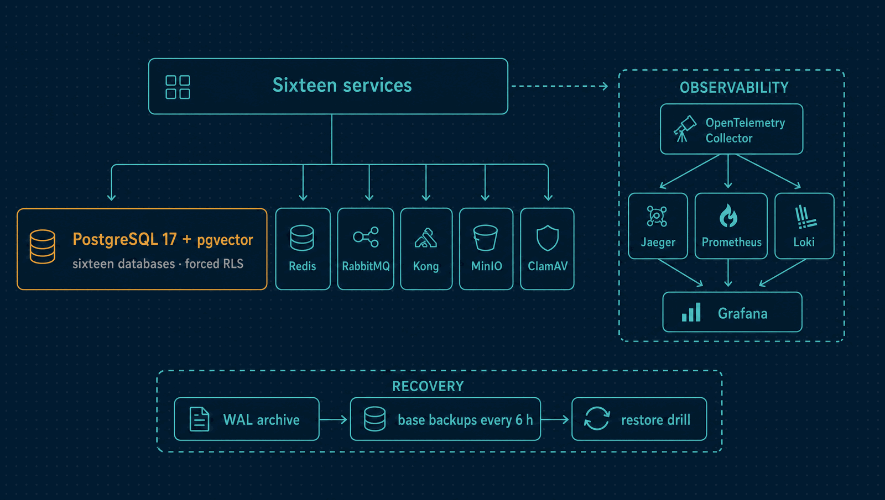

# Infra

The platform every service runs on: local orchestration with Docker Compose, the
observability stack and its alert rules, database bootstrap, backups and restore drills,
and the Terraform that describes the AWS deployment.

| | |
|---|---|
| **Runs** | PostgreSQL 17 with pgvector, Redis 7, RabbitMQ 4, Kong, MinIO, ClamAV, Mailpit, Verdaccio, and the observability stack |
| **Observability** | OpenTelemetry Collector → Jaeger, Prometheus, Loki; Grafana Alloy; Grafana |
| **Stack** | Docker Compose · Terraform for AWS (ECS Fargate, RDS, ElastiCache, Amazon MQ) |

<p align="center">
  
</p>

---

## Quick start

```bash
make up          # start the platform and wait for every healthcheck
make smoke       # prove it works, not merely that it started
make up-apps     # add Horizon's own services and the portal
make down        # stop, keeping data
make clean       # stop and delete the volumes
```

`make up` generates development keys if they are missing, renders the Kong configuration,
and waits for health. Optional profiles add what most work does not need:

| Command | Adds |
|---|---|
| `make up-fiscal` | The Fiscal API, worker and document bucket |
| `make up-scanner` | ClamAV, and points Files at it |
| `make up-ai` | The local embedding model for document search |

| Service | URL | Credentials |
|---|---|---|
| Gateway (Kong) | http://localhost:8000 | — |
| Portal | http://localhost:3000 | `demo@horizon.local` / `Horizon-demo-2026!` after `make demo` |
| Grafana | http://localhost:3300 | admin / admin |
| Jaeger | http://localhost:16686 | — |
| Prometheus | http://localhost:9090 | — |
| RabbitMQ management | http://localhost:15672 | horizon / horizon, the operator |
| Mailpit | http://localhost:8025 | — |
| Verdaccio | http://localhost:4873 | — |

Every published port can be overridden in `infra/.env` (copy `.env.example`), for example
`HORIZON_POSTGRES_PORT=5433`. Containers always reach each other by service name.
Every published port binds to `127.0.0.1`, so the stack is reachable from this machine
only; `HORIZON_BIND_ADDRESS` changes that. Kong's Admin API is not published, and Redis
takes a password (`HORIZON_REDIS_PASSWORD`).

Each service connects to RabbitMQ as a user of its own, `<module>` with the password
`<module>-local` unless `infra/.env` sets `HORIZON_RABBITMQ_PASSWORD_<MODULE>`, and may
publish only its own events ([ADR 0075](../docs/adr/0075-one-broker-identity-per-module.md)).
`make broker-config`, which `make up` runs, renders those users into the definitions the
broker imports at boot.

---

## What it provides

- **`docker-compose.yml`, the platform.** It runs alone, so a service can be worked on
  from source against it, which is the normal development loop.
- **`docker-compose.apps.yml`, the application overlay.** Every service, its migration
  job, the portal, the synthetic probe and the retention job.
- **Database bootstrap.** One PostgreSQL holding sixteen databases, one per module
  ([ADR 0016](../docs/adr/0016-one-database-per-module.md)).
- **Observability.** The Collector pipeline, Prometheus scraping and alert rules, Loki,
  Alloy, and Grafana with its datasources and dashboards provisioned from files: the
  service overview, service levels, AI, and the tax engine.
- **Backups, retention and restore drills.**
- **Terraform** for AWS, in [`terraform/`](terraform/).

## What it leaves to others

- **Application configuration.** Each module owns its `.env.example` and validates its own
  configuration at boot.
- **Secrets.** Development keys are generated into a gitignored path; nothing real is read.

---

## The database roles

The role separation is what makes tenant isolation real rather than aspirational
([ADR 0017](../docs/adr/0017-row-level-security-and-tenant-aware-transaction.md)):

| Role | Purpose | Notably |
|---|---|---|
| `horizon_owner` | Owns the schemas, runs migrations | The services never connect as this |
| `horizon_app` | What the services connect as | `NOSUPERUSER`, `NOBYPASSRLS`, so RLS applies to it |
| `horizon_relay` | The outbox relays and workers | Only the grants each module's migrations give it |
| `horizon_debug` | The MCP debugger | No privilege on any business table |

`make smoke` asserts that `horizon_app` is not a superuser, cannot bypass RLS and cannot
create roles. If it could, every tenant-isolation test in the repository would pass
without proving anything.

---

## The observability pipeline

```text
services ──OTLP──▶ Collector ──┬──▶ Jaeger      (traces)
                               ├──▶ Prometheus  (metrics)
                               └──▶ Loki        (logs)
container stdout ──▶ Alloy ────────▶ Loki
                                      ▲
                              Grafana ┘ (also Prometheus and Jaeger)
```

Nothing talks to a backend directly
([ADR 0033](../docs/adr/0033-opentelemetry-with-collector-fanout.md)). A backend can be
swapped in one file, and a backend outage loses visibility instead of slowing the
application.

`make smoke` pushes one trace, one log and one metric through the Collector and checks
each arrived: the trace in Jaeger, the log in Loki **with the same trace id**, the metric in
Prometheus. That correlation is what makes an investigation possible, so it is tested.

**Alert rules** live in `observability/rules/`, each file with its own promtool tests:
service levels, Sales, Fiscal, AI and the tax engine. `make test-alerts` runs them. The
objectives are in [`docs/service-levels.md`](../docs/service-levels.md).

---

## Backups and restore

- **PostgreSQL archives its WAL** at least every 5 minutes.
- **Base backups** every 6 hours, keeping 7, each with a manifest. `make backup-now` takes
  one.
- **Every MinIO bucket is versioned**: fiscal documents, exports and attachments.
- **Retention** removes old delivery bookkeeping daily. `make retention-now` runs a pass.
- **`make restore-drill`** restores everything beside the live stack, verifies it, and
  stores the evidence ([ADR 0063](../docs/adr/0063-recovery-is-measured-by-drills.md)).

See the [recovery runbook](../docs/recovery-runbook.md).

---

## The gateway configuration is rendered

`gateway/kong.yml` is a template. Kong OSS verifies EdDSA tokens but cannot fetch a JWKS
document, so the public keys must be in the configuration.
`scripts/render-kong-config.sh` injects them into `generated/kong.generated.yml`
(gitignored), which the container mounts
([ADR 0036](../docs/adr/0036-kong-oss-has-no-jwks-so-the-gateway-config-is-rendered.md)).

```bash
make keys             # an Ed25519 key pair (gitignored)
make keys ARGS=dev-2  # a second key id, to practise rotation
make kong-config      # render again after a key change
```

`make smoke` checks that a token signed by a key the gateway has never seen is refused.

| Script | Purpose |
|---|---|
| `scripts/generate-keys.sh` | Ed25519 key pair and a blind-index key, into a gitignored path |
| `scripts/render-kong-config.sh` | Kong template plus public keys into a runnable configuration |
| `scripts/mint-dev-token.mjs` | Mint a development token; `--bogus` signs with an unknown key |
| `scripts/smoke.sh` | Assertions about a running platform |

---

## Terraform

[`terraform/`](terraform/) describes all sixteen services on AWS: ECS Fargate, one RDS
instance per module, ElastiCache, Amazon MQ, a load balancer, private buckets and
CloudWatch. Every push runs `terraform fmt`, `validate` and `terraform test` for both
environments. It is not deployed to a paid account, and no workflow is allowed to apply
it ([ADR 0034](../docs/adr/0034-terraform-written-but-never-applied.md)). Its README has
the topology, the secrets each service needs, and a cost estimate.

---

## Healthchecks

Healthchecks use `127.0.0.1`, not `localhost`: inside some images `localhost` resolves to
`::1` first while the service binds IPv4 only. The OpenTelemetry Collector and Alloy are
distroless, with no shell for a healthcheck, so `scripts/smoke.sh` checks them from the host
instead.
