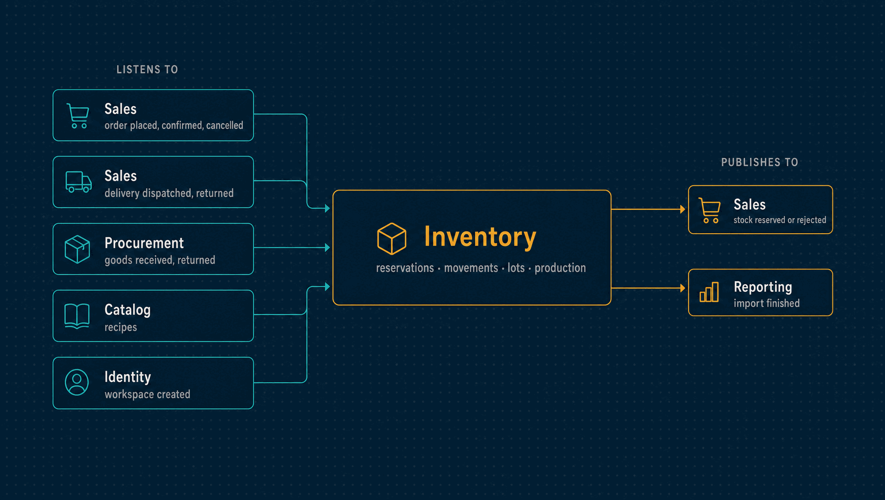

# Inventory

How much of everything there is, where, and what it is worth: warehouses, reservations,
movements, transfers, counts, lots and serial numbers, and production.

| | |
|---|---|
| **Port** | 3003 |
| **Database** | `horizon_inventory`, its own, with forced row-level security |
| **Talks to** | Sales (reservations and deliveries), Procurement (receipts), Catalog (items and recipes) |
| **Stack** | NestJS · Drizzle · PostgreSQL · RabbitMQ · Redis |

<p align="center">
  
</p>

---

## What it does

- **Reservations.** When Sales places an order, Inventory locks every requested balance
  and either holds all the lines or rejects the order with the shortfall per line.
  Nothing is held halfway.
- **A movement ledger.** Every change is an append-only movement. A balance is derived
  from movements and never edited directly.
- **Moving average cost**, per item and warehouse. Each movement records the quantity
  the shelf reached and what a unit was worth, so valuing a past day is a lookup, not a
  replay.
- **Transfers** between the company's warehouses, at the cost the goods left at.
- **Adjustments** with a reason. Above an allowance, a second person must approve them.
- **Counts.** A sheet freezes what the system expects, records what was found, and
  posts the differences, which past the allowance also wait for approval.
- **Lots and serial numbers.** Lots leave earliest-expiry first, and expired stock is
  never shipped. Named units keep their name for good and can be traced from arrival to
  delivery, return or scrap.
- **Production orders.** Releasing an order freezes the recipe in force. Material is
  drawn and scrap is recorded. The finished goods are worth exactly what went into them:
  issued plus conversion equals produced plus scrapped, always.
- **Reports.** The Kardex of an item, the stock position with alerts against minimum and
  maximum levels, valuation at any instant, cost of goods sold, and ABC ranking.
- **Bulk import** of opening stock from a spreadsheet.

## What it leaves to others

- **What an item is** belongs to Catalog. Inventory keeps a projection of what it needs,
  including recipes, so production works while Catalog is down.
- **What an order means** belongs to Sales. Inventory answers reserve, release and ship.
- **Purchasing** belongs to Procurement. Inventory receives what Procurement says arrived.
- **Accounting** belongs to the Ledger.

---

## API

Order reservation and shipping happen through events. The API is for the people who run
the warehouse.

<details>
<summary><b>Warehouses and movements</b></summary>

| Method | Path | Purpose |
|---|---|---|
| `GET`, `POST` | `/warehouses` | Warehouses and their balances, or a new one |
| `PATCH` | `/warehouses/:id/deactivate` | Take a warehouse out of new work |
| `POST` | `/stock-receipts` | Receive stock and recalculate its average cost |
| `GET`, `POST` | `/stock-transfers` | Transfers between warehouses |
| `GET`, `POST` | `/stock-adjustments` | Adjustments, or a new one with a reason |
| `PATCH` | `/stock-adjustments/:id/approve`, `/reject` | Decide somebody else's adjustment |
| `GET`, `PUT` | `/adjustment-policies` | The allowance above which a second person decides |

</details>

<details>
<summary><b>Counts</b></summary>

| Method | Path | Purpose |
|---|---|---|
| `GET`, `POST` | `/stock-counts` | Count sheets, or open one over a warehouse |
| `GET` | `/stock-counts/:id` | Expected, counted and the difference |
| `PATCH` | `/stock-counts/:id/figures` | Record what was found |
| `PATCH` | `/stock-counts/:id/close` | Settle the sheet and post its differences |
| `PATCH` | `/stock-counts/:id/approve`, `/reject` | Decide somebody else's count |
| `PATCH` | `/stock-counts/:id/cancel` | Abandon a sheet; it posts nothing |

</details>

<details>
<summary><b>Lots, serial numbers and production</b></summary>

| Method | Path | Purpose |
|---|---|---|
| `GET`, `PUT` | `/item-tracking` | Which items are tracked by lot or by serial number |
| `GET` | `/stock-lots`, `/stock-lots/:code/trace` | Stock by lot, and where a lot came from and went |
| `GET` | `/stock-serials`, `/stock-serials/:serial/trace` | Every named unit, and the life of one |
| `GET`, `POST` | `/production-orders` | Production orders, or a new one |
| `GET` | `/production-orders/:id` | What it expected, took, ruined and made |
| `PATCH` | `/production-orders/:id/release` | Freeze the recipe and allow material to be drawn |
| `POST` | `/production-orders/:id/material` | Draw material |
| `POST` | `/production-orders/:id/scrap` | Record what was ruined |
| `PUT` | `/production-orders/:id/charge` | What the work cost |
| `PATCH` | `/production-orders/:id/finish`, `/cancel` | Receive the goods, or abandon an order that took nothing |

</details>

<details>
<summary><b>Reports</b></summary>

| Method | Path | Purpose |
|---|---|---|
| `GET` | `/stock-ledger` | The Kardex of one item in one warehouse |
| `GET` | `/stock-position` | What every shelf holds now, with its level and alerts |
| `GET`, `PUT` | `/stock-levels` | Minimum and maximum per item and warehouse |
| `GET` | `/stock-alerts` | The shelves to look at, worst first |
| `GET` | `/stock-valuation` | What was held, and its worth, at an instant |
| `GET` | `/cost-of-goods-sold` | What the goods that left for customers had cost |
| `GET` | `/stock-abc` | Items ranked A, B and C by what leaving them cost |

</details>

<details>
<summary><b>Imports, approvals and operations</b></summary>

| Method | Path | Purpose |
|---|---|---|
| `GET` | `/imports/kinds` | What can be imported |
| `POST` | `/imports/:kind` | Upload a spreadsheet |
| `PUT` | `/imports/:id/mapping` | Map its columns |
| `POST` | `/imports/:id/preview`, `/confirm`, `/cancel` | Preview, apply or drop it |
| `GET` | `/imports`, `/imports/:id`, `/imports/:id/failures` | Imports and their failed rows |
| `GET`, `POST` | `/delegations` | Lend an approval to another member for up to 90 days |
| `POST` | `/delegations/:id/revoke` | End a delegation |
| `GET` | `/audit` | The hash-chained audit log, with the chain's verdict |
| `GET` | `/health/live`, `/health/ready` | Liveness and readiness |

</details>

---

## Events

| Published | Meaning |
|---|---|
| `inventory.stock.reserved` | Every line of an order is held |
| `inventory.stock.reservation-rejected` | Not enough stock, with the shortfall per line |
| `inventory.stock.released` | A hold was released, by cancellation or expiry |
| `inventory.stock.moved` | A movement was recorded |
| `inventory.import.finished` | A bulk import ended |

| Consumed | Reaction |
|---|---|
| `sales.order.placed` | One atomic reservation for every line, then reserved or rejected |
| `sales.order.confirmed` | Commits the hold; the goods stay on the shelf for that customer |
| `sales.order.cancelled` | Releases the hold |
| `sales.shipment.dispatched` | Takes exactly what left out of the hold |
| `sales.shipment.returned` | Returns the goods, at the cost they left at |
| `procurement.receipt.recorded`, `receipt.returned` | Receives goods from a supplier, or sends them back |
| `catalog.composition.defined` | Keeps its own copy of each recipe |
| `identity.tenant.created` | Provisions the workspace |

---

## Guarantees

Besides what [every service guarantees](../docs/service-runtime.md#guarantees-every-service-gives):

- **A late message cannot undo a newer one.** Every order event carries the order's
  version, and an older version is ignored.
- **Lots add up.** What a shelf's lots hold equals its balance, checked in the aggregate
  and by a deferred database trigger.
- **Production conserves value.** Issued plus conversion equals produced plus scrapped,
  in the aggregate and in a trigger. Nobody can state a finished unit cost by hand.
- **Four eyes on write-offs.** Whoever asked for an adjustment, or closed a count, can
  never approve it. A decision made through a delegation records both names and is
  refused if either did the work
  ([ADR 0062](../docs/adr/0062-segregation-of-duties-is-a-declared-matrix.md)).

---

## Run it

```bash
npm install && cp .env.example .env
npm run dev            # http://localhost:3003
```

Tests, migrations, the build and the code layout are the same in every service:
[how every service runs](../docs/service-runtime.md).

<details>
<summary><b>Configuration specific to Inventory</b></summary>

| Variable | Purpose |
|---|---|
| `RESERVATION_TTL_SECONDS` | How long a reservation holds before it expires |
| `JOURNAL_SEAL_INTERVAL_MS` | How often the relay seals each workspace's history for Reporting |
| `IMPORT_BATCH_SIZE`, `IMPORT_LEASE_MS`, `IMPORT_POLL_INTERVAL_MS`, `IMPORT_RETENTION_HOURS` | How imports are processed and kept |

The variables every service shares are in
[the shared configuration](../docs/service-runtime.md#configuration-every-service-shares).

</details>

---

## Read more

- [How every service runs](../docs/service-runtime.md)
- [Architecture](../docs/architecture.md) and the [decision records](../docs/adr/README.md)
- [The event catalogue](../docs/events.md)
