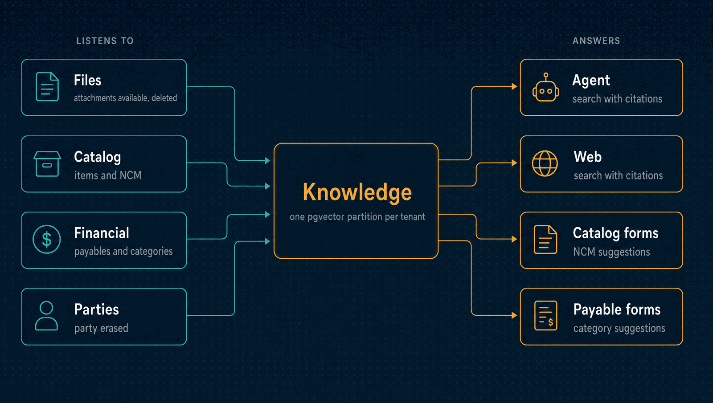

# Knowledge

The index of a company's documents: the text of its attachments, chunked, embedded and
sealed in one pgvector partition per tenant, searchable by meaning and by words with
citations, and gone with the file it came from. It also suggests an item's NCM code and
a payable's category from the company's own history.

| | |
|---|---|
| **Port** | 3016 |
| **Database** | `horizon_knowledge`, its own, with pgvector and forced row-level security |
| **Talks to** | Files (documents to index), Catalog and Financial (history for suggestions) |
| **Stack** | NestJS · Drizzle · PostgreSQL + pgvector · RabbitMQ · Text Embeddings Inference (optional) |

<p align="center">
  
</p>

---

## What it does

- **Indexing.** When a file becomes available, a worker reads it through Kong, extracts
  its text (plain text, CSV, PDF text, DOCX, XLSX; no OCR), chunks it, embeds it and seals
  it. A failure retries with backoff.
- **One partition per tenant.** Chunks live in a table partitioned by tenant, each
  partition with its own HNSW index and forced RLS. A search names its tenant, so the
  planner reads only that partition
  ([ADR 0067](../docs/adr/0067-documents-are-indexed-in-one-partition-per-tenant.md)).
- **Sealed text.** Each document's chunks are encrypted with AES-256-GCM under a key of
  its own. Its words are stored only as keyed hashes, different in every tenant, so no
  word is kept in clear.
- **Hybrid search.** The question's vector against the tenant's HNSW index, and its hashed
  words against a GIN index, merged by reciprocal rank. Each result cites its attachment,
  record, position and excerpt. The question is never logged.
- **Search by permission.** Only the modules whose attachments the caller can read are
  searched, and the filter is applied inside each scan, so what the caller cannot read
  never takes a place in a ranking. An unreadable document answers exactly like one that
  does not exist.
- **Gone with its file.** A deleted, expired, erased or quarantined file deletes its
  chunks and destroys its key
  ([ADR 0068](../docs/adr/0068-derived-ai-data-follows-its-source.md)).
- **Suggestions.** An item's NCM code from similar items and the official NCM table, and a
  payable's category from the company's past payables. A person always decides; the
  decision is counted and nothing else is kept.

## Embedders

| `KNOWLEDGE_EMBEDDER` | What it is |
|---|---|
| `hash` (default, CI) | Deterministic, lexical, in process; 384 dimensions |
| `tei` (`make up-ai`) | `multilingual-e5-small` on Text Embeddings Inference, inside the stack; nothing leaves it |

Retrieval quality is measured, not assumed: a labelled corpus of 24 documents and 36
questions in Portuguese and English requires recall@5 of at least 0.9 on lexical
questions in CI, and 0.8 overall with e5 (`make eval-retrieval`, recorded in
`docs/drills/`).

---

## API

| Method | Path | Purpose |
|---|---|---|
| `GET` | `/search?q=&limit=&module=&recordType=&recordId=` | Search the documents the caller may read, with citations |
| `GET` | `/suggestions/ncm?text=` | Suggest an NCM code for an item |
| `GET` | `/suggestions/payable-category?text=&partyId=` | Suggest a category for a payable |
| `POST` | `/suggestions/decisions` | Count an accepted or rejected suggestion |
| `GET` | `/status` | How much is indexed, and how far behind |
| `GET` | `/health/live`, `/health/ready` | Liveness and readiness |

---

## Events

Knowledge publishes no events.

| Consumed | Reaction |
|---|---|
| `files.attachment.available` | Queues the document for indexing |
| `files.attachment.deleted`, `attachment.quarantined` | Deletes its chunks and destroys its key |
| `catalog.item.created`, `item.classification-changed` | Learns which items have which NCM |
| `financial.payable.posted`, `payable.reversed` | Learns which payables have which category |
| `parties.party.erased` | Forgets that party's history |

---

## Run it

```bash
npm install && cp .env.example .env
npm run db:migrate     # needs the vector extension, created by a superuser
npm run dev            # http://localhost:3016
make up-ai             # at the repository root: the local embedding model
```

Tests, the build and the code layout are the same in every service:
[how every service runs](../docs/service-runtime.md).

<details>
<summary><b>Configuration specific to Knowledge</b></summary>

| Variable | Purpose |
|---|---|
| `KNOWLEDGE_EMBEDDER`, `TEI_URL` | Which embedder, and where the model runs |
| `KNOWLEDGE_MASTER_KEY`, `KNOWLEDGE_PREVIOUS_MASTER_KEYS`, `KNOWLEDGE_REWRAP_INTERVAL_MS` | Wrap each document's key, and rotate the master key |
| `KNOWLEDGE_LEXEME_KEY` | Derives each tenant's key for hashing words |
| `GATEWAY_URL`, `GATEWAY_TIMEOUT_MS`, `SERVICE_TOKEN_SECRET` | Read files and payables through Kong as a service client |
| `KNOWLEDGE_POLL_INTERVAL_MS`, `KNOWLEDGE_LEASE_MS`, `KNOWLEDGE_BATCH` | The worker's pace |
| `KNOWLEDGE_SUGGESTIONS`, `KNOWLEDGE_NCM_TABLE` | Whether suggestions answer, and the official NCM table |

The variables every service shares are in
[the shared configuration](../docs/service-runtime.md#configuration-every-service-shares).

</details>

---

## Read more

- [How every service runs](../docs/service-runtime.md)
- [The AI threat model](../docs/phase-n-threat-model.md)
- [Architecture](../docs/architecture.md) and the [decision records](../docs/adr/README.md)
