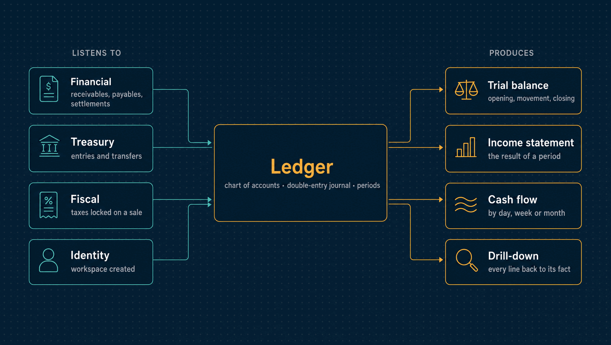

# Ledger

The general ledger: a chart of accounts, a balanced double-entry journal posted
automatically from what happens in the business, monthly periods, and the reports the
books exist to produce, each figure traceable back to the fact behind it.

| | |
|---|---|
| **Port** | 3009 |
| **Database** | `horizon_ledger`, its own, with forced row-level security |
| **Talks to** | Financial, Treasury and Fiscal publish the facts it posts |
| **Stack** | NestJS · Drizzle · PostgreSQL · RabbitMQ |

<p align="center">
  
</p>

---

## What it does

- **A chart of accounts.** Assets, liabilities, equity, revenue and expense, with dotted
  codes (`1.01.001`) that are their place in the tree. Only a leaf takes postings. An
  account is deactivated, never deleted, and its code never changes.
- **A balanced journal.** Each transaction has at least two lines in one currency, and
  debits equal credits.
- **Automatic postings.** Receivables, payables, settlements, transfers, treasury entries
  and the taxes locked on a sale become balanced transactions as they are reported. The
  rules are fixed code, because a posting rule is accounting policy. What a workspace
  chooses is which of its accounts plays each part.
- **Nothing is lost while waiting.** A fact that cannot post yet, because a category has
  no account or the month is closed, waits with its numbers and is replayed once the
  workspace fixes it. Without a mapping, it posts to suspense so the books stay complete.
- **Reversals, not edits.** A correction is a mirror transaction with every side swapped
  ([ADR 0042](../docs/adr/0042-posted-records-are-reversed.md)).
- **Periods.** Closing a month refuses every posting into it. Reopening records who did
  it and why.
- **Manual entries** above a threshold wait for a second person.
- **Reports.** The chart with balances, the trial balance, the result of a period,
  realised cash flow by day, week or month, and an account's lines with the balance each
  left behind.
- **Drill-down.** Every line names the fact it accounts for: a report figure leads to the
  account, the account to its lines, and each line to the receivable, settlement, transfer
  or tax lock behind it.

## The posting rules

| Fact | Debit | Credit |
|---|---|---|
| Receivable posted | receivables | revenue, by the title's category |
| Payable posted | expense, by the title's category | payables |
| Receivable settled | cash, discount granted | financial income, receivables (net) |
| Payable settled | payables (net), financial expense | cash, discount received |
| Transfer between own accounts | destination account, bank fees | source account |
| Treasury opening balance | cash | opening balance |
| Manual treasury entry | cash or suspense | suspense or cash |
| Taxes locked on a sale | sales taxes, by component | taxes payable, by component |

- **Taxes.** A tax lock is held until its document is authorized, then posts the taxes
  contained in the price, one pair of lines per component (ICMS, PIS, Cofins, ISS, ICMS
  DIFAL, FCP DIFAL), once per document. A cancellation reverses them, and a rejected
  document never posts. IPI is
  charged on top and belongs to the receivable. The 2026 CBS/IBS is not posted, because
  its payment is waived.
- **Transfers.** Moving money between the company's own accounts never touches profit
  or loss; the bank's fee for it does.
- **No double counting.** Transfer legs, fees, settlements and reversals reach the ledger
  through the fact that caused them, so their treasury journal lines are deliberately
  ignored.

## What it leaves to others

- **What is owed** belongs to Financial, **where the cash is** to Treasury, and **how
  much tax** to Fiscal ([ADR 0041](../docs/adr/0041-financial-treasury-ledger-boundaries.md)).

---

## API

<details>
<summary><b>Chart, journal and periods</b></summary>

| Method | Path | Purpose |
|---|---|---|
| `GET`, `POST` | `/accounts` | The chart with balances, or a new account |
| `PATCH` | `/accounts/:id/status` | Deactivate or reactivate |
| `GET` | `/accounts/:id/ledger` | An account's lines and running balance |
| `GET`, `POST` | `/transactions` | Transactions, or a manual entry |
| `GET` | `/transactions/:id` | One transaction and the fact behind it |
| `POST` | `/transactions/:id/reverse` | Reverse it with a mirror |
| `GET` | `/manual-entries` | Manual entries waiting for approval |
| `POST` | `/manual-entries/:id/approve`, `/reject` | Decide somebody else's entry |
| `GET`, `PUT` | `/approval-policies` | The threshold above which a manual entry waits |
| `GET`, `PUT` | `/mappings` | Which account plays each part in the posting rules |
| `GET` | `/postings/pending` | Facts waiting to post |
| `POST` | `/postings/pending/replay` | Post them now |
| `GET` | `/periods` | Months and whether they are closed |
| `POST` | `/periods/:period/close`, `/reopen` | Close or reopen a month |

</details>

<details>
<summary><b>Reports and operations</b></summary>

| Method | Path | Purpose |
|---|---|---|
| `GET` | `/trial-balance` | Opening, movement and closing per account |
| `GET` | `/income-statement` | The result of a period |
| `GET` | `/cash-flow` | Realised cash flow by day, week or month |
| `GET`, `POST` | `/delegations` | Lend the entry approval to another member for up to 90 days |
| `POST` | `/delegations/:id/revoke` | End a delegation |
| `GET` | `/audit` | The hash-chained audit log, with the chain's verdict |
| `GET` | `/health/live`, `/health/ready` | Liveness and readiness |

</details>

**Roles.** `viewer` reads. `accountant` posts, reverses and replays. `admin` also changes
the chart and its mappings, and closes and reopens months.

---

## Events

| Published | Meaning |
|---|---|
| `ledger.account.opened` | An account was added to the chart |
| `ledger.transaction.posted` | A balanced transaction was posted, with its lines |
| `ledger.transaction.reversed` | A transaction was undone by its mirror |
| `ledger.period.closed`, `period.reopened` | A month stopped or resumed taking postings |

| Consumed | Reaction |
|---|---|
| `financial.receivable.posted`, `payable.posted` and their reversals | Posts the title, or its mirror |
| `financial.settlement.recorded`, `settlement.reversed` | Posts the settlement, or its mirror |
| `treasury.transfer.posted`, `transfer.cancelled` | Posts the transfer and its fee, or the mirror |
| `treasury.entry.recorded` | Posts opening balances and manual entries; ignores what another fact already covers |
| `fiscal.calculation.locked` | Holds the taxes contained in a sale's price until the authority answers |
| `fiscal.document.simulation-authorized`, `-rejected`, `-cancelled`, `fiscal.consumer-document.simulation-outcome`, `fiscal.document.production-outcome` | An authorization posts the held taxes, a cancellation reverses them, and a rejected document never posts ([ADR 0076](../docs/adr/0076-taxes-follow-the-authority-and-estimates-are-kept-by-reference.md)) |
| `identity.tenant.created` | Provisions the workspace |

---

## Guarantees

Besides what [every service guarantees](../docs/service-runtime.md#guarantees-every-service-gives):

- **An unbalanced transaction cannot exist.** The aggregate refuses it, and a deferred
  database constraint refuses to commit one even from code that bypasses the domain.
- **Only leaves take postings**, checked by the domain and by a database trigger.
- **Balances are computed, never stored**, so a backdated posting moves every later
  balance deterministically.
- **Four eyes on large manual entries.** Whoever wrote one never approves it
  ([ADR 0062](../docs/adr/0062-segregation-of-duties-is-a-declared-matrix.md)).

---

## Run it

```bash
npm install && cp .env.example .env
npm run db:migrate
npm run dev            # http://localhost:3009
```

Tests, the build and the code layout are the same in every service:
[how every service runs](../docs/service-runtime.md). The only variable specific to the
Ledger is `JOURNAL_SEAL_INTERVAL_MS`, how often the relay seals each workspace's history
for Reporting.

---

## Read more

- [How every service runs](../docs/service-runtime.md)
- [Architecture](../docs/architecture.md) and the [decision records](../docs/adr/README.md)
- [The tax engine plan](../docs/tax-engine-plan.md), for how tax locks are posted
- [The event catalogue](../docs/events.md)
