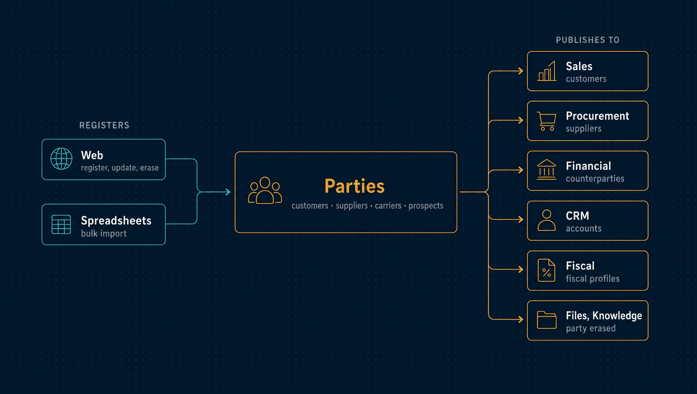

# Parties

Every organization and person the company deals with, recorded once, with the roles each
one plays: customer, supplier, carrier, prospect or partner.

| | |
|---|---|
| **Port** | 3006 |
| **Database** | `horizon_parties`, its own, with forced row-level security |
| **Talks to** | Sales, Procurement, Financial, CRM, Fiscal, Files and Knowledge keep projections of what it publishes |
| **Stack** | NestJS · Drizzle · PostgreSQL · RabbitMQ |

<p align="center">
  
</p>

---

## What it does

- **One record per counterparty.** Legal and trade name, a typed document, email, phone
  and address. The document is a CPF, a CNPJ, a foreign identifier with its country, or
  none yet, which can be completed once later
  ([ADR 0040](../docs/adr/0040-shared-party-registry.md),
  [ADR 0057](../docs/adr/0057-crm-accounts-are-parties-with-typed-documents.md)).
- **Roles as a set.** A customer, supplier or carrier needs full contact details. A
  prospect or partner may be known by name alone.
- **No duplicates.** A document is unique per workspace, and a duplicate check finds
  parties sharing a name, email, phone or document, all through keyed blind indexes.
- **Fiscal profiles.** For a CPF or CNPJ: the fiscal address, state and municipal
  registrations, whether the party is an ICMS contributor or a final consumer, and what a
  contributor customer does with the goods it buys. They are kept in dated
  revisions that Fiscal reads.
- **Erasure.** Each party has its own data key. Destroying it erases the party, and
  every module that kept a copy shreds it
  ([ADR 0026](../docs/adr/0026-crypto-shredding-for-erasure.md)).
- **Bulk import** of parties from a spreadsheet.

## What it leaves to others

- **What a customer bought or a supplier delivered.** Sales, Procurement and Financial
  keep their own projections, fed by events, and never query this database.

---

## API

| Method | Path | Purpose |
|---|---|---|
| `GET`, `POST` | `/parties` | Parties, or register one |
| `GET`, `PUT` | `/parties/:id` | One party, or update it |
| `PUT` | `/parties/:id/document` | Complete a party registered without a document |
| `PUT` | `/parties/:id/roles/:role` | Grant or revoke a role |
| `PATCH` | `/parties/:id/status` | Activate or deactivate |
| `DELETE` | `/parties/:id` | Erase the party |
| `POST` | `/parties/duplicate-check` | Which parties look like this one |
| `PUT` | `/parties/:id/fiscal-profile` | A new fiscal profile revision |
| `GET` | `/parties/fiscal-profiles`, `/parties/:id/fiscal-profile/:revision` | Current profiles, and one revision |
| `POST` | `/imports/:kind` | Upload a spreadsheet |
| `PUT` | `/imports/:id/mapping` | Map its columns |
| `POST` | `/imports/:id/preview`, `/confirm`, `/cancel` | Preview, apply or drop it |
| `GET` | `/imports`, `/imports/:id`, `/imports/:id/failures`, `/imports/kinds` | Imports and their failed rows |
| `GET` | `/health/live`, `/health/ready` | Liveness and readiness |

**Roles.** `viewer` reads, `editor` also registers and updates, and only `admin` erases.

---

## Events

Parties listens to no events.

| Published | Meaning |
|---|---|
| `parties.party.registered`, `party.updated` | A party and its details; a role change is followed by an update, so a new consumer gets the details too |
| `parties.party.role-granted`, `party.role-revoked` | A role changed |
| `parties.party.fiscal-profile-changed` | A fiscal profile has a new revision |
| `parties.party.erased` | The party was erased; every copy must be shredded |
| `parties.import.finished` | A bulk import ended |

No event carries a document number, and the erasure event carries only the party's id.

---

## Run it

```bash
npm install && cp .env.example .env
npm run db:migrate
npm run dev            # http://localhost:3006
```

Tests, the build and the code layout are the same in every service:
[how every service runs](../docs/service-runtime.md).

<details>
<summary><b>Configuration specific to Parties</b></summary>

| Variable | Purpose |
|---|---|
| `PARTY_BLIND_INDEX_KEY` | The key behind document uniqueness and the duplicate check |
| `IMPORT_BATCH_SIZE`, `IMPORT_LEASE_MS`, `IMPORT_POLL_INTERVAL_MS`, `IMPORT_RETENTION_HOURS` | How imports are processed and kept |

The variables every service shares are in
[the shared configuration](../docs/service-runtime.md#configuration-every-service-shares).

</details>

<details>
<summary><b>Maintenance commands</b></summary>

| Command | What it does |
|---|---|
| `make migrate-customers` (repository root) | Brings customers recorded in Sales into the registry, keeping their ids |
| `npm run backfill:party-lookups -- --tenant <uuid>` | Builds the duplicate-check indexes for parties registered before them; safe to repeat |
| `npm run republish:parties -- --tenant <uuid>` | Publishes every live party again, for a consumer that started late |

</details>

---

## Read more

- [How every service runs](../docs/service-runtime.md)
- [Architecture](../docs/architecture.md) and the [decision records](../docs/adr/README.md)
- [The event catalogue](../docs/events.md) and the [privacy notes](../docs/privacy.md)
