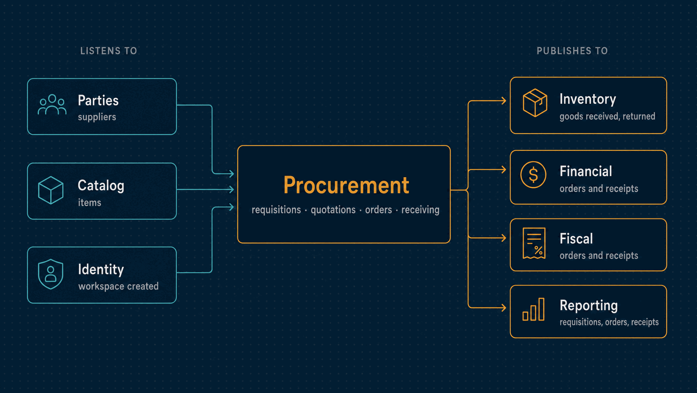

# Procurement

Buying: what somebody needs, what suppliers would charge for it, what the company
committed to buy, and what actually arrived.

| | |
|---|---|
| **Port** | 3010 |
| **Database** | `horizon_procurement`, its own, with forced row-level security |
| **Talks to** | Inventory and Financial act on its receipts; Fiscal reads its orders and receipts |
| **Stack** | NestJS · Drizzle · PostgreSQL · RabbitMQ |

<p align="center">
  
</p>

---

## What it does

- **Requisitions: a need, without money.** This item, this quantity, by this date, for
  this warehouse. A need is approved on its merits; what it costs is discovered later by
  asking suppliers and decided again on the order. Keeping the two apart makes each
  approval auditable on its own.
- **Quotations.** What one supplier said it would charge. A quotation is never revised:
  a supplier that changes its mind sends another one, and both stay.
- **The comparison.** Every offer against every line, side by side, with the cheapest unit
  price per line marked, but no overall verdict: freight, lead time and payment terms are
  for a person to weigh. Selecting one offer declines the rest.
- **Purchase orders.** The commitment. An order keeps its own copy of everything it says
  (supplier, descriptions, prices, tax, freight, terms), so a later price change never
  rewrites what was agreed. From approval on, it is frozen.
- **Tax estimates on orders**, asked from Fiscal and labelled as estimates. Procurement takes
  only the digest, reads the estimate back from Fiscal, and keeps it only if it is of the
  order's supplier and lines ([ADR 0076](../docs/adr/0076-taxes-follow-the-authority-and-estimates-are-kept-by-reference.md)).
- **Approval thresholds.** Above a value per currency, an order needs a second person.
  Below it, the order records that nobody was asked, so an exemption is never mistaken for
  an oversight. A currency with no policy requires approval for every order.
- **Receiving**, in part or in full. Each delivery is owed its share of the order's total,
  taken cumulatively, so the parts always add up to the whole. Receiving more than was
  ordered takes a reason.
- **Returns.** The goods leave stock again, what they made owed is withdrawn, and the
  order expects them again.
- **Closing.** An order stops expecting more, complete or closed short with a reason.

## What it leaves to others

- **Suppliers** are registered in Parties and **items** in Catalog. Procurement keeps
  projections of both.
- **Stock** moves in Inventory, and **the payable** is raised in Financial, both from the
  same receipt event, so the goods on the shelf and the money owed can never disagree.

---

## API

<details>
<summary><b>Requisitions and quotations</b></summary>

| Method | Path | Purpose |
|---|---|---|
| `GET`, `POST` | `/requisitions` | Requisitions, or a new one |
| `GET`, `PUT` | `/requisitions/:id` | One requisition, or revise a draft |
| `POST` | `/requisitions/:id/submit` | Send it for a decision |
| `POST` | `/requisitions/:id/approve`, `/reject`, `/cancel` | Decide or withdraw it |
| `GET` | `/requisitions/:id/quotations` | The quotations it received |
| `GET` | `/requisitions/:id/comparison` | Every offer side by side |
| `POST` | `/quotations` | Record a supplier's quotation |
| `POST` | `/quotations/:id/select`, `/decline` | Choose an offer, or decline it |
| `GET` | `/suppliers` | The supplier projection |

</details>

<details>
<summary><b>Orders and receiving</b></summary>

| Method | Path | Purpose |
|---|---|---|
| `GET`, `POST` | `/orders` | Purchase orders, or draft one |
| `POST` | `/orders/from-quotation` | Draft an order from the selected quotation |
| `GET` | `/orders/summary` | Orders by status and currency, which Reporting reconciles against |
| `GET`, `PUT` | `/orders/:id` | One order, or revise a draft |
| `PUT` | `/orders/:id/tax-estimate` | Keep an estimate Fiscal issued, named by its digest |
| `POST` | `/orders/:id/place` | Submit it |
| `POST` | `/orders/:id/approve`, `/reject` | Decide somebody else's order |
| `POST` | `/orders/:id/cancel`, `/close` | Withdraw it, or stop expecting more |
| `GET` | `/orders/:id/receipts` | What has arrived for it |
| `POST` | `/receipts` | Record goods received |
| `POST` | `/receipts/:id/return` | Send a delivery back |
| `GET`, `PUT` | `/approval-policies` | The threshold per currency |

</details>

<details>
<summary><b>Approvals and operations</b></summary>

| Method | Path | Purpose |
|---|---|---|
| `GET`, `POST` | `/delegations` | Lend an approval to another member for up to 90 days |
| `POST` | `/delegations/:id/revoke` | End a delegation |
| `GET` | `/audit` | The hash-chained audit log, with the chain's verdict |
| `GET` | `/health/live`, `/health/ready` | Liveness and readiness |

</details>

---

## Events

| Published | Meaning |
|---|---|
| `procurement.requisition.submitted`, `approved`, `rejected` | A need was raised and decided |
| `procurement.order.placed` | An order was submitted, saying whether it needs approval |
| `procurement.order.approved` | The company committed to buy, with the dated payment schedule |
| `procurement.order.rejected`, `order.cancelled` | An order was refused or withdrawn |
| `procurement.receipt.recorded` | Goods arrived: what they are worth and what is still committed |
| `procurement.receipt.returned` | A delivery went back |
| `procurement.order.closed` | Nothing more is expected |

| Consumed | Reaction |
|---|---|
| `parties.party.registered`, `updated`, `erased` | Keeps the supplier projection |
| `catalog.item.created`, `item.deactivated` | Keeps the item projection |
| `identity.tenant.created` | Provisions the workspace |

Events carry payment schedules already dated, so no consumer needs to know the terms
were written as day offsets.

---

## Guarantees

Besides what [every service guarantees](../docs/service-runtime.md#guarantees-every-service-gives):

- **Four eyes, three ways.** Whoever submitted a requisition cannot decide it, whoever
  placed an order cannot approve it, and nobody approves the order made from their own
  requisition. The order rule is checked again by a database constraint
  ([ADR 0062](../docs/adr/0062-segregation-of-duties-is-a-declared-matrix.md)).
- **What was agreed stays agreed.** An approved order is frozen; a change of mind is a
  cancellation, and an order that took delivery is closed, never cancelled.
- **Receipts and returns both stay** in the record; neither replaces the other
  ([ADR 0042](../docs/adr/0042-posted-records-are-reversed.md)).

---

## Run it

```bash
npm install && cp .env.example .env
npm run db:migrate
npm run dev            # http://localhost:3010
```

Tests, the build and the code layout are the same in every service:
[how every service runs](../docs/service-runtime.md). The only variable specific to
Procurement is `JOURNAL_SEAL_INTERVAL_MS`, how often the relay seals each workspace's
history for Reporting.

---

## Read more

- [How every service runs](../docs/service-runtime.md)
- [Architecture](../docs/architecture.md) and the [decision records](../docs/adr/README.md)
- [The event catalogue](../docs/events.md)
