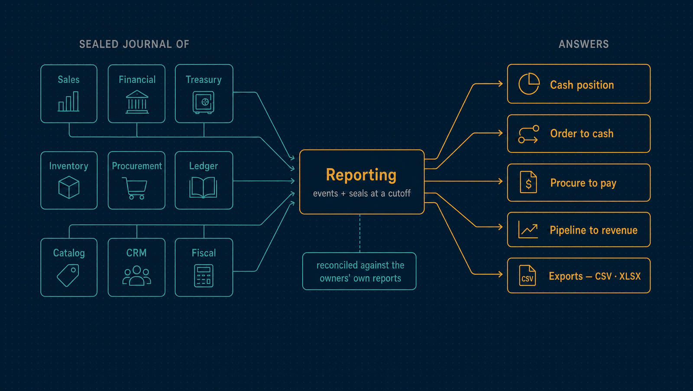

# Reporting

Numbers that cross modules, as of a declared cutoff, and proven to agree with the
modules they came from. Also exports, scheduled exports, saved filters and views,
notifications, and the daily consistency checks.

| | |
|---|---|
| **Port** | 3013 |
| **Database** | `horizon_reporting`, its own, with forced row-level security |
| **Talks to** | Hears the events of every business module; reads their own reports only to reconcile |
| **Stack** | NestJS · Drizzle · PostgreSQL · RabbitMQ · S3-compatible storage |

<p align="center">
  
</p>

---

## What it does

- **A sealed event journal.** An append-only copy of every event of Sales, Financial,
  Treasury, Inventory, Procurement, Ledger, Catalog, CRM and Fiscal, kept once per event.
  Producers periodically send a seal (how many events they sent up to an instant), and the
  journal compares it with its own count. A source is proven complete up to its last
  matched seal ([ADR 0058](../docs/adr/0058-reporting-keeps-a-sealed-event-journal.md)).
- **Reports at a cutoff.** Cash position, order to cash, procure to pay and pipeline to
  revenue are queries over the journal, so there is no projection to drift or rebuild.
- **Reconciliation.** At a settled cutoff, each report is checked against the owner's own
  report, and the differences are kept.
- **Consistency checks.** Every day, and on demand, the owners' figures (receivables,
  payables, cash, stock) are compared with their ledger control accounts, and every
  module's audit chain is verified.
- **Exports.** CSV or XLSX, written by a worker to object storage, downloaded through
  links signed for 15 minutes, and removed after their retention. Schedules run daily,
  weekly or monthly and catch up on missed runs.
- **Saved filters and views**, private or shared by an administrator.
- **Notifications** from events, once per event.

## What it leaves to others

- **Every number's meaning** belongs to the module that owns it. Reporting never writes
  to another module ([ADR 0047](../docs/adr/0047-reporting-projections-never-write-back.md)).
- **Names.** The journal holds ids, never names: nothing of `parties.*` or `identity.*` is
  kept, and supplier names are removed before storage.

---

## API

<details>
<summary><b>Reports and reconciliation</b></summary>

| Method | Path | Purpose |
|---|---|---|
| `GET` | `/sources` | Per source: events held, the watermark, the last seal, and whether a cutoff is settled |
| `GET` | `/reports`, `/reports/:name`, `/dashboard` | The reports at a cutoff |
| `POST`, `GET` | `/reports/:name/reconciliations` | Reconcile a report at a settled cutoff, and past runs |
| `POST`, `GET` | `/consistency-checks` | Compare owners' figures with the ledger, and verify every audit chain |

</details>

<details>
<summary><b>Exports</b></summary>

| Method | Path | Purpose |
|---|---|---|
| `POST`, `GET` | `/exports` | Start an export, or list them |
| `GET` | `/exports/:id` | One export |
| `GET` | `/exports/:id/link` | A download link signed for 15 minutes |
| `GET` | `/exports/:id/file` | The file; public, but checks the link's signature |
| `POST`, `GET` | `/export-schedules` | Scheduled exports |
| `PATCH`, `DELETE` | `/export-schedules/:id` | Change or remove a schedule |

</details>

<details>
<summary><b>Filters, views, notifications and operations</b></summary>

| Method | Path | Purpose |
|---|---|---|
| `GET`, `POST` | `/saved-filters` | Saved filters |
| `PATCH`, `DELETE` | `/saved-filters/:id` | Change or remove one |
| `GET`, `POST` | `/views` | Saved views of list screens |
| `PATCH`, `DELETE` | `/views/:id` | Only the owner changes one |
| `GET` | `/notifications`, `/notifications/unread-count` | My notifications |
| `POST` | `/notifications/:id/read`, `/notifications/read-all` | Mark them read |
| `GET` | `/audit` | The hash-chained audit log, with the chain's verdict |
| `GET` | `/health/live`, `/health/ready` | Liveness and readiness |

</details>

**Roles.** `viewer` reads reports. `analyst` also reconciles, saves filters and schedules
exports. `admin` also shares filters.

---

## Events

Reporting publishes no events. It hears every event of the journaled modules, and the
events that should notify someone, on separate queues. A message that does not match its
contract goes to the queue's dead letters at once; a failing write is retried once.

A producer can refill the journal from its own history, and seal it, at any time:

```bash
# in sales/, financial/, treasury/, inventory/, procurement/, ledger/ or crm/
npm run republish:journal -- --tenant <uuid> [--since <iso>] [--until <iso>] [--seal-only]
```

Running it again changes nothing.

---

## Guarantees

Besides what [every service guarantees](../docs/service-runtime.md#guarantees-every-service-gives):

- **A settled cutoff gives the same answer forever.** Only a matched seal moves a source's
  watermark, and never backwards.
- **Reconciliations use the asker's own access.** Reporting reads an owner's report through
  the gateway with the token of the person who asked, never with a privileged one.
- **Scheduled work has the least access.** The daily checks run with a service token whose
  roles are fixed in code: read where it reads figures, audit where it reads chains.

---

## Run it

```bash
npm install && cp .env.example .env
npm run db:migrate
npm run dev            # http://localhost:3013
```

Tests, the build and the code layout are the same in every service:
[how every service runs](../docs/service-runtime.md).

<details>
<summary><b>Configuration specific to Reporting</b></summary>

| Variable | Purpose |
|---|---|
| `GATEWAY_URL` | Where owners' reports are read for a reconciliation |
| `EXPORT_STORE`, `EXPORT_BUCKET`, `EXPORT_FILE_ROOT` | Where export files are written: S3-compatible storage or a directory |
| `EXPORT_LINK_SECRET` | Signs download links |
| `EXPORT_RETENTION_HOURS`, `EXPORT_SETTLE_GRACE_MS`, `EXPORT_POLL_INTERVAL_MS`, `EXPORT_LEASE_MS` | How exports are processed and kept |
| `SERVICE_TOKEN_SECRET`, `CONTROLS_INTERVAL_SECONDS`, `CONTROLS_FIRST_DELAY_SECONDS` | The daily consistency checks |

The variables every service shares are in
[the shared configuration](../docs/service-runtime.md#configuration-every-service-shares).

</details>

---

## Read more

- [How every service runs](../docs/service-runtime.md)
- [The Reporting API](../docs/reporting-api.md)
- [Architecture](../docs/architecture.md) and the [decision records](../docs/adr/README.md)
