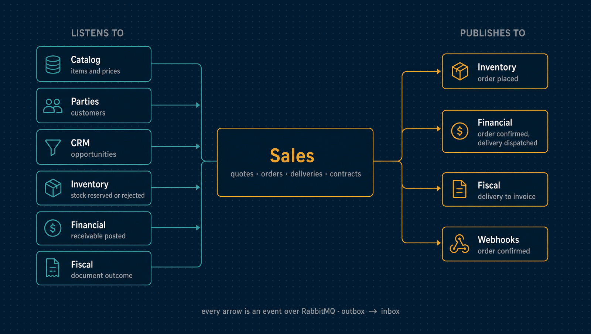

# Sales

Quotes, orders and what happens after the customer says yes: picking and delivery,
returns, service orders, and recurring contracts billed period by period.

| | |
|---|---|
| **Port** | 3004 |
| **Database** | `horizon_sales`, its own, with forced row-level security |
| **Talks to** | Inventory (stock reservation), Financial (receivables), Fiscal (invoices and tax estimates), CRM (attribution) |
| **Stack** | NestJS · Drizzle · PostgreSQL · RabbitMQ · Redis |

<p align="center">
  
</p>

---

## What it does

- **Quotes, negotiated in versions.** A sent quote is never rewritten. The version that
  answers it supersedes it and keeps its identifier. A quote expires, and a discount
  deeper than a seller may give alone waits for a second person to approve it.
- **Tax estimates on quotes and orders.** Sales asks Fiscal for an estimate, keeps it on
  the document, and labels it as an estimate. The amount that reaches the books is the one
  Fiscal locks at delivery ([ADR 0073](../docs/adr/0073-tax-estimates-outside-fiscal-amounts-inside-it.md)).
- **Orders.** Placing an order asks Inventory to reserve the stock. The order is
  confirmed or refused by the answer, never by reading a balance. Prices are frozen at
  confirmation.
- **Delivery.** Goods are picked, packed and dispatched, in parts if needed. Dispatching
  takes the stock out and makes the delivery's share of the order owed. What comes back
  is recorded as a return, and both the stock and the money go back.
- **Service orders.** Services sold on their own, or converted from an accepted quote,
  are delivered in deliveries. Each delivery is billed once, its share of the discount
  in proportion to the work.
- **Recurring contracts.** Monthly, quarterly or yearly, in immutable revisions that
  apply from a period start. Amendments, suspensions and cancellations only affect
  periods that have not begun, and renewals can readjust the price.
- **Period billing.** A billing run previews a month, then bills it contract by contract.
  It records what it billed, skipped or refused, and why, and can be resumed after a
  stop. A billed period can be credited in full and stays in the record.
- **Attribution.** A quote can name a CRM opportunity. Sales checks it against its own
  projection and freezes the opportunity's owner and source on the quote.

## What it leaves to others

- **Stock availability** is Inventory's. Sales asks for a reservation and reacts to the
  answer, because a balance it read itself would be stale by the time it acted.
- **Product data** is Catalog's. Sales keeps a reference and the price it snapshotted.
- **Customers** are registered and erased in Parties. Sales keeps a projection.
- **Taxes and fiscal documents** are Fiscal's. Sales says what was delivered.
- **Receivables** are Financial's. Sales publishes the payment schedule that was agreed.

---

## API

Every endpoint needs a workspace access token. Every command that creates a document
(a quote or a version of it, an order, a delivery, a contract, a billed period, a credit,
a billing run) requires an `Idempotency-Key` header and runs at most once under it.

<details>
<summary><b>Quotes</b></summary>

| Method | Path | Purpose |
|---|---|---|
| `GET` | `/customers` | The workspace's customers, projected from Parties |
| `GET` | `/quotes` | Recent quotes |
| `GET` | `/quotes/:id` | A quote and its priced lines |
| `POST` | `/quotes` | Write a quote from current Catalog prices, optionally for a CRM opportunity |
| `POST` | `/quotes/:id/revise` | Correct a draft, or answer a sent offer with a new version |
| `POST` | `/quotes/:id/send` | Send the offer, or ask for its discount to be approved |
| `POST` | `/quotes/:id/approve` | Approve a discount somebody else asked for |
| `POST` | `/quotes/:id/refuse` | Refuse it with a reason, back to draft |
| `POST` | `/quotes/:id/accept` | The customer agreed |
| `POST` | `/quotes/:id/decline` | The customer declined, with the reason |
| `POST` | `/quotes/:id/expire` | Nobody answered in time |
| `POST` | `/quotes/:id/order` | Convert: goods into a sales order, services into a service order |
| `GET` | `/quotes/:id/tax-estimate` | The tax estimate kept on the quote |
| `PUT` | `/quotes/:id/tax-estimate` | Keep Fiscal's estimate on the quote |

</details>

<details>
<summary><b>Orders and deliveries</b></summary>

| Method | Path | Purpose |
|---|---|---|
| `GET` | `/orders` | Recent orders |
| `GET` | `/orders/summary` | Orders by status and currency, which Reporting reconciles against |
| `GET` | `/orders/:id` | One order |
| `POST` | `/orders` | Place an order and start the reservation |
| `GET` | `/orders/:id/tax-estimate` | The tax estimate kept on the order |
| `PUT` | `/orders/:id/tax-estimate` | Keep Fiscal's estimate on the order |
| `GET` | `/shipments` | Every delivery on its way out: the warehouse's board |
| `GET` | `/orders/:id/shipments` | The deliveries of one order |
| `GET` | `/shipments/:id` | One delivery |
| `POST` | `/shipments` | Pick goods for a customer |
| `POST` | `/shipments/:id/pack` | Close the box and name the carrier |
| `POST` | `/shipments/:id/dispatch` | Send it: the stock moves and the money becomes owed |
| `POST` | `/shipments/:id/return` | The customer sent it back, with the reason |
| `POST` | `/shipments/:id/abandon` | Undo a delivery that never left |

</details>

<details>
<summary><b>Service orders</b></summary>

| Method | Path | Purpose |
|---|---|---|
| `GET` | `/service-orders` | Recent service orders with their deliveries |
| `POST` | `/service-orders` | Open a service order for service items |
| `GET` | `/service-orders/:id` | One order, with each delivery's receivable and invoice |
| `POST` | `/service-orders/:id/start` | Start the work |
| `POST` | `/service-orders/:id/deliveries` | Record delivered work |
| `POST` | `/service-orders/:id/accept` | The customer accepted the completed work |
| `POST` | `/service-orders/:id/cancel` | Cancel an order with no active delivery |
| `POST` | `/service-orders/:id/deliveries/:deliveryId/cancel` | Cancel a delivery that was not provided |

</details>

<details>
<summary><b>Contracts and billing</b></summary>

| Method | Path | Purpose |
|---|---|---|
| `GET` | `/contracts` | Recent contracts, with their revisions and status today |
| `GET` | `/contracts/:id` | One contract |
| `GET` | `/contracts/:id/schedule?from=&to=` | The periods in a range, and whether each is billable |
| `POST` | `/contracts` | Draft a contract |
| `POST` | `/contracts/:id/activate` | Put it into effect |
| `POST` | `/contracts/:id/amendments` | A new revision from a period that has not begun |
| `POST` | `/contracts/:id/suspensions` | Suspend from a period start |
| `POST` | `/contracts/:id/resume` | Set when the suspension ends |
| `POST` | `/contracts/:id/cancel` | Stop billing from a period start |
| `POST` | `/contracts/:id/renewals` | Renew for the original term, optionally readjusted |
| `POST` | `/contracts/renewals` | Renew every self-renewing contract that is due |
| `GET` | `/contracts/:id/billed-periods` | The periods billed so far, with credits, receivables and invoices |
| `POST` | `/contracts/:id/periods/:competence/bill` | Bill one period now |
| `POST` | `/contracts/:id/periods/:competence/credit` | Credit a billed period in full |
| `POST` | `/billing-runs/preview` | What a month's run would do; writes nothing |
| `POST` | `/billing-runs` | Run a month |
| `POST` | `/billing-runs/:id/resume` | Finish a run that stopped |
| `GET` | `/billing-runs?competence=` | Recent runs |
| `GET` | `/billing-runs/:id` | One run, contract by contract |
| `GET` | `/contract-billing/overview` | Billed periods still missing a receivable or an invoice |

</details>

<details>
<summary><b>Operations</b></summary>

| Method | Path | Purpose |
|---|---|---|
| `GET` | `/audit` | The workspace's hash-chained audit log, with the chain's verdict on every page |
| `GET` | `/health/live`, `/health/ready` | Liveness and readiness |

</details>

---

## Events

Schemas live in [`@horizon/contracts`](../contracts/), and the full catalogue is
[`docs/events.md`](../docs/events.md).

<details>
<summary><b>Published</b></summary>

| Event | Meaning |
|---|---|
| `sales.order.placed` | An order was submitted and waits for its stock |
| `sales.order.confirmed` | Stock is reserved and the order is committed, with its agreed instalments |
| `sales.order.cancelled` | The order will not proceed; related holds are released |
| `sales.shipment.dispatched` | Goods left: the stock leaves and the delivery's share becomes owed |
| `sales.shipment.returned` | A delivery came back: the goods and the money go back |
| `sales.invoicing.requested` | A delivery is ready to be invoiced |
| `sales.fiscal-origin.recorded` | What Fiscal needs to issue the document for a delivery or a return |
| `sales.quote.sent`, `accepted`, `rejected` | An offer was sent, accepted or declined |
| `sales.service.delivered` | Service work was delivered: one receivable and one service invoice per line |
| `sales.service.delivery-cancelled` | A delivery was not provided after all |
| `sales.contract.activated`, `amended`, `suspended`, `cancelled` | A contract's life |
| `sales.contract-period.billed` | A period was billed: one receivable and one service invoice per line |
| `sales.contract-period.credited` | A billed period was credited in full |

</details>

<details>
<summary><b>Consumed</b></summary>

| Event | Reaction |
|---|---|
| `identity.tenant.created` | Provisions the workspace |
| `parties.party.registered`, `updated`, `erased` | Keeps the customer projection, and erases it with the person |
| `catalog.item.created`, `item.deactivated`, `price.changed` | Keeps the items and prices used to write quotes and orders |
| `inventory.stock.reserved`, `reservation-rejected` | Confirms or refuses the order |
| `financial.receivable.posted`, `reversed` | Records the receivable on a billed period or a delivery |
| `crm.opportunity.*` | Keeps the opportunities a quote can be attributed to |
| `fiscal.document.production-outcome`, `fiscal.service-document.simulation-outcome` | Records the invoice's outcome on the delivery or billed period |

</details>

---

## Guarantees

Besides what [every service guarantees](../docs/service-runtime.md#guarantees-every-service-gives)
(tenant isolation, outbox and inbox, idempotent writes, exact money):

- **No order moves backwards.** Every transition increments the order's version, and
  Inventory echoes the version it answered, so a late reply cannot move a newer or
  cancelled order.
- **No rewritten history.** A sent quote, a dispatched shipment, a recorded service
  delivery and a billed period are never edited; database triggers refuse it. A
  confirmed order keeps the prices it was confirmed at.
- **Private customer data.** Customer details are encrypted per person, looked up by a
  blind index, and erased by destroying the person's key.

---

## Run it

```bash
npm install && cp .env.example .env
npm run dev            # http://localhost:3004
```

Tests, migrations, the build and the code layout are the same in every service:
[how every service runs](../docs/service-runtime.md).

<details>
<summary><b>Configuration specific to Sales</b></summary>

| Variable | Purpose |
|---|---|
| `QUOTE_DEFAULT_VALIDITY_DAYS` | A new quote's default expiry |
| `ORDER_CONFIRMATION_TIMEOUT_MS` | How long an order waits for its reservation |
| `CUSTOMER_BLIND_INDEX_KEY` | The key for looking up a customer by tax id without storing it in clear |

The variables every service shares are in
[the shared configuration](../docs/service-runtime.md#configuration-every-service-shares).

</details>

<details>
<summary><b>Maintenance commands</b></summary>

Items projected before item kinds existed get theirs from a one-off, idempotent command
that reads the Catalog API and fills only unknown kinds:

```bash
CATALOG_URL=http://localhost:8000/catalog CATALOG_TOKEN=<catalog read token> \
  npm run backfill:item-kinds -- --tenant <uuid>
```

</details>

---

## Read more

- [How every service runs](../docs/service-runtime.md)
- [Architecture](../docs/architecture.md) and the [decision records](../docs/adr/README.md)
- [The event catalogue](../docs/events.md)
- [How the sales, delivery and services features were planned](../docs/plan.md)
