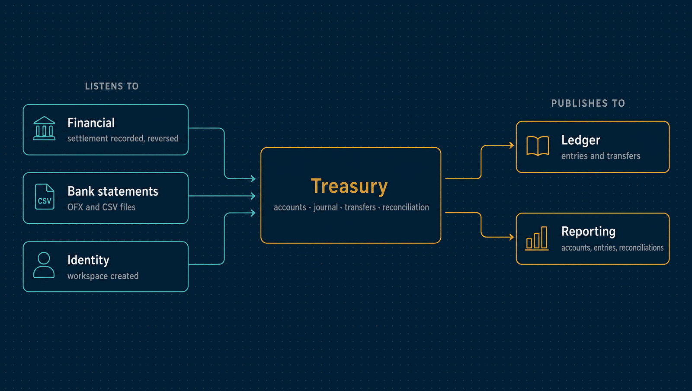

# Treasury

Where the money actually is: bank, cash, card-clearing and virtual accounts, their
append-only journal and balances, transfers between them, bank statement import and
reconciliation.

| | |
|---|---|
| **Port** | 3008 |
| **Database** | `horizon_treasury`, its own, with forced row-level security |
| **Talks to** | Financial's settlements become its entries; the Ledger posts what it records |
| **Stack** | NestJS · Drizzle · PostgreSQL · RabbitMQ |

<p align="center">
  
</p>

---

## What it does

- **Accounts.** Bank (with bank code, branch and account number), cash, card clearing
  and virtual, each in one currency. Deactivated, never deleted.
- **An append-only journal.** One line per movement, with a direction instead of a sign,
  a value date and a source: opening balance, manual entry, transfer leg, fee or
  reversal. A manual entry is corrected by a reversal that names it.
- **Balances computed, never stored.** The book balance through a date, the projected
  balance with later-dated entries, the reconciled balance, and the last balance a bank
  statement reported. There is nothing to drift, so a backdated entry moves every later
  balance deterministically.
- **Transfers.** Outflow, inflow and an optional fee are written together. Above a
  threshold, a transfer waits for a second person. Cancelling adds inverse entries and
  keeps the originals.
- **Statement import.** OFX and CSV files. A file is recognised by its hash and each line
  by its fingerprint, so reimporting or overlapping files stores nothing twice.
- **Reconciliation.** A person matches bank lines to entries: one to one, one to many,
  many to one, partially, or with an explicit adjustment. Suggestions come with a score
  and their reasons, and never confirm themselves
  ([ADR 0046](../docs/adr/0046-reconciliation-suggests-a-human-confirms.md)). Closing a
  period freezes the reconciliations it covers.

## What it leaves to others

- **What is owed** belongs to Financial. A settlement that names an account becomes that
  account's entry here.
- **The accounting entries** belong to the Ledger.

A book balance is labelled as such everywhere. It is never presented as the bank's live
balance.

---

## API

<details>
<summary><b>Accounts, entries and transfers</b></summary>

| Method | Path | Purpose |
|---|---|---|
| `GET`, `POST` | `/accounts` | Accounts with their balances, or open one |
| `GET` | `/accounts/:id` | One account |
| `PATCH` | `/accounts/:id/status` | Deactivate or reactivate |
| `GET` | `/accounts/:id/statement` | Entries with running balances |
| `GET` | `/accounts/:id/timeline` | The daily balance |
| `POST` | `/accounts/:id/entries` | A manual entry |
| `POST` | `/entries/:id/reverse` | Reverse an entry |
| `GET`, `POST` | `/transfers` | Transfers, or move money between accounts |
| `POST` | `/transfers/:id/approve`, `/reject` | Decide somebody else's transfer |
| `POST` | `/transfers/:id/cancel` | Undo a transfer with inverse entries |
| `GET`, `PUT` | `/approval-policies` | The threshold above which a transfer waits |

</details>

<details>
<summary><b>Statements and reconciliation</b></summary>

| Method | Path | Purpose |
|---|---|---|
| `POST` | `/accounts/:id/statements` | Import an OFX or CSV statement |
| `GET` | `/accounts/:id/reconciliation` | Unmatched lines, entries and suggestions |
| `GET` | `/accounts/:id/reconciliation/metrics` | How good the suggestions have been |
| `POST` | `/accounts/:id/reconciliations` | Match lines to entries |
| `POST` | `/accounts/:id/reconciliations/ignore` | Ignore lines, with a reason |
| `POST` | `/reconciliations/:id/undo` | Undo a reconciliation |
| `POST` | `/accounts/:id/suggestions/dismiss` | Dismiss a suggestion |
| `POST` | `/accounts/:id/reconciliation/close`, `/reopen` | Close or reopen a period |

</details>

<details>
<summary><b>Approvals and operations</b></summary>

| Method | Path | Purpose |
|---|---|---|
| `GET`, `POST` | `/delegations` | Lend the transfer approval to another member for up to 90 days |
| `POST` | `/delegations/:id/revoke` | End a delegation |
| `GET` | `/audit` | The hash-chained audit log, with the chain's verdict |
| `GET` | `/health/live`, `/health/ready` | Liveness and readiness |

</details>

**Roles.** `viewer` reads. `operator` records entries, transfers, imports and
reconciliations. `admin` also reverses, cancels, undoes, opens accounts and closes
periods.

---

## Events

| Published | Meaning |
|---|---|
| `treasury.account.opened` | An account started keeping a journal |
| `treasury.entry.recorded` | A line was appended, including transfer legs, fees and reversals |
| `treasury.transfer.posted`, `transfer.cancelled` | Money moved between two accounts, or that was undone |
| `treasury.statement.imported` | A statement was imported; duplicates are counted, not stored |
| `treasury.reconciliation.confirmed`, `reconciliation.undone` | Bank lines were matched or ignored, or that was undone |

| Consumed | Reaction |
|---|---|
| `financial.settlement.recorded`, `settlement.reversed` | A settlement naming an account becomes, or stops being, its entry; one the account cannot take is recorded as refused, with the reason |
| `identity.tenant.created` | Provisions the workspace |

---

## Guarantees

Besides what [every service guarantees](../docs/service-runtime.md#guarantees-every-service-gives):

- **A transfer never has one leg.** A deferred database constraint refuses a transfer
  that commits without both. Concurrent transfers in both directions keep the total
  constant.
- **Order does not matter.** A property test shows the book balance and the daily timeline
  come out the same whatever order backdated entries are recorded in.
- **Every reconciliation balances**, and is undone rather than deleted.
- **Four eyes on large transfers.** Whoever asked for one never approves it
  ([ADR 0062](../docs/adr/0062-segregation-of-duties-is-a-declared-matrix.md)).

---

## Run it

```bash
npm install && cp .env.example .env
npm run db:migrate
npm run dev            # http://localhost:3008
```

Tests, the build and the code layout are the same in every service:
[how every service runs](../docs/service-runtime.md). The only variable specific to
Treasury is `JOURNAL_SEAL_INTERVAL_MS`, how often the relay seals each workspace's history
for Reporting.

---

## Read more

- [How every service runs](../docs/service-runtime.md)
- [Architecture](../docs/architecture.md) and the [decision records](../docs/adr/README.md)
- [The event catalogue](../docs/events.md)
