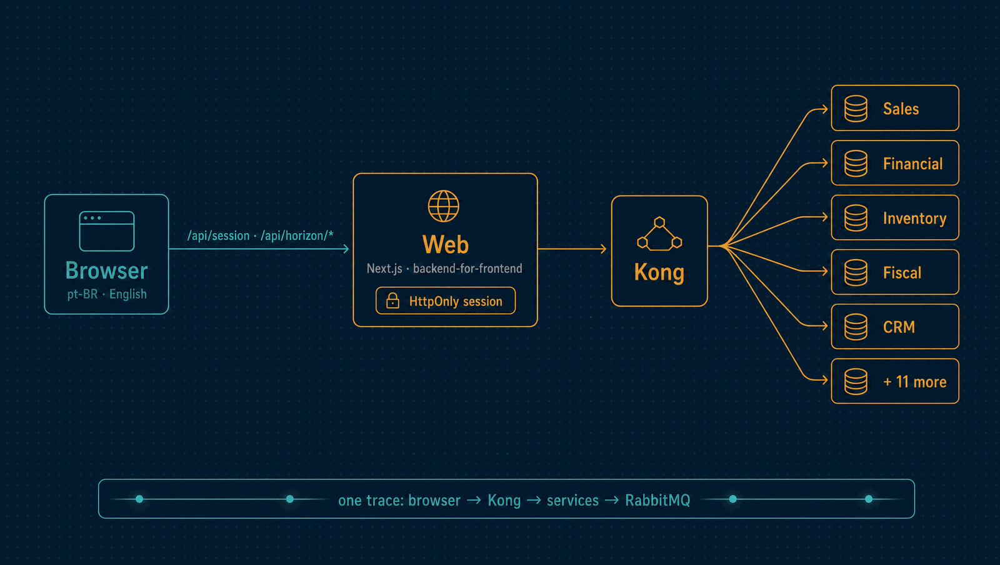

# Web

The portal: a Next.js app in Brazilian Portuguese and English, where navigation follows
the signed-in person's roles, talking to Horizon only through its own backend-for-frontend
and Kong.

| | |
|---|---|
| **Port** | 3000 |
| **Talks to** | Kong only, through its own server-side routes |
| **Stack** | Next.js (App Router) · React · TypeScript · Base UI · Radix Colors · Phosphor icons · OpenTelemetry |

<p align="center">
  
</p>

---

## What it does

- **Every area of the ERP**, each a bookmarkable route under `/app`:

  | Area | Screens |
  |---|---|
  | Sales | customers, quotes, approvals, orders, deliveries, service orders, contracts, billing |
  | Purchasing | requisitions, orders, approvals |
  | Inventory | balances, operations, reports, lot and serial tracking, production, item structure |
  | Finance | receivables, payables, treasury, reconciliation, ledger |
  | Fiscal | documents, preview, supplier XML, service profiles, tax rules, support |
  | CRM | pipeline, accounts, agenda, forecast, settings |
  | Catalog and registrations | items, parties |
  | Reports and jobs | cross-module reports, exports, imports and their progress |
  | Administration | people, workspace, classifications, imports, audit, the assistant |
  | Developers | API keys, webhooks and deliveries, the agent |
  | Settings | security (second factors, sessions), controls (delegations) |

- **Navigation by role.** A screen appears only when the person holds a role that can use
  it, so nobody is offered an action they cannot perform
  ([ADR 0045](../docs/adr/0045-routed-shell-with-permission-navigation-registry.md)).
- **Two languages, chosen by the reader**, not by the URL. Translation stops at the
  presentation layer; services speak codes
  ([ADR 0044](../docs/adr/0044-localization-stops-at-the-presentation-boundary.md)).
- **A search and command palette**, notifications, saved views and the in-app assistant.
- **Accessible.** WCAG 2.2 AA for the delivered screens: landmarks, labels, keyboard
  operation, visible focus, announced status, and no page-level horizontal scroll from
  390 px up.

## What it leaves to others

- **Business rules.** Every invariant is enforced by a service. The portal may repeat a
  validation for a better experience, never as the only check.
- **Tokens and tenant authority.** Identity issues tokens and decides the workspace. A
  browser header never establishes which tenant a request is for.

---

## How a request travels

1. The browser calls only the portal's own routes: `/api/session` and an allowlisted
   `/api/horizon/*`.
2. Those routes keep the access and refresh tokens in `HttpOnly`, `SameSite=Lax` cookies,
   rotate an expired token once, and call Kong.
3. Kong routes to the service, which verifies the token again.
4. Browser spans go to the OpenTelemetry Collector, and the `traceparent` is forwarded, so
   one Jaeger trace runs from the click through Kong, the services and RabbitMQ.

---

## Run it

```bash
npm install && cp .env.example .env.local
npm run typecheck && npm run lint && npm test
npm run dev            # http://localhost:3000
```

The whole stack, from the repository root:

```bash
make up && make demo && make up-apps
make test-phase10      # the portal in Chromium, desktop and mobile, both languages, one trace
```

Sign in as `demo@horizon.local` with `Horizon-demo-2026!` and pick `horizon-demo`.

| Browser suite | What it works through |
|---|---|
| `npm run test:browser` | Sign-in, workspaces, catalog, customers, quotes, an order confirmed by Inventory, webhooks, access, at 390 px and in both languages |
| `npm run test:browser:fiscal` | The fiscal operator's worklist, an authorized NF-e with its calculation sources and artifacts, and supplier XML, in both languages |
| `npm run test:browser:services` | A service order, a contract, a billing run and a credit, with their receivables and service invoices |
| `npm run test:browser:crm` | Pipeline settings, accounts, opportunities, the agenda and the forecast |

<details>
<summary><b>Configuration</b></summary>

| Variable | Purpose |
|---|---|
| `HORIZON_API_URL` | Kong's address, used by the server routes |
| `HORIZON_COOKIE_SECURE` | `Secure` session cookies; required behind HTTPS |
| `HORIZON_WEB_TRUSTED_HOPS` | How many proxies in front may set the client's address |
| `NEXT_PUBLIC_HORIZON_API_URL` | Kong's address as the browser sees it; carries no secret |
| `NEXT_PUBLIC_OTEL_EXPORTER_OTLP_ENDPOINT`, `OTEL_SERVICE_NAME` | Browser and server telemetry |

Anything prefixed `NEXT_PUBLIC_` is compiled into the browser bundle, so it is public. No
secret may carry that prefix.

</details>

<details>
<summary><b>Design system</b></summary>

- **Type:** the self-hosted variable Inter font.
- **Icons:** Phosphor, and no other set.
- **Components:** primitives composed from Base UI in `src/components/ui`. Screens use
  those components, never raw styled buttons, inputs, dialogs or menus.
- **Colour:** Radix Colors through semantic aliases in `src/app/styles.css`: Sage
  neutrals, Jade for accent and success, Amber for warnings, Red for errors.

The rationale is [ADR 0039](../docs/adr/0039-frontend-design-system-foundation.md).

</details>

<details>
<summary><b>The hosted demo profile</b></summary>

With `HORIZON_HOSTED_DEMO=true`, the portal runs a reduced profile for Vercel and Neon: a
signed demo session and the seeded catalogue, with the screens whose services are not
deployed hidden. What it does and does not run is disclosed in
[`docs/deployments/vercel-neon.md`](../docs/deployments/vercel-neon.md).

</details>

`tsconfig.json` is excluded from Biome, because `next build` rewrites it.

---

## Read more

- [Architecture](../docs/architecture.md) and the [decision records](../docs/adr/README.md)
- [Service levels](../docs/service-levels.md), including the synthetic probe that signs
  in, drafts a purchase order and signs out every minute
