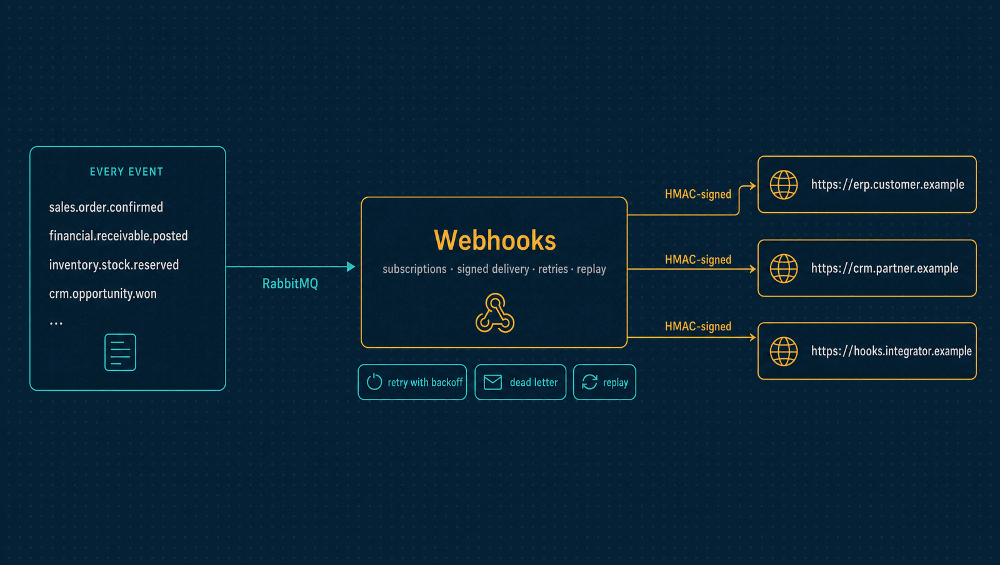

# Webhooks

Lets a company's own systems follow what happens in Horizon: subscriptions to any
published event, delivered as HMAC-signed HTTP callbacks, with retries, dead letters and
replay.

| | |
|---|---|
| **Port** | 3005 |
| **Database** | `horizon_webhooks`, its own, with forced row-level security |
| **Talks to** | Hears every event Horizon publishes; calls the company's own endpoints |
| **Stack** | NestJS · Drizzle · PostgreSQL · RabbitMQ |

<p align="center">
  
</p>

---

## What it does

- **Subscriptions.** A company registers an HTTPS endpoint and the event types it wants.
  Its signing secret is shown once and stored encrypted with AES-256-GCM.
- **Signed delivery.** Every callback carries the exact event envelope and a signature
  the receiver can check.
- **Retries with backoff.** A failed callback is retried with exponential backoff and
  jitter, up to a limit. Every attempt is kept in an append-only log: when, how long, the
  status, and the error.
- **Dead letters and replay.** A callback that exhausts its attempts is kept as a dead
  letter. An admin can replay it, and its history stays.
- **Backpressure without loss.** Once accepted, delivery work is durable in PostgreSQL.
  When the backlog passes a threshold, an alert fires and the worker keeps draining.

## What it leaves to others

- **The events themselves** belong to the modules that publish them.
- **Who may subscribe** is decided by Identity's roles: `viewer` reads, `admin` manages
  subscriptions and replays.

---

## API

| Method | Path | Purpose |
|---|---|---|
| `GET` | `/webhook-subscriptions` | The workspace's subscriptions, without secrets |
| `POST` | `/webhook-subscriptions` | Subscribe; the secret is returned once |
| `DELETE` | `/webhook-subscriptions/:id` | Deactivate a subscription |
| `GET` | `/webhook-deliveries` | Recent deliveries and their last outcome |
| `GET` | `/webhook-deliveries/:id/attempts` | Every attempt of one delivery |
| `POST` | `/webhook-deliveries/:id/replay` | Replay a dead letter |
| `GET` | `/health/live`, `/health/ready` | Liveness and readiness |

```json
{
  "endpointUrl": "https://integrator.example/horizon",
  "eventTypes": ["sales.order.confirmed"]
}
```

An endpoint must be HTTPS, without credentials in the URL, on the public internet. An
address that is private, loopback, link-local (cloud metadata included), carrier-grade NAT,
multicast or reserved is refused when subscribing, by address and by the name's current
resolution, and again at each delivery, on the very address the connection uses, so a
name that later resolves inside the network is refused then. Redirects are not followed.
A development stack may allow plain HTTP to its own loopback with `WEBHOOK_ALLOW_LOOPBACK`.

---

## Verifying a callback

Each request carries:
- `X-Horizon-Event-Id`, a stable key to deduplicate on, because delivery is at least
  once;
- `X-Horizon-Signature: t=<unix-seconds>,v1=<hex-hmac>`, the HMAC-SHA256 of
  `timestamp + "." + rawBody`.

Verify the raw bytes before parsing them, reject old timestamps, and compare in constant
time:

```js
import { createHmac, timingSafeEqual } from 'node:crypto'

export function verify(secret, rawBody, signature, now = Math.floor(Date.now() / 1000)) {
  const fields = Object.fromEntries(signature.split(',').map((part) => part.trim().split('=', 2)))
  const timestamp = Number(fields.t)
  if (!Number.isSafeInteger(timestamp) || Math.abs(now - timestamp) > 300) return false
  const expected = createHmac('sha256', secret).update(`${timestamp}.${rawBody}`).digest()
  const actual = Buffer.from(fields.v1 ?? '', 'hex')
  return actual.length === expected.length && timingSafeEqual(actual, expected)
}
```

Any `2xx` acknowledges the delivery. Anything else, a network error or a timeout is a
failure and is retried. Each attempt records the status, or only a category of the error
(`timeout`, `dns`, `tls`, `connection failed`, `refused: not a public address`), never its
text.

---

## Events

Webhooks publishes no events. It listens to every event on the bus, validates it
against its contract in [`@horizon/contracts`](../contracts/), and queues it for each
subscription that asked for its type. A message it cannot read is retried once, then
sent to its own dead-letter queue.

---

## Run it

```bash
npm install && cp .env.example .env
npm run db:migrate
npm run dev            # http://localhost:3005
```

`make demo` at the repository root proves the whole path: an order confirmed in Sales,
reserved in Inventory, and delivered here as a signed callback. Tests, the build and the
code layout are the same in every service: [how every service runs](../docs/service-runtime.md).

<details>
<summary><b>Configuration specific to Webhooks</b></summary>

| Variable | Purpose |
|---|---|
| `WEBHOOK_SECRET_ENCRYPTION_KEY` | The 32-byte key subscription secrets are encrypted with |
| `WEBHOOK_DELIVERY_TIMEOUT_MS` | How long a callback may take |
| `WEBHOOK_MAX_ATTEMPTS` | Attempts before a delivery becomes a dead letter |
| `WEBHOOK_BACKOFF_BASE_MS`, `WEBHOOK_BACKOFF_MAX_MS`, `WEBHOOK_BACKOFF_JITTER_RATIO` | The retry schedule |
| `WEBHOOK_SIGNATURE_TOLERANCE_SECONDS` | The timestamp skew a receiver should accept |
| `WEBHOOK_QUEUE_DEPTH_ALERT` | The backlog that raises an alert |
| `WEBHOOK_ALLOW_LOOPBACK` | Plain HTTP to this machine's own loopback, for a development stack only |

The variables every service shares are in
[the shared configuration](../docs/service-runtime.md#configuration-every-service-shares).

</details>

---

## Read more

- [How every service runs](../docs/service-runtime.md)
- [The event catalogue](../docs/events.md): every event a subscription can ask for
- [Architecture](../docs/architecture.md) and the [decision records](../docs/adr/README.md)
